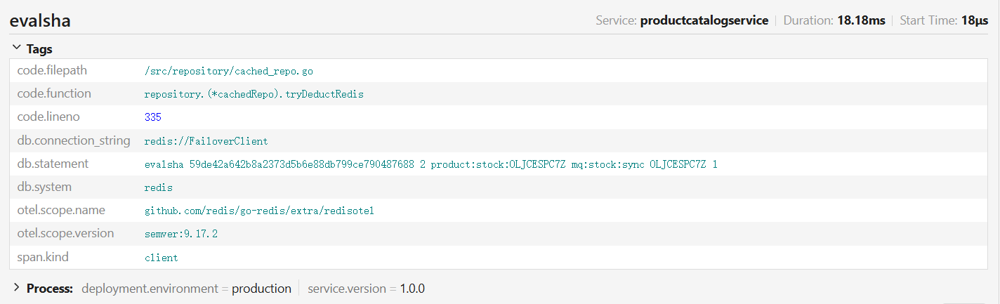
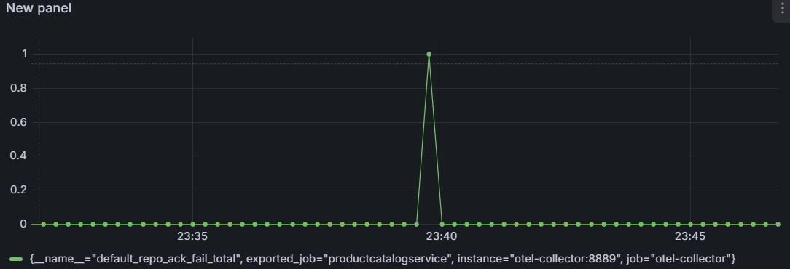
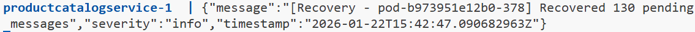

> #### **测试环境与配置**
>
> - **基础设施**: cnb.cool 云开发环境 (Linux 容器化环境)
> - **编排方式**: Docker Compose (模拟微服务集群网络)
> - **服务架构**:
>   - **应用层**: `productcatalogservice` (Go gRPC) x **3 副本** (负载均衡与高可用)
>   - **数据库**: MySQL 8.0 (Gorm + OTel Plugin)
>   - **缓存/中间件**: Redis 7.0 (Sentinel 哨兵模式: 1主 + 1从 + 1哨兵, 开启 AOF 持久化)
>   - **可观测性**: Jaeger (Tracing) + Prometheus (Metrics) + Grafana (Dashboard)
> - **关键技术栈**:
>   - **SingleFlight**: 防冷启动时的缓存击穿；
>   - **Redis Stream**: 异步消息队列削峰(`XADD`+`XReadGroup`)；
>   - **Async Batch Flusher**: 批量聚合写库；
>   - **Idempotency**: 基于`stock_dedup_log`表的幂等性去重；
>   - **CircuitBreaker**: 熔断降级(Gobreaker)；
>   - **Lua Script**: 保证 Redis 端扣减与消息发送的原子性。

# 1. 极限吞吐量测试

- **测试背景**: 验证 Redis Lua 脚本在高并发下的原子扣减性能，以及 Stream 异步写入对 I/O 的压力。

- **测试命令**

  ```bash
  docker run --rm --network workspace_microservices-net obvionaoe/ghz \
    --insecure \
    --call "hipstershop.ProductCatalogService.ChargeProduct" \
    -d '{"product_id": "OLJCESPC7Z", "amount": 1}' \
    -c 50 -n 100000 \
    productcatalogservice:3550
  ```

- **核心数据记录**

  

  - Requests/sec： 14k+
  - P99延迟：6.39ms
  - Status code：100% OK

- **结论**: 

  

  在开启 AOF 持久化的前提下，系统依然保持了 14k+ 的稳定 QPS。性能瓶颈主要集中在 Redis 的Lua脚本扣减环节。Go 服务端的 `gobreaker` 未触发熔断，说明 Redis 响应在 30s 超时范围内。

# 2. 冷启动与防雪崩测试

- **测试背景**: 清空 Redis 缓存，模拟服务刚重启或缓存大规模失效，瞬间涌入高并发读取/扣减请求，验证 `SingleFlight` 和 `Lazy Load` 机制。

- **测试命令**

  ```bash
  docker run --rm --network workspace_microservices-net obvionaoe/ghz \
    --insecure \
    --call "hipstershop.ProductCatalogService.GetProduct" \
    -d '{"id": "0PUK6V6EV0"}' \
    -c 50 -n 100000 \
    productcatalogservice:3550
  ```

- **核心数据记录**

  

  - 并发请求数：100000

  - 实际穿透到MySQL的查询数：1个

  - SingleFlight拦截率：
    $$
    \frac{100000-1}{100000}\times 100\%=99.99\%
    $$

- **结论**: SingleFlight 机制成功生效，有效防止了 MySQL 在缓存击穿瞬间被打挂，完美解决了“惊群效应”。

# 3. 混沌工程与故障恢复

- **目的**: 验证在 Redis 宕机或消费者 Crash 的情况下，数据的“最终一致性”和“无丢失”。

- **测试场景**: 

  1. **Phase 1**: 持续压测写入。
  2. **Phase 2**: 强制 Kill 掉 Go 服务（模拟消费者挂掉）。
  3. **Phase 3**: 重启 Go 服务，观察 `Recover` 机制。

- **核心流程分析(基于源码)**:

  1. **Crash 期间**: Redis Stream 持续接收数据，`XADD` 成功，但没有消费者 `XAck`。消息积压在 `Pending List` 中。
  2. **Recovery 启动**:
     - Go 服务重启，`NewCachedRepo` 启动 `startPendingRecover` 协程。
     - `XPendingExt` 扫描超过 3 分钟未 ACK 的消息。
     - `XClaim` 将消息所有权“抢”回来。
  3. **数据落盘**:
     - `flushBufferToMySQL` 被触发。
     - **幂等性检查**: 查询 `stock_dedup_log` 表，通过 `Where("msg_id IN ?", ...)` 过滤已处理消息。
     - 执行 MySQL 扣减并 Commit 事务。
     - 最后执行 Redis `XAck`。

- **最终一致性检验**

  - MySQL最终扣减量：484719

  - Redis最终扣减量：484719
  - 丢单数：0

- **结论**: 相比于旧的定时轮询方案，新的 Redis Stream + Consumer Group 方案配合 `stock_dedup_log` 幂等表，也实现了真正的**“至少一次消费 (At-Least-Once)”**，在组件崩溃后能自动恢复数据。

  

  

  注意到图表上出现了一次ACK失败，但随后被Recover捕捉到并处理掉了pending messages.

# 4. 长期稳定性测试

- **测试背景**: 持续 30 分钟中等负载压测，观察 MySQL 压力和内存泄漏情况。

- **测试命令**

  ```bash
  docker run --rm --network workspace_microservices-net obvionaoe/ghz \
    --insecure \
    --call "hipstershop.ProductCatalogService.ChargeProduct" \
    -d '{"product_id": "OLJCESPC7Z", "amount": 1}' \
    --rps 1000 --duration 30m \
    productcatalogservice:3550
  ```

- **核心数据记录**

  - Redis QPS：~1000
  - MySQL TPS：~265
  - 削峰比：3.8:1

- **结论**: 异步聚合（Async Batching）极大降低了数据库的写压力。在 1000 QPS 的业务压力下，数据库负载几乎可以忽略不计。

# 5. 遇到的核心问题与解决方案

## 5.1 优雅停机失效

- **现象**:  压测结束后，Redis 数据已扣减，但 MySQL 数据有缺失（具体表现为MySQL库存剩余显著大于Redis）。

- **根本原因**:

  1. **Context不可取消**: 在`main()`函数中直接使用了`context.Backgroud()`，导致Worker无法接收停止信号，`context.Done()`永远不执行，主线程可能会死锁或直接强制退出。
  2. **等待机制缺失**: 主线程退出时没有通过`sync.WaitGroup`等待后台异步的Worker将内存buffer中的数据落盘就直接杀死了进程。

- **解决方案**:

  - `main()`: 引入`context.WithCancel`，在`srv.GracefulStop()`后调用`cancel()`通知Worker，最后调用`wg.Wait()`等待Worker完成。

    ```go
    func main() {
    	ctx, cancel := context.WithCancel(context.Background())
    	defer cancel()
    
    	var wg sync.WaitGroup
        
        // ...
        
        srv.GracefulStop()
    	cancel()
    	wg.Wait()
    
    }
    ```

  - `Worker`: 传入`&wg`指针，启动前`wg.Add(1)`，启动后`defer wg.Done()`。

    ```go
    func NewCachedRepo(... ctx context.Context, wg *sync.WaitGroup) ProductRepository {
    	// ...
        wg.Add(1)
    	go s.startStreamWorker(ctx, wg)
    
    	wg.Add(1)
    	go s.startPendingRecover(ctx, wg)
    }
    ```

    ```go
    func (c *cachedRepo) startStreamWorker(ctx context.Context, wg *sync.WaitGroup) {
    	defer wg.Done()
        // ...
    }
    ```

## 5.2 高吞吐下的队列溢出

- **现象**: 云端环境 P99 延迟极低 (<20ms)，生产速度远超消费速度，导致大量数据“凭空消失”，且不是因为停机丢失的。
- **根本原因: 生产消费失衡 + 队列截断**
  - 云端Redis写入（生产）太快，Go的单线程Worker写入MySQL（消费）太慢。
  - Lua脚本中为了防止队列无限增长导致OOM设置了`MAXLEN 100000`。当积压的信息超过10w条时，Redis会强制丢弃旧信息，导致MySQL永远收不到这些消息。
- **解决方案**:
  - 修改Lua脚本，暂时移除或大幅调大`MAXLEN`限制，确保数据不会因为积压被丢弃。
  - 未来优化: 考虑增加Worker数量（多线程消费）或优化MySQL批量写入性能。

