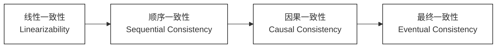
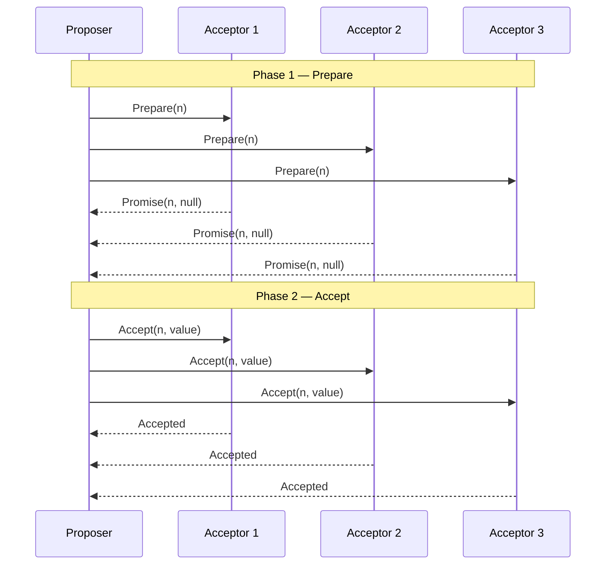

# 分布式系统整体架构

## 分层模型

| 层次 | 职责 | 代表组件 |
|---|---|---|
| **接入层** | 流量入口，分发与鉴权 | Nginx、LVS、API 网关 |
| **服务层** | 业务逻辑处理，服务间调用 | 微服务集群、Dubbo、gRPC、Nacos |
| **消息层** | 异步解耦，削峰填谷 | Kafka、RocketMQ |
| **存储层** | 数据持久化与检索 | MySQL、Redis、Elasticsearch、OSS |
| **协调层** | 配置、锁、选举等分布式协调 | ZooKeeper、etcd |
| **可观测层** | 监控、链路追踪、日志 | Prometheus、Grafana、SkyWalking、ELK |
| **治理层** | 熔断、限流、降级，防止雪崩 | Sentinel、Hystrix |

## 架构图


## 各层核心要点

- **接入层**：单点流量入口，必须高可用；API 网关承担横切逻辑（鉴权、限流），避免各服务重复实现
- **服务层**：无状态部署，水平扩展；服务间通过注册中心发现对方，通过 RPC 框架调用
- **消息层**：写入 MQ 即返回，下游异步消费；天然削峰，同时解耦服务依赖
- **存储层**：MySQL 存核心业务数据；Redis 抗高并发读；ES 负责全文检索；OSS 存非结构化文件
- **协调层**：强一致性是核心价值；写入频率低但可靠性要求极高；奇数节点集群部署（通常 3 或 5 节点）
- **可观测层**：Metrics / Logs / Traces 三支柱缺一不可；出问题时是排查的唯一依据
- **治理层**：保护上游服务不被下游故障拖垮；熔断器三态（Closed / Open / Half-Open）

# 理论基石

## CAP 定理

### 背景与提出

- **提出者**：Eric Brewer 于 2000 年 PODC 会议上以猜想形式提出，2002 年由 Gilbert & Lynch 给出严格数学证明。
- **核心命题**：一个分布式系统**不可能同时满足**一致性（C）、可用性（A）、分区容忍性（P）三个属性，**最多只能同时满足其中两个**。


### 三要素精确定义

> C（Consistency，一致性）

- **定义**：所有节点在同一时刻看到的数据完全一致，即对任何客户端，一次成功的读操作必须返回最近一次成功写操作的结果。
- **等价语义**：CAP 语境下的 C 特指**线性一致性（Linearizability）**，是最强的一致性模型。
  - 每次操作都像在单一原子步骤中完成，操作效果对所有节点即时可见。
  - 与 ACID 中的 C（约束不被破坏）**完全不同**，两者不可混淆。
- **反例**：主从异步复制场景下，写入 Master 后立刻从 Slave 读取，可能读到旧数据 → 违反 C。

> A（Availability，可用性）

- **定义**：集群中每个**非故障节点**收到的请求，都必须在有限时间内返回**非错误响应**（不要求返回最新数据）。
- **关键约束**：
  - "有限时间"是核心——无限期等待等价于不可用。
  - 响应可以是旧版本数据，但不能是超时或错误码。
- **反例**：ZooKeeper 在 Leader 重新选举期间（通常 `200ms~30s`）拒绝写请求 → 此阶段违反 A。

> P（Partition Tolerance，分区容忍性）

- **定义**：当网络分区发生（节点间消息任意丢失或延迟）时，系统仍能继续正确运行。
- **网络分区的本质**：
  - 物理层：网线断开、交换机故障、机房网络隔离。
  - 逻辑层：网络延迟过高导致节点互相判定对方宕机（脑裂）。
- **P 为何不可放弃**：
  - 真实网络环境中分区**不可避免**（即使同机房也存在网卡故障、流量风暴等）。
  - 放弃 P 意味着假设网络永远可靠，等价于退化为单机系统，失去分布式意义。
  - **工程结论：P 必须保留，实际的设计抉择只在 C 与 A 之间二选一。**


### CP 与 AP 的工程权衡

**CP 系统**

- **取舍逻辑**：发生网络分区时，优先保证数据一致性，**拒绝服务**（返回错误/超时）而非返回可能过时的数据。
- **典型代表**

  | 系统 | CP 体现 |
  |------|---------|
  | **ZooKeeper** | Leader 选举期间停止写服务；读写均路由至 Leader 保证强一致。 |
  | **etcd** | 基于 Raft，多数派不可达时拒绝写请求。 |
  | **HBase** | RegionServer 宕机时对应 Region 暂时不可读写，等待重新分配。 |
  | **MySQL（半同步）** | 半同步复制超时降级为异步前，主库等待至少一个从库确认。 |

- **适用场景**：金融账务、配置中心、分布式锁、元数据管理——**数据正确性高于一切**。

**AP 系统**

- **取舍逻辑**：发生网络分区时，优先保证服务可用，**允许各分区独立响应**（数据可能不一致），分区恢复后异步合并。
- **典型代表**

  | 系统 | AP 体现 |
  |------|---------|
  | **Cassandra** | 无主架构，节点独立响应，通过 Gossip 协议最终同步。 |
  | **Eureka** | 节点间对等复制，分区期间各自保留本地注册表继续提供发现服务。 |
  | **RocketMQ NameServer** | 节点完全独立，路由信息可能短暂不一致，客户端容错兜底。 |
  | **DNS** | 全球节点缓存解析结果，TTL 期间内数据可能已变更。 |

- **适用场景**：购物车、社交 Feed、缓存层、服务注册发现——**服务持续响应高于数据实时一致**。


### 常见误区

> 误区一：CAP 是绝对的三选二

- **实际情况**：CAP 描述的是**分区发生时**的极端边界条件，并非系统在正常运行时的常态。
- **正常运行时**（无分区）：系统可以同时提供强一致与高可用，只有在**分区发生的瞬间**才必须二选一。
- **推论**：CP 系统不代表"永远牺牲可用性"，仅在分区期间拒绝部分请求；AP 系统不代表"放弃一致性"，而是接受**最终一致**。

> 误区二：CAP 的 C 等于 ACID 的 C

| 维度 | CAP - C | ACID - C |
|------|---------|----------|
| 含义 | 线性一致性（多副本数据强同步） | 约束完整性（数据满足业务规则） |
| 层次 | 分布式副本间的数据一致 | 单库内事务前后的数据合法 |
| 关联 | 描述分布式场景的副本同步问题 | 描述单节点事务的业务约束问题 |

> 误区三：Partition Tolerance 可以"实现"

- P 不是一种"能力"，而是对网络故障的**容忍承诺**。
- 无法消灭网络分区，只能选择分区发生时是保 C 还是保 A。

> 误区四：只有两种选择（CP 或 AP）

- 实际工程中系统往往是**混合型**的：不同接口、不同数据路径有不同的一致性保证。
- 例：MySQL 主从架构，写主库（CP）+ 读从库（AP），按业务场景分流。


### 局限性与演进

- **CAP 的不足**
  - 模型过于简化，只讨论了极端分区场景（二值状态）；未量化"可用性"与"一致性"的程度。
  - 忽略了延迟（Latency）这一关键工程变量——现实中即使不发生分区，一致性与延迟也存在根本矛盾。
- **PACELC 模型（CAP 的延伸）**
  - 由 Daniel Abadi 于 2012 年提出，补充了"无分区时（Else）延迟（Latency）与一致性（Consistency）的权衡"。
  - **完整表达**：`If Partition → (Availability vs Consistency); Else → (Latency vs Consistency)`
  - 例：DynamoDB 选择 PA/EL（分区保 A，正常低延迟优先）；Zookeeper 选择 PC/EC（分区保 C，正常强一致）。
- **工程启示**
  - CAP 给出了方向，但真正的系统设计需要结合 **SLA 目标（RTO/RPO）、业务容忍度、数据类型** 综合决策。
  - 不存在绝对的 CP 或 AP 系统，只有在**特定操作粒度上的一致性与可用性取舍**。


## BASE 理论

### 核心思想

BASE 是对 CAP 中 AP 路线的工程化诠释，是 ACID 强一致约束的对立面。  
核心主张：**以牺牲强一致性换取高可用性**，通过软状态过渡、最终收敛保障系统整体正确性。


### 三要素

> **BA — Basically Available（基本可用）**

- **定义**：系统在发生局部故障（节点宕机、网络分区）时，允许以**降级**方式响应，而非整体不可用。
- **降级的两种形式**：
  1. **响应时间延长**：正常 50ms 的查询，故障时允许延迟至 500ms 返回
  2. **功能裁剪**：电商大促时关闭推荐系统、评价模块等非核心功能，保障核心下单链路
- **关键约束**：降级响应必须是**有意义的非错误结果**，与 CAP 的 A（非故障节点必须响应）含义不同；BA 允许故障节点下线，代价是功能/性能降级。

> **S — Soft State（软状态）**

- **定义**：系统允许数据在副本同步过程中存在**中间过渡状态**，该状态无需外部输入即可随时间自动推进至最终状态。
- **与 ACID 的对比**：ACID 要求事务中间态对外不可见（Isolation）；Soft State 则允许中间态在有限时间窗口内对外暴露。
- **工程体现**：
  - 主从异步复制：写入 Master 后，Slave 延迟同步期间处于软状态
  - 分布式缓存：缓存与数据库之间的短暂不一致（更新传播中）
  - 购物车：客户端本地状态与服务端状态在网络恢复前的差异

> **E — Eventually Consistent（最终一致）**

- **定义**：在**没有新的写入操作**的前提下，系统所有副本的数据将在**有限时间内**收敛至完全一致的状态。
- **精确边界**：
  - "最终"不等于"立即"，收敛时间由网络延迟、副本同步策略决定，通常为毫秒至秒级
  - 收敛条件是**写操作静止**；持续写入场景下系统可能永远处于软状态
- **一致性子变体**（工程中对"最终一致"的加强约束）：
  - **Read-Your-Writes**：写入者自身后续读必定能看到最新值
  - **Monotonic Read**：同一客户端不会读到比上次更旧的版本
  - **Causal Consistency**：具有因果关系的操作在所有节点保序可见


### BASE vs ACID

| 维度 | ACID | BASE |
|---|---|---|
| 一致性要求 | 强一致（事务边界内） | 最终一致 |
| 可用性取向 | 为保一致可拒绝请求 | 优先保可用，容忍短暂不一致 |
| 适用场景 | 关系型数据库、金融交易 | NoSQL、互联网高并发读写 |
| CAP 倾向 | CP | AP |


### 实践映射

- **电商库存**：超卖后补偿（允许短暂数据软状态），而非实时强锁库存
- **消息队列**（RocketMQ / Kafka）：消息最终送达，允许短暂延迟，Broker 故障时降级堆积
- **DNS 解析**：全球节点不同步新记录，TTL 到期后最终一致
- **购物车**：多端异步合并，网络恢复后最终同步


## 一致性模型谱系

### 谱系概览

一致性模型描述分布式系统对客户端读写可见性的承诺规范，从强到弱构成连续谱系。  
越强的模型，实现代价（协调开销、延迟）越高；越弱的模型，系统可获得越高的吞吐与可用性。



### 线性一致性（Linearizability）

- **定义**：所有操作在全局时间轴上存在唯一串行顺序，每个操作在其 `[调用时刻, 响应时刻]` 区间内有一个原子生效点，生效后对所有节点立即可见。
- **关键约束**：全局顺序必须与真实物理时间对齐，后发起的读必须看到先完成的写。
- **工程代价**：所有写需 Leader 或 Quorum 多数派确认；分区时牺牲可用性（CP）。
- **代表系统**

  | 系统 | 线性一致性实现方式 |
  |---|---|
  | **ZooKeeper** | 读写均路由至 Leader；Follower 读需 `sync()` 强制刷新后才能保证线性一致 |
  | **etcd** | 基于 Raft，写操作须经多数派日志提交；读可配置 `serializable`（顺序一致）或 `linearizable`（强读，走 Leader ReadIndex 机制） |
  | **Raft 强读** | Leader 在响应读请求前，需确认自身仍是 Leader（ReadIndex 或 Lease Read 机制），防止脑裂导致返回旧数据 |


### 顺序一致性（Sequential Consistency）

- **定义**：所有操作结果等价于某种全局串行顺序执行；每个进程内操作顺序与程序顺序一致。
- **与线性一致性的差异**：不要求全局顺序与物理时钟对齐——并发操作的全局顺序可任意选定，但所有节点必须看到**同一种顺序**。
- **代表场景**

  | 场景 | 说明 |
  |---|---|
  | **x86 TSO 内存模型** | CPU 保证 Store-Load 有序，同一线程的写对其他线程以顺序一致方式可见 |
  | **Java `volatile`** | 写 volatile 变量 happens-before 后续读，保证可见性与禁止重排序 |
  | **ZooKeeper Follower 读（无 sync）** | 返回本地已提交日志，顺序一致但非线性一致（可能读到稍旧的提交值） |


### 因果一致性（Causal Consistency）

- **定义**：具有 happened-before（因果）关系的操作，在所有节点上必须以相同顺序可见；无因果关系的并发操作可被各节点以任意顺序观察。
- **因果关系来源**：
  1. 同一进程内的程序顺序
  2. 跨进程的读写依赖（B 读到 A 的写结果后发起写，则 A → B 存在因果）
- **工程实现**

  | 机制 | 说明 |
  |---|---|
  | **向量时钟（Vector Clock）** | 每个节点维护一个计数器向量；操作携带依赖的向量时钟，接收节点确认所有依赖已就绪后才执行 |
  | **因果令牌（Causal Token）** | 客户端写入后获得令牌，后续读请求携带令牌路由到已满足因果依赖的副本 |

- **代表系统**

  | 系统 | 实现方式 |
  |---|---|
  | **MongoDB 因果一致性会话** | 客户端 Session 携带 `clusterTime` + `operationTime`，读请求等待副本追上该时间戳后响应 |
  | **Amazon COPS** | 跨数据中心键值存储，基于依赖追踪实现因果一致，写操作附带 `deps` 列表，远端确认依赖后提交 |


### 最终一致性（Eventual Consistency）

- **定义**：写操作静止后，系统所有副本的数据在有限时间内收敛至一致状态；收敛期间不约束中间状态的可见性。
- **精确边界**：
  - 收敛前提是**写操作静止**；持续写入下数据可能永远处于软状态
  - 收敛时间由网络延迟与副本同步策略决定（通常毫秒至秒级）
- **代表系统**

  | 系统 | 实现方式 |
  |---|---|
  | **Cassandra** | 无主架构；写入任意节点后通过 Gossip 协议向其他节点扩散；Read Repair 在读时触发副本修复 |
  | **DynamoDB** | 基于向量时钟检测冲突，应用层或 Last-Write-Wins 策略解决冲突 |
  | **DNS** | 全球分布式缓存，变更通过权威服务器逐级扩散；TTL 决定最长不一致窗口 |
  | **RocketMQ NameServer** | 节点完全独立，Broker 心跳各自上报；节点间路由信息可能短暂不一致，客户端重试容错兜底 |


### 读写一致性变体（工程常用）

最终一致性基础上的针对性加强，解决单客户端读写直觉问题：

| 模型 | 承诺 | 典型场景 | 常见实现 |
|---|---|---|---|
| **Read-Your-Writes** | 写入者自身后续读必定能看到最新值 | 修改头像立刻刷新主页 | 写主读主 / Session 携带写版本号，路由至已同步副本 |
| **Monotonic Read** | 同一客户端不会读到比上次更旧的版本 | 防止刷新后内容条数回退 | Session 粘性（Sticky Session）/ 客户端记录读时间戳，过滤落后副本 |
| **Session Consistency** | 同一 Session 内同时保证以上两者 | 读写分离架构的会话一致性 | Session 绑定副本版本号；写后短暂将读路由回主库 |

> Read-Your-Writes ∩ Monotonic Read = Session Consistency

# 分布式协调

## Paxos 协议

### 核心问题

在节点可宕机、消息可丢失的异步网络中，让多个节点就**某一个值**达成不可撤销的共识。  
Paxos 是分布式共识问题的理论基础，选主、日志复制、配置变更均以此为底层模型。

**关键概念**

- **提案（Proposal）**：格式为 `(n, value)`；`n` 是全局单调递增的提案编号，用于排序和抢占；`value` 是业务层实际写入内容（如 Leader ID、日志条目、配置项），Paxos 本身不关心其语义
- **共识（Consensus）**：超过半数（N/2 + 1）的 Acceptor 接受了同一个 `value`，该值即为共识结果，此后不可撤销、不可替换

### 角色模型

- **Proposer（提议者）**：发起提案，驱动两阶段流程；任意节点均可成为 Proposer，并发 Proposer 之间通过提案编号竞争
- **Acceptor（接受者）**：投票仲裁方，需持久化「已承诺的最大提案编号」与「已接受的提案」；多数派节点构成法定人数（Quorum）
- **Learner（学习者）**：被动获取已达成共识的 value，不参与投票（如只读副本、状态机执行者）

### 两阶段流程（Basic Paxos）



**Phase 1 — Prepare**

1. Proposer 选取一个全局唯一且比已知最大编号更大的 `n`，向所有 Acceptor 广播 `Prepare(n)`
2. Acceptor 收到请求后检查 `n`：
   - 若 `n` ≤ 自身已承诺的最大编号 → **拒绝**，不回复（或回复 Reject）
   - 若 `n` > 自身已承诺的最大编号 → **更新承诺**，回复 `Promise(n, 已接受的最高编号提案值)`，此后拒绝所有编号 < n 的提案
3. Proposer 等待多数派 Promise 响应；未达多数派则放弃，以更大的 `n` 重试

**Phase 2 — Accept**

1. Proposer 汇总所有 Promise 返回的历史接受值：
   - 若存在历史值 → 取编号最大的那个 value（**必须沿用，不可自定**）
   - 若无历史值 → 使用自身希望写入的 value
2. Proposer 广播 `Accept(n, value)` 给所有 Acceptor
3. Acceptor 收到请求后检查 `n`：
   - 若此后未承诺过更大的编号 → 接受并持久化 `(n, value)`，回复 `Accepted`
   - 若已承诺过更大的编号 → **拒绝**
4. Proposer 收到多数派 `Accepted` → 共识达成，通知所有 Learner

**Prepare/Promise 的双重作用**
- **抢占封锁**：以更大的 `n` 覆盖旧承诺，使所有编号 < n 的旧提案永久失效，防止宕机 Proposer 复活后写入脏值
- **状态移交**：Promise 携带历史接受值，使新 Proposer 能发现并延续可能已达成的旧共识，保证所有节点最终收敛到同一个 value

### 局限性

- **活锁（Livelock）**：多个 Proposer 并发时互相用更大编号打断对方，共识永远无法推进；实践中通过随机退避或强制 Leader 选举规避
- **单值局限**：Basic Paxos 仅解决单次共识；日志复制场景需 Multi-Paxos（稳定 Leader 期间跳过 Phase 1，直接 Phase 2，大幅降低往返延迟）
- **工程不完整**：原始论文未规范成员变更、日志压缩等工程细节，落地复杂度极高；Raft 协议正是为填补此缺口而设计

## Raft 协议

### 设计目标

以**强 Leader 模型**将分布式共识问题分解为三个独立子问题，在保证与 Paxos 等价安全性的前提下最大化工程可理解性。  
所有写请求必须经由 Leader，由 Leader 单点决定日志顺序后复制至 Follower。

### 关键术语

| 术语 | 含义 |
|---|---|
| **Term（任期）** | 全局单调递增的逻辑时钟，每次选举开启新 Term；节点发现对方 Term 更大时立即降级为 Follower，用于识别并丢弃过期消息 |
| **Log Entry（日志条目）** | 由 Leader 写入的最小操作单元，包含 `index`（在日志中的位置）、`term`（写入时的 Term）、`command`（业务命令）三个字段 |
| **commitIndex** | Leader 已知的最高已提交日志索引；日志条目提交 = 被多数派持久化，状态机可据此执行 |
| **lastApplied** | 已被状态机实际执行（apply）的最高日志索引；`lastApplied ≤ commitIndex` 恒成立 |
| **nextIndex** | Leader 维护的每个 Follower 视图：下一条待发送给该 Follower 的日志索引；初始为 Leader 日志末尾 + 1，冲突时递减 |
| **matchIndex** | Leader 维护的每个 Follower 视图：已确认与 Leader 日志完全匹配的最高索引；用于计算多数派提交点 |
| **AppendEntries RPC** | Leader 向 Follower 发送的核心 RPC，兼具两种用途：携带日志条目时为日志复制请求；不携带条目时为心跳（维持 Leader 权威、重置选举计时器） |
| **RequestVote RPC** | Candidate 发起选举时广播的投票请求，携带自身 Term、最后一条日志的 `index` 和 `term`，用于让其他节点评估其日志新旧程度 |
| **election timeout** | Follower 等待 Leader 心跳的随机超时时间（通常 150~300ms）；超时后转为 Candidate 发起选举；随机化可减少多节点同时超时 |

### 核心角色

- **Leader**：唯一处理客户端写请求；负责日志复制；定期广播心跳维持权威；每个 Term 至多一个
- **Follower**：被动接收 Leader 的日志与心跳；election timeout 到期后转为 Candidate
- **Candidate**：发起选举，向全集群广播 RequestVote；获多数派票后晋升 Leader

### 三大子问题

> **Leader Election（领导选举）**


- **触发条件**：Follower 在 election timeout 内未收到任何 AppendEntries（包括心跳），转为 Candidate
- **选举流程**：
  1. Candidate 自增 Term，广播 `RequestVote(term, lastLogIndex, lastLogTerm)`
  2. 收到请求的节点投票需同时满足：
     - 该 Term 内尚未投票给其他节点
     - Candidate 日志不旧于自身：`lastLogTerm` 更大，或 Term 相同且 `lastLogIndex` ≥ 自身
  3. Candidate 收到多数派票 → 成为 Leader，立即广播心跳压制其他选举
  4. 未达多数派 → 等待下次 election timeout，以更大的 Term 重新发起

> **Log Replication（日志复制）**


- **正常写入流程**：
  1. Leader 将客户端请求封装为 Log Entry，追加到本地日志（未提交状态）
  2. 并发向所有 Follower 广播 AppendEntries
  3. 多数派 Follower 持久化并回复成功 → Leader 推进 `commitIndex`，向客户端响应
  4. 后续 AppendEntries（含心跳）携带最新 `leaderCommit`，Follower 将 `lastApplied` 推进至 `min(leaderCommit, 本地最后索引)`，驱动状态机执行

- **AppendEntries 一致性检查字段**：
  - `prevLogIndex`：本次追加的前一条日志的索引；Follower 需在此处存在日志才能接受新条目
  - `prevLogTerm`：`prevLogIndex` 处日志的 Term 编号；与 `prevLogIndex` 共同验证双方日志在该位置的内容一致
  - `entries[]`：本次要复制的日志条目数组；心跳时为空数组
  - `leaderCommit`：Leader 当前的 `commitIndex`，通知 Follower 可以提交到哪里

- **冲突修复流程**：
  - Follower 检查自身 `prevLogIndex` 处的 Term 与 `prevLogTerm` 不符 → 拒绝并回报冲突索引
  - Leader 收到拒绝 → 递减该 Follower 的 `nextIndex` 重试，找到双方共同的日志前缀
  - 从分歧点起，Leader 日志强制覆盖 Follower 的不一致条目

> **Safety（安全性保障）**

- **选举限制**：Candidate 日志必须不旧于多数派才能赢得选举
  - 保证新 Leader 的日志包含所有已提交条目，不会覆盖已提交值
- **提交限制**：Leader 只主动提交**当前 Term** 的日志条目
  - 前任 Term 遗留的未提交条目随当前 Term 新条目一起被间接提交，避免"幽灵提交"问题

### 日志压缩（Snapshot）

- 各节点独立对已提交日志做快照，丢弃快照点之前的全部日志，防止日志无限增长
- 快照记录状态机的完整状态及快照点的 `lastIncludedIndex`（快照覆盖的最后日志索引）和 `lastIncludedTerm`
- 新节点或严重落后的节点通过 `InstallSnapshot` RPC 直接接收快照，跳过逐条日志回放

### 工程落地

| 系统 | Raft 应用方式 |
|---|---|
| **etcd** | 核心共识层，Kubernetes 所有集群状态存储的基础 |
| **TiKV** | Multi-Raft，每个 Region（96MB 数据分片）独立运行一个 Raft 组 |
| **CockroachDB** | 基于 Raft 实现跨节点强一致副本复制 |
| **Consul** | 用于服务注册中心的 Leader 选举与配置一致性 |

## ZAB 协议

### 适用场景

- 专为 ZooKeeper 设计，解决**主备架构下的原子广播与崩溃恢复**问题
- 保证集群中所有节点以完全相同的顺序执行相同的事务，且 Leader 崩溃后数据不丢失、不乱序

### ZXID

- 格式：`高 32 位（epoch）+ 低 32 位（counter）`

| 字段 | 含义 |
|---|---|
| **epoch（纪元）** | 每选出一届新 Leader 单调递增；用于识别并丢弃过期消息 |
| **counter（计数器）** | 当届 Leader 写入的第几条事务，从 0 开始递增 |

- **分配机制**：ZXID 由 Leader 唯一负责分配，Follower 不生成 ZXID；每个写请求到达 Leader 后分配新 ZXID，连同完整写操作内容封装为 Proposal 广播
- **全局有序保证**：
  - 单 Leader 串行分配，counter 严格单调递增
  - 新 Leader 选出后 epoch +1、counter 归零，新 ZXID 整数值必然大于所有旧 Leader 的 ZXID，跨任期也保持全局有序
- **Follower 存储完整日志而非只存最新 ZXID**：
  - 每条 ZXID 对应完整的事务操作内容，节点重启需从快照点逐条回放才能恢复内存状态
  - 恢复模式下新 Leader 需逐条比对补齐缺失事务、截断多余事务，只有最新 ZXID 无法完成对齐
  - 快照点之前的日志可丢弃，快照点之后的增量日志必须完整保留

### 状态机模型

> **Recovery（恢复模式）**

- **触发条件**：集群启动、Leader 崩溃、或 Leader 失去超过半数 Follower 连接
- **两步流程**：
  1. **Leader 选举**：各节点广播自己的 `(epoch, counter, myid)`，按 ZXID 大小 PK——epoch 大者优先，epoch 相同则 counter 大者优先，再相同则 myid 大者优先；多数派投票确认
     - **选 ZXID 最大节点的原因**：事务提交需多数派 ACK，新 Leader 由多数派选出，两个多数派必然有交集，ZXID 最大的节点就是该交集的最优候选，保证已提交事务不被回滚
  2. **数据同步**：新 Leader 与所有 Follower 对齐日志——补齐 Follower 缺失的事务，截断 Follower 多余的未提交事务
- 多数派完成同步后退出恢复模式，切换至广播模式

> **Broadcast（广播模式）**

- **正常写入流程**：
  1. 所有写请求路由至 Leader（Follower 收到后转发）
  2. Leader 分配新 ZXID，将完整写操作内容封装为 Proposal，**每条请求单独广播**，不攒批
  3. 超过半数 Follower 持久化并回复 ACK → Leader 发送 Commit
  4. Follower 收到 Commit 后按 ZXID 顺序执行事务
- **本质**：简化版两阶段提交，以多数派 ACK 替代全量确认，兼顾一致性与可用性
- **不攒批的原因**：ZooKeeper 定位为协调服务，写入频率低，单条广播延迟更低；攒批反而引入不必要的延迟

### 与 Raft 对比

| 维度 | Raft | ZAB |
|---|---|---|
| **设计目标** | 通用共识，可理解性优先 | 专为 ZooKeeper 主备复制场景定制 |
| **任期标识** | Term（单调递增整数） | epoch（ZXID 高 32 位） |
| **选举依据** | lastLogTerm 大者优先，再比 lastLogIndex | epoch 大者优先，再比 counter（本质相同，合并为 ZXID 单次整数比较） |
| **写入流程** | AppendEntries → 多数派确认 → Commit | Proposal → 多数派 ACK → Commit |
| **崩溃恢复** | 新 Leader 通过日志复制逐步补齐 Follower | 专属 Recovery 模式，全量/增量同步后统一切换广播模式 |
| **顺序保证** | Log Index 全局有序 | ZXID 全局有序，严格保证因果顺序 |

## 分布式时钟

### 核心问题

分布式系统中没有全局时钟，物理时间在不同机器间存在偏差，需要一种机制判断事件的先后与因果关系。

### 逻辑时钟（Lamport Clock）

- 每个节点维护一个单调递增计数器
- **规则**：本地事件 +1；发送消息时附上当前计数；收到消息时取 `max(local, msg) + 1`
- **能力**：A 因果上先于 B → `timestamp(A) < timestamp(B)`
- **缺陷**：反向不成立——计数小不代表因果上更早，无法区分"因果有序"与"并发"

### 向量时钟（Vector Clock）

- 每个节点维护长度为 N 的向量（N 为节点总数），第 i 位记录节点 i 已知的事件计数
- **规则**：本地事件时自身位 +1；发送消息时附上完整向量；收到消息时逐位取 max，再将自身位 +1
- **因果判断**：
  - `V(A)` 每一位都 ≤ `V(B)` 且至少一位严格 < → A 因果上先于 B（B 见过 A 的消息）
  - `V(A)` 与 `V(B)` 互有大小，无法比较 → 两者并发，互不知晓
- **代价**：向量长度随节点数线性增长，节点规模大时开销显著
- **工程代表（DynamoDB）**：
  - 无主多副本写入时，用向量时钟标记每个对象的版本
  - 读取时若多个版本的向量时钟无法比较大小（并发写），则将冲突版本全部返回客户端
  - 由应用层合并（如购物车取两个版本的并集）

### 混合逻辑时钟（HLC）

- **动机**：Lamport / Vector Clock 与物理时间完全脱钩，无法支持 TTL、MVCC 等依赖真实时间的场景
- **结构**：`HLC = max(物理时钟, 上次HLC) + 逻辑计数`
  - 正常情况下紧贴物理时钟，误差极小
  - 物理时钟回拨（NTP 同步）时逻辑计数兜底，保证单调递增
- **工程代表（CockroachDB）**：
  - 每笔事务用 HLC 打时间戳，驱动 MVCC 版本判断
  - 跨节点读写时，读操作只需等本地 HLC ≥ 事务时间戳即可，无需与全部节点通信

### TrueTime（Google Spanner）

- **思路**：将物理时钟误差显式暴露，而非假装误差不存在
- **接口**：`TT.now()` 返回区间 `[earliest, latest]`，真实时间必然落在区间内，误差通常 1~7ms
- **硬件保障**：每个数据中心部署 GPS 时钟 + 原子钟双路互校，将不确定性压至极低
- **工程代表（Spanner）**：
  - 事务提交前执行 commit wait，等待 `TT.now().latest` 过去，保证全局顺序
  - 只读事务选择历史时间戳读取，完全无锁

### 横向对比

| | Lamport Clock | Vector Clock | HLC | TrueTime |
|---|---|---|---|---|
| **判断因果顺序** | 单向（不完整） | 完整 | 完整 | 完整 |
| **判断并发** | 不能 | 能 | 能 | 能 |
| **空间开销** | O(1) | O(N) | O(1) | O(1) |
| **依赖物理时钟** | 否 | 否 | 部分 | 强依赖（GPS + 原子钟） |
| **工程代表** | 理论基础 | DynamoDB | CockroachDB | Google Spanner |

# 分布式事务

## 两阶段提交（2PC）

### 角色

- **协调者（Coordinator）**：驱动整个事务流程，决定最终提交或回滚
- **参与者（Participant）**：执行本地事务，听从协调者指令

### 流程

1. **Prepare 阶段**：协调者询问所有参与者"能否提交"；参与者执行事务、写 undo/redo 日志但不提交，回复 Yes / No
2. **Commit / Rollback 阶段**：
   - 所有参与者回复 Yes → 协调者广播 Commit，所有人提交
   - 任意参与者回复 No 或超时 → 协调者广播 Rollback，所有人回滚

### 问题

- **同步阻塞**：Prepare 之后参与者持锁等待协调者指令，协调者响应慢则全部卡住
- **协调者单点**：协调者在发出部分 Commit 后崩溃，已收到的节点提交、未收到的节点阻塞，无法自动恢复
- **数据不一致**：协调者广播 Commit 时网络丢包，部分节点提交、部分节点未收到，形成不一致状态

## TCC（Try-Confirm-Cancel）

### 核心思路

将事务控制权交给业务层，用业务逻辑代替数据库行锁，以最终一致性换取高并发。

- **Try**：预留资源，不直接修改最终状态；所有参与者 Try 成功才推进
- **Confirm**：所有 Try 成功后正式执行；必须幂等，失败可反复重试
- **Cancel**：任意 Try 失败后释放已预留资源；必须幂等，失败可反复重试

### 特点

- **无全局锁**：Try 阶段只预留资源，不持有数据库行锁，并发性远优于 2PC
- **业务侵入性强**：每个参与服务均需实现 Try / Confirm / Cancel 三个接口
- **需处理异常场景**：
  - **空回滚**：Try 未到达（网络丢包），Cancel 先执行——需判断 Try 未执行过时直接返回成功
  - **悬挂**：Cancel 先执行完，Try 又迟到——需记录已取消状态，拒绝后续 Try
- **适用场景**：强一致性要求 + 高并发，如支付、库存扣减

### 示例（跨行转账）

| 阶段 | 账户服务 | 行为 |
|---|---|---|
| **Try** | 转出方 | 余额不变，冻结金额 +100 |
| **Try** | 转入方 | 预增金额 +100（待确认） |
| **Confirm** | 转出方 | 余额 -100，冻结金额 -100 |
| **Confirm** | 转入方 | 余额 +100，预增金额清零 |
| **Cancel** | 转出方 | 冻结金额 -100，恢复原状 |
| **Cancel** | 转入方 | 预增金额清零，恢复原状 |

## Saga 模式

### 核心思路

将长事务拆分为一串本地事务，每个本地事务对应一个补偿操作；出错后逆序执行补偿，以最终一致性替代强一致性。

- 正向：T1 → T2 → T3 → T4
- 补偿：T3 失败 → C2 → C1（逆序执行已提交步骤的补偿）

### 两种编排方式

- **Choreography（事件驱动）**：每个服务完成后发布事件，下游服务监听事件触发自身操作，无中央控制器
  - 优点：松耦合，无单点
  - 缺点：流程分散，全局进度难追踪，出问题难排查
- **Orchestration（中央编排）**：由 Saga 编排器统一指挥各服务执行或补偿
  - 优点：流程集中，状态清晰，易监控调试
  - 缺点：编排器是单点，与各服务耦合度较高

### 隔离性缺陷

Saga 每一步都是真实提交，没有任何机制屏蔽中间状态，其他事务可以读到尚未完成的流程产生的数据。

**典型场景（电商下单：锁库存 T1 → 创建订单 T2 → 扣款 T3）**：

- T1、T2 已提交，T3 扣款失败开始补偿
- 补偿执行期间，其他用户查询库存看到的是已被占用的状态——**脏读**
- 更严重：用户已收到"下单成功"通知（T2 已提交），补偿完成后订单消失——**业务语义被破坏**

补偿只能"事后弥补"，无法做到"从未发生"，这是 Saga 与 TCC 最本质的区别。

### 适用场景

- 长事务、跨多个服务、对中间状态暴露有一定容忍度的业务（如电商下单、旅行预订）
- 不适合对隔离性要求严格的金融核心场景

## 本地消息表（Transactional Outbox）

### 核心思路


将"待发送消息"与业务数据写入同一本地事务，借助数据库的原子性解决"本地操作"与"发消息"之间的一致性问题。

1. 业务操作 + 往消息表插入一条待发记录，在同一数据库事务内提交
2. 独立轮询进程扫描消息表，将未发送记录投递到 MQ
3. MQ 确认收到后，将消息表记录标记为已发送

### 保障

- **不丢消息**：业务与消息同事务提交，消息表有记录则必然被投递
- **至少一次投递**：轮询进程可能重试，消费者须做幂等处理
- **最终一致性**：消息可能延迟投递，但最终一定送达

### 变体

- **CDC（Change Data Capture）**：监听数据库 binlog 替代轮询消息表
  - Canal / Debezium 等工具捕获 binlog 变更后直接投递 MQ
  - 无需额外消息表与轮询进程，性能开销更低
  - 本质相同：将发消息附着在数据库写入上，借助数据库持久性保证消息不丢

# 分布式存储

## 数据分片

### 垂直分片

按列拆分，将大宽表拆成多张小表分放不同库。改造简单，但单表数据量持续增长时仍会触及瓶颈。

### 水平分片

按行拆分，同一张表的数据分散到多个节点，每个节点存一部分行，从根本上解决数据量问题。

**Range Sharding（范围分片）**

- 按字段值域范围划分节点，如 id 1~100w 在节点1，100w~200w 在节点2
- 优点：范围查询高效，顺序写入集中
- 缺点：新数据永远写入最后一个节点，负载不均（热点问题）

**Hash Sharding（哈希分片）**

- 对字段取哈希再取模决定节点，如 `hash(user_id) % 3`
- 优点：数据分布均匀，无热点
- 缺点：范围查询需扫全部节点；扩容时分母变化导致几乎所有数据需要迁移

**一致性哈希（Consistent Hashing）**

- 专门解决 Hash Sharding 扩容迁移量大的问题
- 将哈希空间 $0-2^{32}$ 构成环形，节点与数据均映射到环上，数据顺时针找到的第一个节点即为归属节点
- 扩容时只需迁移新节点与其逆时针邻居之间的数据，其余数据完全不动


**虚拟节点**

- 节点数少时环上位置分布可能不均，导致部分节点负载过重
- 每个物理节点在环上映射多个虚拟位置（生产通常 100~200 个），使数据均匀散布
- 节点故障时其虚拟位置分散交给不同邻居，负载分摊至整个集群

A 故障后（A1、A2、A3 全部失效）：
- A1(20°)  的数据 → 交给 B1(80°)  即节点 B
- A2(130°) 的数据 → 交给 C1(190°) 即节点 C
- A3(350°) 的数据 → 交给 B1(80°)  即节点 B（顺时针绕圈）
负载分散给 B 和 C，而非全压给单一邻居

### 三种策略对比

| | Range | Hash | 一致性哈希 |
|---|---|---|---|
| **数据分布** | 不均匀，有热点 | 均匀 | 均匀（加虚拟节点后） |
| **范围查询** | 高效 | 需扫全部节点 | 需扫全部节点 |
| **扩容迁移量** | 部分迁移 | 几乎全量迁移 | 只迁移相邻数据 |
| **典型场景** | HBase、时序数据 | 早期分库分表 | Redis Cluster、Cassandra |

## 副本策略

### 主从复制

一个节点为主（Leader）负责所有写入，其他节点为从（Follower）同步数据并分担读请求。

- **同步复制**：主库等所有从库确认后才返回客户端
  - 优点：数据不丢，主挂后从库有完整数据
  - 缺点：任意从库慢则写入变慢；从库挂则写入阻塞
- **异步复制**：主库写入后立即返回，从库后台异步同步
  - 优点：写入延迟低，从库故障不影响主库
  - 缺点：主库宕机时未同步数据永久丢失
- **半同步复制**：等至少一个从库确认后返回，不等全部从库（MySQL 默认模式）
  - 保证至少一份完整备份，同时不被最慢从库拖累

**故障转移与 GTID**

主库宕机后需从各从库中选出数据最完整的晋升为新主库：

- 每个事务都有全局唯一的 **GTID（Global Transaction ID）**，从库记录自己已执行到哪个 GTID
- 主库宕机后比较各从库的 GTID 集合，**已执行事务最多的从库**晋升为新主库
- 其他从库向新主库补齐缺失事务后继续跟随同步
- MHA、Orchestrator 等高可用工具负责自动比较 GTID 并触发晋升，不能随机选库
- 半同步复制只保证"至少一个从库收到"，但不保证收到最多的从库一定被选中，选举算法必须主动挑 GTID 最大的节点，否则仍有丢数据风险

**主从复制的风险**

| 风险 | 触发条件 | 影响 |
|---|---|---|
| **数据丢失** | 异步复制 + 主库宕机 | 未同步数据永久丢失 |
| **读旧数据** | 主从延迟 | 短暂不一致，最终恢复；写后强制读主库可规避 |
| **脑裂** | 网络分区 + 自动故障转移 | 双主同时写入，数据分叉，需人工介入；引入多数派投票可规避 |

### 多主复制

多个节点均可接受写入，互相同步数据。

- **适用场景**：多机房部署，每个机房有本地主库，就近写入，机房间异步同步
- **核心问题**：两个主库同时修改同一条数据产生写冲突，需业务层定义合并策略（如 Last Write Wins、用户手动合并）
- 冲突处理复杂，工程上能避免则避免

### 无主复制

无主节点，客户端同时向多个节点写入、从多个节点读取，以多数派保证一致性。

- **Quorum 条件**：N 个节点，写入需 W 个确认，读取需从 R 个节点读，满足 `W + R > N` 则读写集合必有交集
  - 常见配置：N=3，W=2，R=2
- **读修复**：读取时发现节点间版本不一致，将最新版本写回落后节点
- **典型代表**：Cassandra、DynamoDB
- 优点：无单点，任意节点可写，高可用；缺点：最终一致，冲突依赖版本号或向量时钟解决

### 三种策略对比

| | 主从复制 | 多主复制 | 无主复制 |
|---|---|---|---|
| **写入节点** | 只有主库 | 多个主库 | 所有节点 |
| **一致性** | 强（同步）/ 最终（异步） | 最终一致，有冲突风险 | 最终一致（W+R>N） |
| **高可用** | 主库单点 | 高 | 高 |
| **冲突处理** | 无冲突 | 需合并策略 | 版本号 / 向量时钟 |
| **典型代表** | MySQL、Redis | CockroachDB 跨机房 | Cassandra、DynamoDB |

## LSM-Tree 与 B+Tree 对比

### B+Tree

- 数据按顺序组织在树形结构，叶子节点存数据，叶子间链表串联支持范围查询
- 写入时找到对应叶子节点**原地修改**，可能触发页分裂
- 读友好：O(log N) 直接定位；写放大：随机写磁盘，哪怕改一个字节也要读出整页再写回

### LSM-Tree（Log-Structured Merge Tree）

- 所有写入顺序追加，永不原地修改，定期合并整理

**写入流程**：
1. 写入先进内存 MemTable（通常为有序跳表）
2. MemTable 写满后整体顺序刷盘，生成不可变的 SSTable 文件
3. 后台 Compaction 定期合并多个 SSTable，清理旧版本和已删除数据

**读取流程**：
1. 先查 MemTable（内存）
2. 从最新 SSTable 往旧的依次查找，找到第一个匹配即为最新版本
3. 用 BloomFilter 快速跳过一定不含目标 key 的 SSTable，减少无效磁盘读


### 核心对比

| | B+Tree | LSM-Tree |
|---|---|---|
| **写入方式** | 随机写，原地修改 | 顺序追加，批量刷盘 |
| **写放大** | 高 | 低 |
| **读放大** | 低 | 高（多层 SSTable） |
| **空间放大** | 低 | 高（Compaction 前有冗余版本） |
| **范围查询** | 高效（叶子链表） | 较高效（SSTable 有序） |
| **适用场景** | 读多写少 | 写多读少 |
| **典型代表** | MySQL、PostgreSQL | RocksDB、HBase、Cassandra、TiKV |

## 分布式文件系统

### GFS / HDFS 架构模型

**设计前提**

- POSIX 文件系统的隐含假设是单机：本地磁盘、微秒延迟、写后立即可读
- 分布式场景下上述假设全部失效：网络延迟高、节点随时宕机、并发写一致性代价极高
- GFS / HDFS 主动放弃 POSIX 兼容性，针对**大文件顺序读写**场景专项优化

**元数据节点**

- 维护**命名空间**与**块映射表**（文件 → 块 ID → DataNode 列表），不存储文件内容
- 元数据全量驻内存（`FsImage` + `EditLog`），不参与数据流传输
- 单点瓶颈：所有操作均需先经元数据节点；HDFS 通过 **Active/Standby HA** 规避单点故障

**数据节点**

- 以**块（Block / Chunk）** 为单位存储文件数据；HDFS 默认块大小 **128 MB**，GFS 为 **64 MB**
- 周期性向 NameNode 发送心跳与块列表报告（Block Report），上报存活状态
- 写入时多节点间形成**流水线**，客户端数据依次转发，默认 **3 副本**
- NameNode 检测到节点失联后，自动触发副本补全，将块副本数恢复至目标值

**大文件优化**

大文件的核心困难有两个：单机带宽是瓶颈，宕机导致整文件丢失且恢复代价极高。

- **切块 + 并行读**：文件按固定大小切块，不同块分散在不同 DataNode，客户端并行读取，聚合带宽线性扩展
- **流水线复制**：写入沿 DataNode 链式转发，客户端上行带宽压力降为 1/3
- **块级副本**：宕机只影响该节点上的块，仅需补全对应块的副本，恢复粒度细
- **机架感知**：副本分散至不同机架，容忍交换机级故障
- **追加写**：GFS 以 Record Append 为核心写模式，规避随机写的并发一致性问题

> 小文件场景（百万级细碎文件）是 HDFS 的缺陷而非设计目标；工程上通过将小文件打包为 SequenceFile / HAR 归档绕开，NameNode 只记录大文件块信息，内部二级索引定位具体小文件。

### 对象存储（S3 语义）

- 以**平坦键值** 组织数据，Bucket + Key 定位唯一对象，不存在目录树
- 对象不可部分修改，只能**整体 PUT 覆盖**；大文件通过 Multipart Upload 分片上传后合并
- 通过 HTTP REST 接口（PUT / GET / DELETE）访问，无需挂载文件系统
- 不是另一种文件系统，而是**完全不同的抽象层**，主动放弃 POSIX 全部语义换取近无限水平扩展

**与 POSIX 文件系统的本质差异**

| 维度 | 对象存储 | POSIX 文件系统 |
|------|---------|--------------|
| **命名空间** | 平坦 Key | 层级目录树 |
| **修改语义** | 整体覆盖 | 随机写 / 追加 |
| **元数据** | 自定义属性（ETag、ContentType） | inode（权限、时间戳） |
| **扩展性** | 近无限水平扩展 | 受限于 FS 容量上限 |
| **一致性** | 强一致（AWS S3 自 2020 年起） | 强一致 |

**适用场景**

- 静态资源托管（图片、视频、前端产物）
- 数据湖底层存储（配合 Spark / Hive 的 HDFS 兼容接口）
- 备份、归档、日志冷存储

# 分布式服务治理

## 服务注册与发现

**核心问题**

- 微服务场景下服务实例地址动态变化（扩缩容、故障重启），调用方不能硬编码目标地址
- 注册中心作为动态"地址簿"：服务启动时注册自身地址，调用方查询获取可用实例列表

**客户端发现 vs 服务端发现**

| | 客户端发现 | 服务端发现 |
|---|---|---|
| **流程** | 调用方查注册中心，自行选取实例直连 | 调用方请求固定 LB 地址，LB 查注册中心后转发 |
| **负载均衡位置** | 客户端内置 | LB 层集中处理 |
| **优点** | 链路短，无额外跳转，性能高 | 调用方无感知，语言无关 |
| **缺点** | 各语言客户端均需实现发现逻辑 | LB 引入额外延迟，自身存在单点风险 |
| **代表** | Ribbon、gRPC 客户端负载均衡 | Nginx + Consul、AWS ALB |

**注册中心选型对比**

| | ZooKeeper | Eureka | Consul | Nacos |
|---|---|---|---|---|
| **CAP 取向** | CP | AP | CP | AP（可切 CP） |
| **一致性协议** | ZAB | 异步对等复制 | Raft | Raft（CP 模式） |
| **健康检查** | 临时节点 + 会话超时 | 客户端心跳 | Agent 主动探测 | 心跳 + 主动探测 |
| **额外能力** | 分布式锁、配置 | 仅服务发现 | DNS 接口、多数据中心 | 配置管理、流量管理 |
| **适用场景** | 强一致协调场景 | 容忍短暂不一致的发现场景 | 多数据中心、异构语言 | 阿里系、Spring Cloud 生态 |

**CP / AP 在注册中心的具体体现**

> ZooKeeper — CP

- 写操作经 Leader 广播，多数派确认后才返回成功
- 网络分区时少数派节点**拒绝所有读写**，宁可不可用也不返回过时数据
- Leader 重选期间（通常 200ms～30s）整个集群停止写服务，存在明确不可用窗口

> Eureka — AP

- 节点对等，注册数据通过 HTTP 异步复制，无 Leader，无强一致保证
- 分区时各节点用本地缓存的注册表**独立继续响应**，两侧数据可能不一致
- **自我保护模式**：短时间内大量心跳超时时，不立即摘除实例，认为是网络抖动而非服务故障；宁可返回可能已下线的地址，也不清空注册表

> 为何注册发现场景更倾向 AP

- 拿到过时地址，调用失败重试一次代价低
- 注册中心整体不可用，所有服务调用阻塞，代价极高
- 客户端熔断 + 重试可兜底数据不一致，但无法兜底注册中心不可用

**健康检查机制**

- **主动上报（心跳续约）**：服务实例定期向注册中心发送心跳，超时未收到则摘除实例
  - 缺陷：进程存活但业务卡死时心跳照发，注册中心误判为健康（假活问题）
  - 代表：Eureka（默认 30s 心跳，90s 超时摘除）
- **主动探测（Agent Check）**：注册中心或本机 Agent 定期调用实例健康检查端点（HTTP / TCP / gRPC）
  - 优势：能检测进程活但业务不可用的情况，准确性更高
  - 代表：Consul Agent、Nacos 探活接口

## 负载均衡

**核心目标**：将请求流量分散至多个服务实例，避免单点过载；两个设计维度——**如何选实例**（算法策略）与**在哪一层做决策**（负载均衡层次）。

**算法策略**

| 算法 | 原理 | 适用场景 |
|------|------|---------|
| **轮询（Round Robin）** | 请求依次分发至每个实例 | 实例同构、请求处理时间均匀 |
| **加权轮询（Weighted RR）** | 按权重比例分配，配置高的实例多承载 | 实例异构，机器规格不一 |
| **最少连接（Least Connections）** | 每次选当前活跃连接数最少的实例 | 请求处理时间差异大，防慢请求堆积 |
| **一致性哈希** | 对请求特征（用户 ID、IP）哈希，相同特征路由至同一实例 | 需要会话亲和或缓存命中率敏感场景 |
| **随机（Random）** | 随机选取实例 | 简单场景，节点数足够时效果接近轮询 |

**负载均衡层次**

> DNS 负载均衡

- 同一域名返回多个 A 记录，客户端随机选取 IP 直连
- 缺陷：DNS 缓存（TTL）导致故障切换慢，摘除实例后客户端仍可能路由至故障节点

> 四层负载均衡（L4）

- 工作在传输层，仅依据 **IP + 端口** 转发 TCP/UDP 数据包，不解析报文内容
- 性能极高（内核态转发，几乎零额外延迟），但无法按请求内容路由
- 代表：LVS、F5

> 七层负载均衡（L7）

- 工作在应用层，完整解析 HTTP 请求，可按 **URL、Header、Cookie** 做精细路由
- 支持 SSL 卸载、请求压缩、限流、灰度发布等横切能力
- 代价：需解析报文，性能低于 L4
- 代表：Nginx、HAProxy、Envoy

**实际部署：分层叠加**

```
客户端 → DNS → L4（LVS，抗流量洪峰，纯转发）→ L7（Nginx，精细路由）→ 服务实例
```

- L4 承担第一道流量收口，性能损耗极低，扛住超大并发
- L7 在 L4 之后做业务语义路由，两层各司其职

