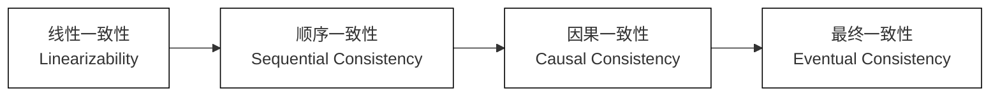
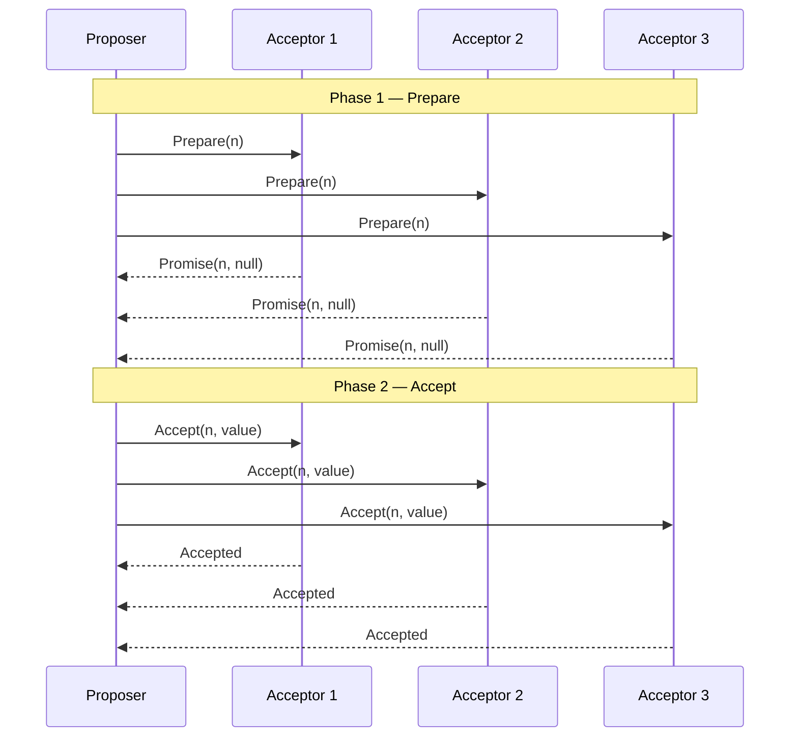

# 理论基石

## CAP 定理

### 背景与提出

- **提出者**：Eric Brewer 于 2000 年 PODC 会议上以猜想形式提出，2002 年由 Gilbert & Lynch 给出严格数学证明。
- **核心命题**：一个分布式系统**不可能同时满足**一致性（C）、可用性（A）、分区容忍性（P）三个属性，**最多只能同时满足其中两个**。

### 三要素精确定义

> C（Consistency，一致性）

- **定义**：所有节点在同一时刻看到的数据完全一致，即对任何客户端，一次成功的读操作必须返回最近一次成功写操作的结果。
- **等价语义**：CAP 语境下的 C 特指**线性一致性（Linearizability）**，是最强的一致性模型。
  - 每次操作都像在单一原子步骤中完成，操作效果对所有节点即时可见。
  - 与 ACID 中的 C（约束不被破坏）**完全不同**，两者不可混淆。
- **反例**：主从异步复制场景下，写入 Master 后立刻从 Slave 读取，可能读到旧数据 → 违反 C。

> A（Availability，可用性）

- **定义**：集群中每个**非故障节点**收到的请求，都必须在有限时间内返回**非错误响应**（不要求返回最新数据）。
- **关键约束**：
  - "有限时间"是核心——无限期等待等价于不可用。
  - 响应可以是旧版本数据，但不能是超时或错误码。
- **反例**：ZooKeeper 在 Leader 重新选举期间（通常 `200ms~30s`）拒绝写请求 → 此阶段违反 A。

> P（Partition Tolerance，分区容忍性）

- **定义**：当网络分区发生（节点间消息任意丢失或延迟）时，系统仍能继续正确运行。
- **网络分区的本质**：
  - 物理层：网线断开、交换机故障、机房网络隔离。
  - 逻辑层：网络延迟过高导致节点互相判定对方宕机（脑裂）。
- **P 为何不可放弃**：
  - 真实网络环境中分区**不可避免**（即使同机房也存在网卡故障、流量风暴等）。
  - 放弃 P 意味着假设网络永远可靠，等价于退化为单机系统，失去分布式意义。
  - **工程结论：P 必须保留，实际的设计抉择只在 C 与 A 之间二选一。**

### CP 与 AP 的工程权衡

**CP 系统**

- **取舍逻辑**：发生网络分区时，优先保证数据一致性，**拒绝服务**（返回错误/超时）而非返回可能过时的数据。
- **典型代表**

  | 系统 | CP 体现 |
  |------|---------|
  | **ZooKeeper** | Leader 选举期间停止写服务；读写均路由至 Leader 保证强一致。 |
  | **etcd** | 基于 Raft，多数派不可达时拒绝写请求。 |
  | **HBase** | RegionServer 宕机时对应 Region 暂时不可读写，等待重新分配。 |
  | **MySQL（半同步）** | 半同步复制超时降级为异步前，主库等待至少一个从库确认。 |

- **适用场景**：金融账务、配置中心、分布式锁、元数据管理——**数据正确性高于一切**。

**AP 系统**

- **取舍逻辑**：发生网络分区时，优先保证服务可用，**允许各分区独立响应**（数据可能不一致），分区恢复后异步合并。
- **典型代表**

  | 系统 | AP 体现 |
  |------|---------|
  | **Cassandra** | 无主架构，节点独立响应，通过 Gossip 协议最终同步。 |
  | **Eureka** | 节点间对等复制，分区期间各自保留本地注册表继续提供发现服务。 |
  | **RocketMQ NameServer** | 节点完全独立，路由信息可能短暂不一致，客户端容错兜底。 |
  | **DNS** | 全球节点缓存解析结果，TTL 期间内数据可能已变更。 |

- **适用场景**：购物车、社交 Feed、缓存层、服务注册发现——**服务持续响应高于数据实时一致**。

### 常见误区

> 误区一：CAP 是绝对的三选二

- **实际情况**：CAP 描述的是**分区发生时**的极端边界条件，并非系统在正常运行时的常态。
- **正常运行时**（无分区）：系统可以同时提供强一致与高可用，只有在**分区发生的瞬间**才必须二选一。
- **推论**：CP 系统不代表"永远牺牲可用性"，仅在分区期间拒绝部分请求；AP 系统不代表"放弃一致性"，而是接受**最终一致**。

> 误区二：CAP 的 C 等于 ACID 的 C

| 维度 | CAP - C | ACID - C |
|------|---------|----------|
| 含义 | 线性一致性（多副本数据强同步） | 约束完整性（数据满足业务规则） |
| 层次 | 分布式副本间的数据一致 | 单库内事务前后的数据合法 |
| 关联 | 描述分布式场景的副本同步问题 | 描述单节点事务的业务约束问题 |

> 误区三：Partition Tolerance 可以"实现"

- P 不是一种"能力"，而是对网络故障的**容忍承诺**。
- 无法消灭网络分区，只能选择分区发生时是保 C 还是保 A。

> 误区四：只有两种选择（CP 或 AP）

- 实际工程中系统往往是**混合型**的：不同接口、不同数据路径有不同的一致性保证。
- 例：MySQL 主从架构，写主库（CP）+ 读从库（AP），按业务场景分流。

### 局限性与演进

- **CAP 的不足**
  - 模型过于简化，只讨论了极端分区场景（二值状态）；未量化"可用性"与"一致性"的程度。
  - 忽略了延迟（Latency）这一关键工程变量——现实中即使不发生分区，一致性与延迟也存在根本矛盾。
- **PACELC 模型（CAP 的延伸）**
  - 由 Daniel Abadi 于 2012 年提出，补充了"无分区时（Else）延迟（Latency）与一致性（Consistency）的权衡"。
  - **完整表达**：`If Partition → (Availability vs Consistency); Else → (Latency vs Consistency)`
  - 例：DynamoDB 选择 PA/EL（分区保 A，正常低延迟优先）；Zookeeper 选择 PC/EC（分区保 C，正常强一致）。
- **工程启示**
  - CAP 给出了方向，但真正的系统设计需要结合 **SLA 目标（RTO/RPO）、业务容忍度、数据类型** 综合决策。
  - 不存在绝对的 CP 或 AP 系统，只有在**特定操作粒度上的一致性与可用性取舍**。

## BASE 理论

### 核心思想

BASE 是对 CAP 中 AP 路线的工程化诠释，是 ACID 强一致约束的对立面。  
核心主张：**以牺牲强一致性换取高可用性**，通过软状态过渡、最终收敛保障系统整体正确性。

### 三要素

> **BA — Basically Available（基本可用）**

- **定义**：系统在发生局部故障（节点宕机、网络分区）时，允许以**降级**方式响应，而非整体不可用。
- **降级的两种形式**：
  1. **响应时间延长**：正常 50ms 的查询，故障时允许延迟至 500ms 返回
  2. **功能裁剪**：电商大促时关闭推荐系统、评价模块等非核心功能，保障核心下单链路
- **关键约束**：降级响应必须是**有意义的非错误结果**，与 CAP 的 A（非故障节点必须响应）含义不同；BA 允许故障节点下线，代价是功能/性能降级。

> **S — Soft State（软状态）**

- **定义**：系统允许数据在副本同步过程中存在**中间过渡状态**，该状态无需外部输入即可随时间自动推进至最终状态。
- **与 ACID 的对比**：ACID 要求事务中间态对外不可见（Isolation）；Soft State 则允许中间态在有限时间窗口内对外暴露。
- **工程体现**：
  - 主从异步复制：写入 Master 后，Slave 延迟同步期间处于软状态
  - 分布式缓存：缓存与数据库之间的短暂不一致（更新传播中）
  - 购物车：客户端本地状态与服务端状态在网络恢复前的差异

> **E — Eventually Consistent（最终一致）**

- **定义**：在**没有新的写入操作**的前提下，系统所有副本的数据将在**有限时间内**收敛至完全一致的状态。
- **精确边界**：
  - "最终"不等于"立即"，收敛时间由网络延迟、副本同步策略决定，通常为毫秒至秒级
  - 收敛条件是**写操作静止**；持续写入场景下系统可能永远处于软状态
- **一致性子变体**（工程中对"最终一致"的加强约束）：
  - **Read-Your-Writes**：写入者自身后续读必定能看到最新值
  - **Monotonic Read**：同一客户端不会读到比上次更旧的版本
  - **Causal Consistency**：具有因果关系的操作在所有节点保序可见

### BASE vs ACID

| 维度 | ACID | BASE |
|---|---|---|
| 一致性要求 | 强一致（事务边界内） | 最终一致 |
| 可用性取向 | 为保一致可拒绝请求 | 优先保可用，容忍短暂不一致 |
| 适用场景 | 关系型数据库、金融交易 | NoSQL、互联网高并发读写 |
| CAP 倾向 | CP | AP |

### 实践映射

- **电商库存**：超卖后补偿（允许短暂数据软状态），而非实时强锁库存
- **消息队列**（RocketMQ / Kafka）：消息最终送达，允许短暂延迟，Broker 故障时降级堆积
- **DNS 解析**：全球节点不同步新记录，TTL 到期后最终一致
- **购物车**：多端异步合并，网络恢复后最终同步

## 一致性模型谱系

### 谱系概览

一致性模型描述分布式系统对客户端读写可见性的承诺规范，从强到弱构成连续谱系。  
越强的模型，实现代价（协调开销、延迟）越高；越弱的模型，系统可获得越高的吞吐与可用性。

### 线性一致性（Linearizability）

- **定义**：所有操作在全局时间轴上存在唯一串行顺序，每个操作在其 `[调用时刻, 响应时刻]` 区间内有一个原子生效点，生效后对所有节点立即可见。
- **关键约束**：全局顺序必须与真实物理时间对齐，后发起的读必须看到先完成的写。
- **工程代价**：所有写需 Leader 或 Quorum 多数派确认；分区时牺牲可用性（CP）。
- **代表系统**

  | 系统 | 线性一致性实现方式 |
  |---|---|
  | **ZooKeeper** | 读写均路由至 Leader；Follower 读需 `sync()` 强制刷新后才能保证线性一致 |
  | **etcd** | 基于 Raft，写操作须经多数派日志提交；读可配置 `serializable`（顺序一致）或 `linearizable`（强读，走 Leader ReadIndex 机制） |
  | **Raft 强读** | Leader 在响应读请求前，需确认自身仍是 Leader（ReadIndex 或 Lease Read 机制），防止脑裂导致返回旧数据 |

### 顺序一致性（Sequential Consistency）

- **定义**：所有操作结果等价于某种全局串行顺序执行；每个进程内操作顺序与程序顺序一致。
- **与线性一致性的差异**：不要求全局顺序与物理时钟对齐——并发操作的全局顺序可任意选定，但所有节点必须看到**同一种顺序**。
- **代表场景**

  | 场景 | 说明 |
  |---|---|
  | **x86 TSO 内存模型** | CPU 保证 Store-Load 有序，同一线程的写对其他线程以顺序一致方式可见 |
  | **Java `volatile`** | 写 volatile 变量 happens-before 后续读，保证可见性与禁止重排序 |
  | **ZooKeeper Follower 读（无 sync）** | 返回本地已提交日志，顺序一致但非线性一致（可能读到稍旧的提交值） |

### 因果一致性（Causal Consistency）

- **定义**：具有 happened-before（因果）关系的操作，在所有节点上必须以相同顺序可见；无因果关系的并发操作可被各节点以任意顺序观察。
- **因果关系来源**：
  1. 同一进程内的程序顺序
  2. 跨进程的读写依赖（B 读到 A 的写结果后发起写，则 A → B 存在因果）
- **工程实现**

  | 机制 | 说明 |
  |---|---|
  | **向量时钟（Vector Clock）** | 每个节点维护一个计数器向量；操作携带依赖的向量时钟，接收节点确认所有依赖已就绪后才执行 |
  | **因果令牌（Causal Token）** | 客户端写入后获得令牌，后续读请求携带令牌路由到已满足因果依赖的副本 |

- **代表系统**

  | 系统 | 实现方式 |
  |---|---|
  | **MongoDB 因果一致性会话** | 客户端 Session 携带 `clusterTime` + `operationTime`，读请求等待副本追上该时间戳后响应 |
  | **Amazon COPS** | 跨数据中心键值存储，基于依赖追踪实现因果一致，写操作附带 `deps` 列表，远端确认依赖后提交 |

### 最终一致性（Eventual Consistency）

- **定义**：写操作静止后，系统所有副本的数据在有限时间内收敛至一致状态；收敛期间不约束中间状态的可见性。
- **精确边界**：
  - 收敛前提是**写操作静止**；持续写入下数据可能永远处于软状态
  - 收敛时间由网络延迟与副本同步策略决定（通常毫秒至秒级）
- **代表系统**

  | 系统 | 实现方式 |
  |---|---|
  | **Cassandra** | 无主架构；写入任意节点后通过 Gossip 协议向其他节点扩散；Read Repair 在读时触发副本修复 |
  | **DynamoDB** | 基于向量时钟检测冲突，应用层或 Last-Write-Wins 策略解决冲突 |
  | **DNS** | 全球分布式缓存，变更通过权威服务器逐级扩散；TTL 决定最长不一致窗口 |
  | **RocketMQ NameServer** | 节点完全独立，Broker 心跳各自上报；节点间路由信息可能短暂不一致，客户端重试容错兜底 |

### 读写一致性变体（工程常用）

最终一致性基础上的针对性加强，解决单客户端读写直觉问题：

| 模型 | 承诺 | 典型场景 | 常见实现 |
|---|---|---|---|
| **Read-Your-Writes** | 写入者自身后续读必定能看到最新值 | 修改头像立刻刷新主页 | 写主读主 / Session 携带写版本号，路由至已同步副本 |
| **Monotonic Read** | 同一客户端不会读到比上次更旧的版本 | 防止刷新后内容条数回退 | Session 粘性（Sticky Session）/ 客户端记录读时间戳，过滤落后副本 |
| **Session Consistency** | 同一 Session 内同时保证以上两者 | 读写分离架构的会话一致性 | Session 绑定副本版本号；写后短暂将读路由回主库 |

> Read-Your-Writes ∩ Monotonic Read = Session Consistency

# 分布式协调

## Paxos 协议

### 核心问题

在节点可宕机、消息可丢失的异步网络中，让多个节点就**某一个值**达成不可撤销的共识。  
Paxos 是分布式共识问题的理论基础，选主、日志复制、配置变更均以此为底层模型。

**关键概念**

- **提案（Proposal）**：格式为 `(n, value)`；`n` 是全局单调递增的提案编号，用于排序和抢占；`value` 是业务层实际写入内容（如 Leader ID、日志条目、配置项），Paxos 本身不关心其语义
- **共识（Consensus）**：超过半数（N/2 + 1）的 Acceptor 接受了同一个 `value`，该值即为共识结果，此后不可撤销、不可替换

### 角色模型

- **Proposer（提议者）**：发起提案，驱动两阶段流程；任意节点均可成为 Proposer，并发 Proposer 之间通过提案编号竞争
- **Acceptor（接受者）**：投票仲裁方，需持久化「已承诺的最大提案编号」与「已接受的提案」；多数派节点构成法定人数（Quorum）
- **Learner（学习者）**：被动获取已达成共识的 value，不参与投票（如只读副本、状态机执行者）

### 两阶段流程（Basic Paxos）

**Phase 1 — Prepare**

1. Proposer 选取一个全局唯一且比已知最大编号更大的 `n`，向所有 Acceptor 广播 `Prepare(n)`
2. Acceptor 收到请求后检查 `n`：
   - 若 `n` ≤ 自身已承诺的最大编号 → **拒绝**，不回复（或回复 Reject）
   - 若 `n` > 自身已承诺的最大编号 → **更新承诺**，回复 `Promise(n, 已接受的最高编号提案值)`，此后拒绝所有编号 < n 的提案
3. Proposer 等待多数派 Promise 响应；未达多数派则放弃，以更大的 `n` 重试

**Phase 2 — Accept**

1. Proposer 汇总所有 Promise 返回的历史接受值：
   - 若存在历史值 → 取编号最大的那个 value（**必须沿用，不可自定**）
   - 若无历史值 → 使用自身希望写入的 value
2. Proposer 广播 `Accept(n, value)` 给所有 Acceptor
3. Acceptor 收到请求后检查 `n`：
   - 若此后未承诺过更大的编号 → 接受并持久化 `(n, value)`，回复 `Accepted`
   - 若已承诺过更大的编号 → **拒绝**
4. Proposer 收到多数派 `Accepted` → 共识达成，通知所有 Learner

**Prepare/Promise 的双重作用**
- **抢占封锁**：以更大的 `n` 覆盖旧承诺，使所有编号 < n 的旧提案永久失效，防止宕机 Proposer 复活后写入脏值
- **状态移交**：Promise 携带历史接受值，使新 Proposer 能发现并延续可能已达成的旧共识，保证所有节点最终收敛到同一个 value

### 局限性

- **活锁（Livelock）**：多个 Proposer 并发时互相用更大编号打断对方，共识永远无法推进；实践中通过随机退避或强制 Leader 选举规避
- **单值局限**：Basic Paxos 仅解决单次共识；日志复制场景需 Multi-Paxos（稳定 Leader 期间跳过 Phase 1，直接 Phase 2，大幅降低往返延迟）
- **工程不完整**：原始论文未规范成员变更、日志压缩等工程细节，落地复杂度极高；Raft 协议正是为填补此缺口而设计

## Raft 协议

### 设计目标

以**强 Leader 模型**将分布式共识问题分解为三个独立子问题，在保证与 Paxos 等价安全性的前提下最大化工程可理解性。  
所有写请求必须经由 Leader，由 Leader 单点决定日志顺序后复制至 Follower。

### 关键术语

| 术语 | 含义 |
|---|---|
| **Term（任期）** | 全局单调递增的逻辑时钟，每次选举开启新 Term；节点发现对方 Term 更大时立即降级为 Follower，用于识别并丢弃过期消息 |
| **Log Entry（日志条目）** | 由 Leader 写入的最小操作单元，包含 `index`（在日志中的位置）、`term`（写入时的 Term）、`command`（业务命令）三个字段 |
| **commitIndex** | Leader 已知的最高已提交日志索引；日志条目提交 = 被多数派持久化，状态机可据此执行 |
| **lastApplied** | 已被状态机实际执行（apply）的最高日志索引；`lastApplied ≤ commitIndex` 恒成立 |
| **nextIndex** | Leader 维护的每个 Follower 视图：下一条待发送给该 Follower 的日志索引；初始为 Leader 日志末尾 + 1，冲突时递减 |
| **matchIndex** | Leader 维护的每个 Follower 视图：已确认与 Leader 日志完全匹配的最高索引；用于计算多数派提交点 |
| **AppendEntries RPC** | Leader 向 Follower 发送的核心 RPC，兼具两种用途：携带日志条目时为日志复制请求；不携带条目时为心跳（维持 Leader 权威、重置选举计时器） |
| **RequestVote RPC** | Candidate 发起选举时广播的投票请求，携带自身 Term、最后一条日志的 `index` 和 `term`，用于让其他节点评估其日志新旧程度 |
| **election timeout** | Follower 等待 Leader 心跳的随机超时时间（通常 150~300ms）；超时后转为 Candidate 发起选举；随机化可减少多节点同时超时 |

### 核心角色

- **Leader**：唯一处理客户端写请求；负责日志复制；定期广播心跳维持权威；每个 Term 至多一个
- **Follower**：被动接收 Leader 的日志与心跳；election timeout 到期后转为 Candidate
- **Candidate**：发起选举，向全集群广播 RequestVote；获多数派票后晋升 Leader

### 三大子问题

> **Leader Election（领导选举）**

- **触发条件**：Follower 在 election timeout 内未收到任何 AppendEntries（包括心跳），转为 Candidate
- **选举流程**：
  1. Candidate 自增 Term，广播 `RequestVote(term, lastLogIndex, lastLogTerm)`
  2. 收到请求的节点投票需同时满足：
     - 该 Term 内尚未投票给其他节点
     - Candidate 日志不旧于自身：`lastLogTerm` 更大，或 Term 相同且 `lastLogIndex` ≥ 自身
  3. Candidate 收到多数派票 → 成为 Leader，立即广播心跳压制其他选举
  4. 未达多数派 → 等待下次 election timeout，以更大的 Term 重新发起

> **Log Replication（日志复制）**

- **正常写入流程**：
  1. Leader 将客户端请求封装为 Log Entry，追加到本地日志（未提交状态）
  2. 并发向所有 Follower 广播 AppendEntries
  3. 多数派 Follower 持久化并回复成功 → Leader 推进 `commitIndex`，向客户端响应
  4. 后续 AppendEntries（含心跳）携带最新 `leaderCommit`，Follower 将 `lastApplied` 推进至 `min(leaderCommit, 本地最后索引)`，驱动状态机执行

- **AppendEntries 一致性检查字段**：
  - `prevLogIndex`：本次追加的前一条日志的索引；Follower 需在此处存在日志才能接受新条目
  - `prevLogTerm`：`prevLogIndex` 处日志的 Term 编号；与 `prevLogIndex` 共同验证双方日志在该位置的内容一致
  - `entries[]`：本次要复制的日志条目数组；心跳时为空数组
  - `leaderCommit`：Leader 当前的 `commitIndex`，通知 Follower 可以提交到哪里

- **冲突修复流程**：
  - Follower 检查自身 `prevLogIndex` 处的 Term 与 `prevLogTerm` 不符 → 拒绝并回报冲突索引
  - Leader 收到拒绝 → 递减该 Follower 的 `nextIndex` 重试，找到双方共同的日志前缀
  - 从分歧点起，Leader 日志强制覆盖 Follower 的不一致条目

> **Safety（安全性保障）**

- **选举限制**：Candidate 日志必须不旧于多数派才能赢得选举
  - 保证新 Leader 的日志包含所有已提交条目，不会覆盖已提交值
- **提交限制**：Leader 只主动提交**当前 Term** 的日志条目
  - 前任 Term 遗留的未提交条目随当前 Term 新条目一起被间接提交，避免"幽灵提交"问题

### 日志压缩（Snapshot）

- 各节点独立对已提交日志做快照，丢弃快照点之前的全部日志，防止日志无限增长
- 快照记录状态机的完整状态及快照点的 `lastIncludedIndex`（快照覆盖的最后日志索引）和 `lastIncludedTerm`
- 新节点或严重落后的节点通过 `InstallSnapshot` RPC 直接接收快照，跳过逐条日志回放

### 工程落地

| 系统 | Raft 应用方式 |
|---|---|
| **etcd** | 核心共识层，Kubernetes 所有集群状态存储的基础 |
| **TiKV** | Multi-Raft，每个 Region（96MB 数据分片）独立运行一个 Raft 组 |
| **CockroachDB** | 基于 Raft 实现跨节点强一致副本复制 |
| **Consul** | 用于服务注册中心的 Leader 选举与配置一致性 |
