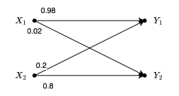
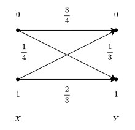

# 自信息与信息熵

## 离散信息的自信息量

- **定义**：又称为非平均自信息量。它是指离散信源符号集合 $X$ 中的某一个符号 $x_i$ 作为一条消息发出时对外提供的信息量。

- **公式**
  $$
  I(x_i)=-\log_2p(x_i)=\log_2\left[\frac{1}{p(x_i)}\right]
  $$
  其中 $p(x_i)$ 为 $x_i$ 出现的概率。

- **示例**

  抛掷一枚材质均匀的硬币，记“出现正面”为事件 $A$。

  1. 求事件 $A$ 发生的概率 $P(A)$；
     $$
     P(A)=\frac{1}{2}
     $$

  2. 求收到“硬币正面朝上”这一消息时所获得的自信息量 $I(A)$。

     根据
     $$
     I(x)=-\log_2P(x)
     $$
     得到
     $$
     I(A)=-\log_2P(A)=-\log_2\frac{1}{2}=1\text{bit}
     $$

- **结论**

  概率越小，事件越罕见，发生的自信息量（带来的信息冲击 / 消除的不确定度）就越大。

## 离散信源的信息熵

- **定义**：信源所有可能发出事件自信息量的**数学期望**（平均自信息量），代表信源的**平均不确定度**。

- **公式**
  $$
  H(X)=E[I(X)]=-\sum_{i=1}^nP(x_i)\log_2P(x_i)
  $$

- **示例**

  1. 设离散信源中有 26 个英文字母，每个字母以等概率出现，求信源熵；

     由各字母以等概率出现可知
     $$
     P(x_i)=\frac{1}{26}
     $$
     所以
     $$
     H(X)=-\sum_{i=1}^{26}\frac{1}{26}\log_2\frac{1}{26}=\log_226\approx4.7\text{bit}/符号
     $$

  2. 设信源 $X$ 只有两个符号 $x_1,\ x_2$，各符号的出现概率分别为 $P(x_1)=q,\ P(x_2)=1-q$，求信源熵。

     代入公式得到
     $$
     H(X)=-q\log_2q-(1-q)\log_2(1-q)\text{bit}/符号
     $$

# 条件熵

## 特定情况

- **定义**：在已知**某个具体条件** $Y=y_j$ 发生的条件下，$X$ 的平均不确定度。

- **公式**
  $$
  H(X|Y=y_i)=-\sum_iP(x_i|y_i)\log_2P(x_i|y_i)
  $$

## 总体

- **定义**：已知随机变量 $Y$ 的情况下，对 $X$ 的平均不确定度。

- **公式**
  $$
  H(X|Y)=\sum_jP(y_j)H(X|Y=y_j)=-\sum_i\sum_jP(x_i,y_j)\log_2P(x_i|y_j)
  $$

> 示例1

假设天气 $X \in \{\text{晴天}(x_1), \text{雨天}(x_2)\}$，出门方式 $Y \in \{\text{步行}(y_1), \text{乘车}(y_2)\}$。已知具体概率如下：

- **边缘概率**：$P(Y=y_1) = 0.6$（步行概率），$P(Y=y_2) = 0.4$（乘车概率）
- **后验条件概率**：
  - 若选择**步行 ($Y=y_1$)**：天气为晴天的概率 $P(x_1\vert{}y_1) = 0.5$，雨天的概率 $P(x_2\vert{}y_1) = 0.5$
  - 若选择**乘车 ($Y=y_2$)**：天气为晴天的概率 $P(x_1\vert{}y_2) = 0.25$，雨天的概率 $P(x_2\vert{}y_2) = 0.75$

1. 已知某人今天选择**步行 ($Y=y_1$)**，求天气的平均不确定度；

   代入公式
   $$
   \begin{aligned}
   H(X|Y=y_1)&=-\sum_iP(x_i|y_1)\log_2P(x_i|y_1) \\
   &=-P(x_1|y_1)\log_2P(x_1|y_1)-P(x_2|y_1)\log_2P(x_2|y_1) \\
   &=\frac{1}{2}\log_22+\frac{1}{2}\log_22 \\
   &=1\text{bit}
   \end{aligned}
   $$

2. 在已知出门方式 $Y$ 的情况下，求天气的平均不确定度。

   若选择乘车
   $$
   \begin{aligned}
   H(X|Y=y_2)&=-P(x_1|y_2)\log_2P(x_1|y_2)-P(x_2|y_2)\log_2P(x_2|y_2) \\
   &=\frac{1}{4}\log_24+\frac{3}{4}\log_2\frac{4}{3} \\
   &=0.811\text{bit}
   \end{aligned}
   $$
   现利用边缘概率 $P(Y)$ 加权求总体条件熵
   $$
   H(X|Y)=P(y_1)H(X|Y=y_1)+P(y_2)H(X|Y=y_2)
   $$
   可得
   $$
   H(X|Y)=0.6\times1+0.4\times0.811=0.9244\text{bit}
   $$

# 联合熵

- **定义**：同时观察两个随机变量 $(X, Y)$ 时得到的平均信息量（总体平均不确定度）。

- **公式**
  $$
  H(XY)=-\sum_i\sum_jP(x_iy_j)\log_2P(x_iy_j)
  $$

- **性质**

  1. 一般情况
     $$
     H(XY)=H(X)+H(Y|X)=H(Y)+H(X|Y)
     $$

  2. 特殊情况

     当 $X$ 与 $Y$ 独立时，有
     $$
     H(XY)=H(X)+H(Y)
     $$
     此时信息具有可加性。

# 互信息

## 单点互信息量

- **定义**：收到特定事件 $Y=y_j$ 时，为特定发送事件 $X=x_i$ 所提供的互信息量。

- **公式**
  $$
  I(x_i; y_j) = \log_2 \frac{P(y_j\vert{}x_i)}{P(y_j)} = \log_2 \frac{P(x_i\vert{}y_j)}{P(x_i)}
  $$

## 半平均互信息量

- **定义**：收到**特定符号** $Y=y_j$ 时，关于整个信源 $X$ 所提供的平均不确定度消除量（以后验概率为权值加权平均）。

- **公式**
  $$
  I(X;y_j)=\sum_iP(x_i|y_j)I(x_i;y_j)=\sum_iP(x_i|y_j)\log_2\frac{P(y_j|x_i)}{P(y_j)}
  $$

## 平均互信息量

- **定义**：从整个信道接收端观察到的关于发送端的平均信息量。

- **公式**
  $$
  I(X;Y)=H(X)-H(X|Y)=H(Y)-H(Y|X)=H(X)+H(Y)-H(XY)
  $$

> 示例2

已知信源 $X$ 中含有两个符号 $x_1$ 和 $x_2$，两个符号以等概率出现，且通过以下信道进行传递，求平均互信息量 $I(X;Y),\ H(X|Y)$ 与 $H(Y|X)$。

1. $H(X|Y)$

   先求出 $H(X|Y=y_1)$：

   已知
   $$
   P(y_1)=P(x_1y_1)+P(x_2y_1)=0.5\times0.98+0.5\times0.2=0.59
   $$
   所以
   $$
   \begin{aligned}
   P(x_1|y_1)&=\frac{0.5\times0.98}{0.59}=\frac{49}{59} \\\\
   P(x_2|y_1)&=\frac{0.5\times0.2}{0.59}=\frac{10}{59}
   \end{aligned}
   $$
   由此可得
   $$
   \begin{aligned}
   H(X|Y=y_1)&=-P(x_1|y_1)\log_2P(x_1|y_1)-P(x_2|y_1)\log_2P(x_2|y_1) \\
   &=\frac{49}{59}\log_2\frac{59}{49}+\frac{10}{59}\log_2\frac{59}{10} \\
   &=0.223+0.434 \\
   &=0.657\text{bit/符号}
   \end{aligned}
   $$
   再求出 $H(X|Y=y_2)$：

   已知
   $$
   P(y_2)=P(x_1y_2)+P(x_2y_2)=0.5\times0.02+0.5\times0.8=0.41
   $$
   所以
   $$
   \begin{aligned}
   P(x_1|y_2)&=\frac{0.5\times0.02}{0.41}=\frac{1}{41} \\\\
   P(x_2|y_2)&=\frac{0.5\times0.8}{0.41}=\frac{40}{41}
   \end{aligned}
   $$
   由此可得
   $$
   \begin{aligned}
   H(X|Y=y_2)&=-P(x_1|y_2)\log_2P(x_1|y_2)-P(x_2|y_2)\log_2P(x_2|y_2) \\
   &=\frac{1}{41}\log_241+\frac{40}{41}\log_2\frac{41}{40} \\
   &=0.131+0.035 \\
   &=0.166\text{bit/符号}
   \end{aligned}
   $$
   所以
   $$
   \begin{aligned}
   H(X|Y)&=P(y_1)H(X|Y=y_1)+P(y_2)H(X|Y=y_2) \\
   &=0.59\times0.657+0.41\times0.166 \\
   &=0.456\text{bit/符号}
   \end{aligned}
   $$

2. $I(X;Y)$

   由于
   $$
   I(X;Y)=H(X)-H(X|Y)
   $$
   又因为
   $$
   H(X)=2\times\frac{1}{2}\log_22=1\text{bit/符号}
   $$
   所以
   $$
   I(X;Y)=1-0.456=0.544\text{bit/符号}
   $$

3. $H(Y|X)$

   因为
   $$
   I(X;Y)=H(Y)-H(Y|X)
   $$
   所以有
   $$
   H(Y|X)=H(Y)-I(X;Y)
   $$
   又因为
   $$
   \begin{aligned}
   H(Y)&=-P(y_1)\log_2P(y_1)-P(y_2)\log_2P(y_2) \\
   &=-0.59\log_20.59-0.41\log_20.41 \\
   &=0.977\text{bit/符号}
   \end{aligned}
   $$
   最终可得
   $$
   H(Y|X)=0.977-0.544=0.433\text{bit/符号}
   $$

# 课后习题

## 1-1

同时投掷两个正常的骰子（即每个点数的概率都是 $\frac{1}{6}$），令 $X$ 为两个点数之和，求：

1. $X$ 的概率空间；

   两个正常骰子的点数和 $X$ 的取值范围是从 $2$ 到 $12$，总基本事件数为 $6 \times 6 = 36$ 种。各项对应的组合数与概率如下：

   - $X = 2$: $(1,1)$，共 $1$ 种，$P(X=2) = \frac{1}{36}$

   - $X = 3$: $(1,2), (2,1)$，共 $2$ 种，$P(X=3) = \frac{2}{36} = \frac{1}{18}$

   - $X = 4$: $(1,3), (2,2), (3,1)$，共 $3$ 种，$P(X=4) = \frac{3}{36} = \frac{1}{12}$

   - $X = 5$: $(1,4), (2,3), (3,2), (4,1)$，共 $4$ 种，$P(X=5) = \frac{4}{36} = \frac{1}{9}$

   - $X = 6$: $(1,5), (2,4), (3,3), (4,2), (5,1)$，共 $5$ 种，$P(X=6) = \frac{5}{36}$

   - $X = 7$: $(1,6), (2,5), (3,4), (4,3), (5,2), (6,1)$，共 $6$ 种，$P(X=7) = \frac{6}{36} = \frac{1}{6}$

   - $X = 8$: $(2,6), (3,5), (4,4), (5,3), (6,2)$，共 $5$ 种，$P(X=8) = \frac{5}{36}$

   - $X = 9$: $(3,6), (4,5), (5,4), (6,3)$，共 $4$ 种，$P(X=9) = \frac{4}{36} = \frac{1}{9}$

   - $X = 10$: $(4,6), (5,5), (6,4)$，共 $3$ 种，$P(X=10) = \frac{3}{36} = \frac{1}{12}$

   - $X = 11$: $(5,6), (6,5)$，共 $2$ 种，$P(X=11) = \frac{2}{36} = \frac{1}{18}$

   - $X = 12$: $(6,6)$，共 $1$ 种，$P(X=12) = \frac{1}{36}$

   因此，$X$ 的概率空间可表示为矩阵形式：
   $$
   X = \begin{pmatrix} 2 & 3 & 4 & 5 & 6 & 7 & 8 & 9 & 10 & 11 & 12 \\ \frac{1}{36} & \frac{1}{18} & \frac{1}{12} & \frac{1}{9} & \frac{5}{36} & \frac{1}{6} & \frac{5}{36} & \frac{1}{9} & \frac{1}{12} & \frac{1}{18} & \frac{1}{36} \end{pmatrix}
   $$

2. 消息 $X=4$ 和 $X=6$ 的自信息；

   根据
   $$
   I(x)=-\log_2P(x)
   $$
   对于 $X=4$
   $$
   I(X=4) = -\log_2 \left(\frac{1}{12}\right) = \log_2 12 \approx 3.585 \text{ bit}
   $$
   对于 $X=6$
   $$
   I(X=6)=-\log_2\left(\frac{5}{36}\right)\approx2.848\ \text{bit}
   $$

3. $X$ 的熵。

   根据
   $$
   H(X)=-\sum P(x)\log_2P(x)
   $$
   利用概率的对称性逐项计算：

   - $X=2, 12$: $2 \times \left(\frac{1}{36} \log_2 36\right) \approx 0.2872 \text{ bit}$
   - $X=3, 11$: $2 \times \left(\frac{1}{18} \log_2 18\right) \approx 0.4633 \text{ bit}$
   - $X=4, 10$: $2 \times \left(\frac{1}{12} \log_2 12\right) \approx 0.5975 \text{ bit}$
   - $X=5, 9$: $2 \times \left(\frac{1}{9} \log_2 9\right) \approx 0.7044 \text{ bit}$
   - $X=6, 8$: $2 \times \left(\frac{5}{36} \log_2 \frac{36}{5}\right) \approx 0.7911 \text{ bit}$
   - $X=7$: $\frac{1}{6} \log_2 6 \approx 0.4308 \text{ bit}$

   求和得信源熵
   $$
   H(X) = 0.2872 + 0.4633 + 0.5975 + 0.7044 + 0.7911 + 0.4308 = 3.2743 \text{ bit}
   $$

## 1-2

瓮 1 中有 5 个白球，7 个黑球。瓮 2 中有 3 个白球，12 个黑球。我们抛掷一枚有偏差的硬币，得到正面的概率为 0.6，反面的概率为 0.4。如果得到的结果是正面，就从瓮 1 中取一个球，而如果结果是反面，就从瓮 2 中取一个球。（定义 $X=\{H,T\}$ 为抛硬币正反的消息，$Y=\{B,W\}$ 为取出球的颜色为黑白的消息）

1. 假设已知当前选取的球是白球，试求对于抛硬币结果的平均不确定度是多少？

   等价于求 $H(X|Y=W)$。

   先求出 $P(Y=W)$
   $$
   \begin{aligned}
   P(Y=W)&=P(X=H,Y=W)+P(X=T,Y=W) \\
   &=0.6\times\frac{5}{12}+0.4\times\frac{1}{5} \\
   &=0.33
   \end{aligned}
   $$
   由此可以得到
   $$
   \begin{aligned}
   P(X=T|Y=W)&=\frac{0.25}{0.33}=\frac{25}{33} \\\\
   P(X=H|Y=W)&=\frac{0.08}{0.33}=\frac{8}{33}
   \end{aligned}
   $$
   代入
   $$
   H(X|Y=W)=-\sum P(X|Y=W)\log_2P(X|Y=W)
   $$
   可得
   $$
   H(X|Y=W)=\frac{25}{33}\log_2\frac{33}{25}+\frac{8}{33}\log_2\frac{33}{8}\approx0.799\text{bit}
   $$

2. 如果已知是黑球，抛硬币结果的平均不确定度是多少？

   等价于求 $H(X|Y=B)$。

   先求出 $P(Y=B)$
   $$
   \begin{aligned}
   P(Y=B)&=P(X=H,Y=B)+P(X=T,Y=B) \\
   &=0.6\times\frac{7}{12}+0.4\times\frac{4}{5} \\ 
   &=0.67
   \end{aligned}
   $$
   由此可以得到
   $$
   \begin{aligned}
   P(X=H|Y=B)&=\frac{0.35}{0.67}=\frac{35}{67} \\\\
   P(X=T|Y=B)&=\frac{0.32}{0.67}=\frac{32}{67}
   \end{aligned}
   $$
   代入
   $$
   H(X|Y=B)=-\sum P(X|Y=B)\log_2P(X|Y=B)
   $$
   可得
   $$
   H(X|Y=B)=\frac{35}{67}\log_2\frac{67}{35}+\frac{32}{67}\log_2\frac{67}{32}\approx0.999\text{bit}
   $$

3. 已知球颜色的情况下，计算抛硬币结果的平均不确定度。

   等价于求 $H(X|Y)$。

   代入
   $$
   H(X|Y)=P(Y=W)H(X|Y=W)+P(Y=B)H(X|Y=B)
   $$
   最终得到
   $$
   H(X|Y)=0.33\times0.799+0.67\times0.999=0.933\text{bit}
   $$

## 1-3

设两个试验 $X$ 和 $Y$，$X=\{x_1,x_2,x_3\},\ Y=\{y_1,y_2,y_3\}$，联合概率 $p(x_i,y_j)=p_{ij}$ 为
$$
\left(
\begin{array}{}
p_{11} & p_{12} & p_{13} \\
p_{21} & p_{22} & p_{23} \\
p_{31} & p_{32} & p_{33}
\end{array}
\right)=
\left(
\begin{array}{}
\frac{1}{4} & \frac{1}{12} & 0 \\
\frac{1}{12} & \frac{5}{24} & \frac{1}{24} \\
0 & \frac{5}{18} & \frac{1}{18}
\end{array}
\right)
$$

1. 如果得知 $X$ 和 $Y$ 的结果，得到的平均信息量是多少？
   $$
   \begin{aligned}
   H(XY)&=\frac{1}{4}\log_24+2\times\frac{1}{12}\log_212+\frac{5}{24}\log_2\frac{24}{5}+\frac{1}{24}\log_224+\frac{5}{18}\log_2\frac{18}{5}+\frac{1}{18}\log_218 \\
   &=2.505\text{bit}
   \end{aligned}
   $$

2. 得知 $Y$ 的结果获得的平均信息量是多少？

   已知
   $$
   \begin{aligned}
   P(Y=1)&=\frac{1}{4}+\frac{1}{12}=\frac{1}{3} \\\\
   P(Y=2)&=\frac{1}{12}+\frac{5}{24}+\frac{5}{18}=\frac{41}{72} \\\\
   P(Y=3)&=\frac{1}{24}+\frac{1}{18}=\frac{7}{72}
   \end{aligned}
   $$
   所以
   $$
   H(Y)=\frac{1}{3}\log_23+\frac{41}{72}\log_2\frac{72}{41}+\frac{7}{72}\log_2\frac{72}{7}\approx1.318\text{bit}
   $$

3. 在已经得知 $Y$ 的试验结果的情况下，给出 $X$ 的实验结果，得到的平均信息量是多少？

   等价于求 $H(X|Y)$。

   因为
   $$
   H(X|Y)+H(Y)=H(XY)
   $$
   所以
   $$
   \begin{aligned}
   H(X|Y)&=H(XY)-H(Y) \\
   &=2.505-1.318 \\
   &=1.187\text{bit}
   \end{aligned}
   $$

## 1-4

一个二进制信道的输入符号概率分布 $P(X=0)=0.4,\ P(X=1)=0,6$，信道转移特性如下图所示。

求：

1. 输出 $Y$ 的熵 $H(Y)$；

   由特性图可知
   $$
   P(Y=0)=0.4\times\frac{3}{4}+0.6\times\frac{1}{3}=0.5  \\\\
   P(Y=1)=0.4\times\frac{1}{4}+0.6\times\frac{2}{3}=0.5
   $$
   所以
   $$
   H(Y)=2\times\frac{1}{2}\log_22=1\text{bit}
   $$

2. $H(Y|X),\ H(X|Y),\ H(XY)$；

   对于 $H(X|Y)$：
   $$
   P(X=0|Y=0)=\frac{0.3}{0.5}=\frac{3}{5} \\
   P(X=1|Y=0)=\frac{0.2}{0.5}=\frac{2}{5} \\\\
   \Rightarrow H(X|Y=0)=\frac{3}{5}\log_2\frac{5}{3}+\frac{2}{5}\log_2\frac{5}{2}\approx0.971\text{bit} \\\\
   P(X=0|Y=1)=\frac{0.1}{0.5}=\frac{1}{5} \\
   P(X=1|Y=1)=\frac{0.4}{0.5}=\frac{4}{5} \\\\
   \Rightarrow H(X|Y=1)=\frac{1}{5}\log_25+\frac{4}{5}\log_2\frac{5}{4}\approx0.722\text{bit}
   $$
   所以可得
   $$
   \begin{aligned}
   H(X|Y)&=P(Y=0)H(X|Y=0)+P(Y=1)H(X|Y=1) \\
   &=0.5\times0.971+0.5\times0.722 \\
   &=0.847\text{bit}
   \end{aligned}
   $$
   且
   $$
   H(XY)=H(X|Y)+H(Y)=0.847+1=1.847\text{bit}
   $$
   又因为
   $$
   H(XY)=H(Y|X)+H(X)\Rightarrow H(Y|X)=H(XY)-H(X)
   $$
   对于 $H(X)$，有
   $$
   H(X)=\frac{2}{5}\log_2\frac{5}{2}+\frac{3}{5}\log_2\frac{5}{3}\approx0.971\text{bit}
   $$
   所以
   $$
   H(Y|X)=1.847-0.971=0.876\text{bit}
   $$

3. 收到符号 $Y=0$ 对于发送符号为 $X=1$ 提供的互信息 $I(X=1; Y=0)$；

   代入
   $$
   I(X=1; Y=0)=\log_2\left[\frac{P(X=1|Y=0)}{P(X=1)}\right]
   $$
   可得
   $$
   I(X=1; Y=0)=\log_2\frac{\frac{2}{5}}{\frac{3}{5}}=\log_2\frac{2}{3}\approx-0.585\text{bit}
   $$

4. 收到符号 $Y=0$，求该消息所提供关于 $X$ 的平均互信息量 $I(X;Y=0)$；

   求出
   $$
   I(X=0;Y=0)=\log_2\left[\frac{P(X=0|Y=0)}{P(X=0)}\right]=\log_2\frac{3}{2}\approx0.585\text{bit}
   $$
   可得
   $$
   \begin{aligned}
   I(X;Y=0)&=P(X=0|Y=0)I(X=0;Y=0)+P(X=1|Y=0)I(X=1;Y=0) \\
   &=0.6\times0.585-0.4\times0.585 \\
   &=0.117\text{bit}
   \end{aligned}
   $$

5. 平均互信息 $I(X;Y)$；
   $$
   \begin{aligned}
   I(X;Y)&=H(X)+H(Y)-H(XY) \\
   &=0.971+1-1.847 \\
   &=0.124\text{bit}
   \end{aligned}
   $$
   

