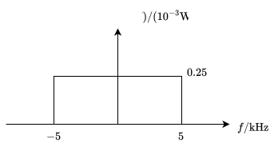

# 线性调制系统的抗噪声性能

1. **窄带噪声功率**

   若为**单边功率谱密度** $n_0$，带通滤波器是高度为 1、宽度为 $B$ 的理想矩形函数，则
   $$
   N_i=n_0B
   $$
   若为**双边功率谱密度 $\frac{N_0}{2}$**，带通滤波器是高度为 1、宽度为 $B$ 的理想矩形函数，则
   $$
   N_i=\frac{N_0}{2}\cdot2B=N_0B=P_n(f)\cdot2B
   $$

2. **解调器输入输出信噪比**

   - **输出信噪比**
     $$
     \frac{S_o}{N_o}=\frac{解调器输出有用信号的平均功率}{解调器输出噪声的平均功率}
     $$

   - **输入信噪比**
     $$
     \frac{S_i}{N_i}=\frac{解调器输入已调信号的平均功率}{解调器输入噪声的平均功率}
     $$

3. **制度增益**
   $$
   G=\frac{S_o/N_o}{S_i/N_i}
   $$

# 幅度调制原理

幅度调制是用调制信号 $m(t)$ 去控制高频载波 $c(t) = A_c \cos(\omega_c t)$ 的振幅。

## AM 调制

- **表达式**
  $$
  s_{AM}(t) = [A_0 + m(t)] \cos(\omega_c t)
  $$

- **频谱特征**：包含载波分量（$\omega_c$）以及上、下两个边带（$\omega_c + \omega_m, \omega_c - \omega_m$）

- **带宽**
  $$
  B_{AM} = 2f_m
  $$
  

  其中 $f_m$ 为基带信号最高频率。

- **功率**

  调制信号 $m(t)$ 的平均功率为
  $$
  P_m = \overline{m^2(t)}
  $$
  AM 信号的总平均功率 $P_{AM}$ 由两部分组成：
  $$
  P_{AM} = P_c + P_s
  $$

  - **载波功率 $P_c$**：纯载波分量所占有的功率。
    $$
    P_c = \frac{A_0^2}{2}
    $$

  - **边带功率 $P_s$**：携带调制信号信息的上、下两个边带的总功率。
    $$
    P_s = \frac{P_m}{2} = \frac{\overline{m^2(t)}}{2}
    $$

  - **调制效率 $\eta_{AM}$**
    $$
    \eta_{AM}=\frac{P_s}{P_{AM}}
    $$

- **解调**

  **只能使用包络检波解调。**

  在**大信噪比**条件下，有
  $$
  \begin{aligned}
  N_o&=N_i=n_0B_{AM}=P_n(f)\cdot2B_{AM} \\\\
  S_i&=P_{AM}=P_c+P_s \\\\
  S_o&=2P_s
  \end{aligned}
  $$

> 示例1

设某信道具有均匀的双边噪声功率谱密度 $P_n(f)=0.5\times10^{-3}\text{W/Hz}$，在该信道中传输**振幅调制信号**，并设调制信号 $m(t)$ 的频带限制于 5kHz，载频是 100kHz，边带功率为 10kW，载波功率为 40kW。若接收机的输入信号先经过一个合适的理想带通滤波器，然后再加至包络检波器进行解调。试求：

1. 解调器输入端的信噪功率比；

   因为
   $$
   S_i=P_c+P_s=50\text{kW}
   $$
   且
   $$
   B_{AM}=2\times5\times10^3=10\text{kHz}
   $$
   所以
   $$
   N_i=P_n(f)\cdot 2B_{AM}=0.5\times10^{-3}\times2\times10\times10^{3}=10\text{W}
   $$
   由此可得
   $$
   \frac{S_i}{N_i}=\frac{50\times10^3}{10}=5000
   $$

2. 解调器输出端的信噪功率比；

   因为
   $$
   S_o=2P_s=20\text{kW}
   $$
   又因为
   $$
   N_o=N_i=10\text{W}
   $$
   所以
   $$
   \frac{S_o}{N_o}=\frac{20\times10^3}{10}=2000
   $$

3. 制度增益 $G$。
   $$
   G=\frac{S_o/N_o}{S_i/N_i}=\frac{2}{5}
   $$

## DSB 调制

- **表达式**
  $$
  s_{DSB}(t) = m(t) \cos(\omega_c t)
  $$

- **频谱特征**：由上边带（USB）**和**下边带（LSB）对称组成，分别位于 $\pm \omega_c$ 两侧；无直流载波分量。

- **带宽**
  $$
  B_{DSB}=2f_m
  $$

- **功率**

  DSB 信号的平均功率 $P_{DSB}$ 完全由边带功率 $P_s$ 构成：
  $$
  P_{DSB} = P_s = \frac{1}{2} \overline{m^2(t)} = \frac{P_m}{2}
  $$

- **解调**

  **只能使用相干解调。**

  - **输出信号**
    $$
    m_o(t)=\frac{1}{2}m(t)
    $$

  - **输出噪声功率**
    $$
    N_o=\frac{1}{4}N_i=\frac{1}{4}n_0B_{DSB}=\frac{1}{2}P_n(f)B_{DSB}
    $$

  - **制度增益**
    $$
    G=2
    $$

> 示例2

对抑制载波的双边带信号进行相干解调，设接收信号功率为 2mW，载波为 100kHz，并设调制信号 $m(t)$ 的频带限制在 4kHz，信道噪声双边功率谱密度 $\frac{n_0}{2}=2\times10^{-3}\mu \text{W/Hz}$。

1. 求解调器输入端的信噪功率比；

   已知
   $$
   S_i=2\text{mW}
   $$
   又因为
   $$
   N_i=n_0B_{DSB}
   $$
   其中
   $$
   \begin{aligned}
   n_0&=2\times2\times10^{-3}=4\times10^{-3}\mu\text{W/Hz} \\\\
   B_{DSB}&=2\times4\times10^3=8\text{kHz}
   \end{aligned}
   $$
   所以
   $$
   N_i=4\times10^{-9}\times8\times10^{3}=32\mu\text{W}
   $$
   由此可得
   $$
   \frac{S_i}{N_i}=\frac{2\times10^{-3}}{32\times10^{-6}}=62.5
   $$

2. 求解调器输出端的信噪功率比。

   因为 DSB 信号的制度增益为
   $$
   G=\frac{S_o/N_o}{S_i/N_i}=2
   $$
   所以
   $$
   \frac{S_o}{N_o}=2\frac{S_i}{N_i}=125
   $$

## SSB 调制

**单边带调制**是幅度调制（AM）技术中**频带利用率和功率利用率最高**的线性调制方式。它是在 DSB 的基础上，通过滤除或抵消其中一个边带而得到的。

- **带宽**

  因为只保留了一个边带，所以
  $$
  B_{SSB}=f_m
  $$
  由此可见，SSB 节省了一半的频谱资源，**频带利用率提高了一倍**。

- **功率**

  由于抑止了载波且只保留单边带，SSB 的信号功率仅为 DSB 功率的一半：
  $$
  P_{SSB} = \frac{1}{2} P_{DSB} = \frac{1}{4} P_m = \frac{\overline{m^2(t)}}{4}
  $$

- **解调**

  **只能采用相干解调**。

  - **输出噪声功率**
    $$
    N_o=\frac{1}{4}N_i=\frac{1}{4}n_0B_{SSB}
    $$

  - **输出信号**
    $$
    m_o(t)=\frac{1}{4}m(t)
    $$

  - **制度增益**
    $$
    G=1
    $$
    

> 示例3

对抑制载波的单边带（上边带）信号进行相干解调，设接收信号功率为 2mW，载波为 100kHz，并设调制信号 $m(t)$ 的频带限制在 4kHz，信道噪声双边功率谱密度 $\frac{n_0}{2}=2\times10^{-3}\mu\text{W/Hz}$。

1. 求该理想带通滤波器的传输特性 $H(f)$；

   因为单边带（上边带），所以
   $$
   B_{SSB}=f_m=4\text{kHz}
   $$
   由此可得
   $$
   H(f)=
   \begin{cases}
   K,\ & 100\text{kHz}\le|f|\le104\text{kHz}\\
   0,\ & 其他
   \end{cases}
   $$

2. 求解调器输入端的信噪功率比；

   已知
   $$
   S_i=2\text{mW}
   $$
   且
   $$
   \begin{aligned}
   N_i&=n_0B_{SSB} \\
   &=2\times2\times10^{-3}\times10^{-6}\times4\times10^3 \\
   &=16\mu\text{W}
   \end{aligned}
   $$
   所以
   $$
   \frac{S_i}{N_i}=\frac{2\times10^{-3}}{16\times10^{-6}}=125
   $$

3. 求解调器输出端的信噪功率比。

   因为 $G=1$，所以
   $$
   \frac{S_o}{N_o}=\frac{S_i}{N_i}=125
   $$

# 课后习题

## 4-7

设某信道具有均匀的双边带噪声功率谱密度 $P_n(f)=0.5\times10^{-3}\text{W/Hz}$，在该信道中传输抑制载波的双边带信号，并设调制信号 $m(t)$ 的频带限制在 5kHz，而载波为 100kHz，已调信号的功率为 10kW。若接收机的输入信号在加至解调器之前，先经过一理想带通滤波器滤波，求：

1. 该理想带通滤波器的传输特性 $H(\omega)$；

   因为双边带，所以
   $$
   B_{DSB}=2f_m=10\text{kHz}
   $$
   由此可得
   $$
   H(\omega)=
   \begin{cases}
   K,\ & 95\text{kHz}\le|f|\le105\text{kHz} \\
   0,\ & 其他
   \end{cases}
   $$

2. 解调器输入端的信噪功率比；

   已知
   $$
   S_i=10\text{kW}
   $$
   因为
   $$
   \begin{aligned}
   N_i&=P_n(f)\cdot2B_{DSB} \\
   &=0.5\times10^{-3}\times2\times10\times10^3 \\
   &=10\text{W}
   \end{aligned}
   $$
   所以
   $$
   \frac{S_i}{N_i}=\frac{10\times10^3}{10}=1000
   $$

3. 解调器输出端的信噪功率比；

   因为 $G=2$，所以
   $$
   \frac{S_o}{N_o}=2\frac{S_i}{N_i}=2000
   $$

4. 解调器输出端的噪声功率谱密度，并用图形表示。

   根据
   $$
   P_{nc}(f)=2P_n(f)=10^{-3}\text{W/Hz}
   $$
   又因为
   $$
   n_o(t)=\frac{1}{2}n_c(t)\Rightarrow P_{no}(f)=\frac{1}{4}P_{nc}(f)=0.25\times10^{-3}\text{W/Hz}
   $$
   所以
   $$
   P_{no}(f)=
   \begin{cases}
   0.25\times10^{-3}\text{W/Hz},\ & |f|\le5\text{kHz} \\
   0,\ & 其他
   \end{cases}
   $$
   图像如下：
   
   

## 4-9

设某信道具有均匀的双边带噪声功率谱密度 $P_n(f)=0.5\times10^{-3}\text{W/Hz}$，在该信道中传输抑制载波的单边带（上边带）信号，并设调制信号 $m(t)$ 的频带限制在 5kHz，而载波是 100kHz，已调信号功率是 10kW。若接收机的输入信号在加至解调器之前，先经过一理想带通滤波器滤波，求：

1. 该理想带通滤波器的传输特性 $H(\omega)$；

   因为单边带，所以
   $$
   B_{SSB}=f_m=5\text{kHz}
   $$
   结合上边带，可得
   $$
   H(\omega)=
   \begin{cases}
   K,\ & 100\text{kHz}\le|f|\le105\text{kHz} \\
   0,\ & 其他
   \end{cases}
   $$

2. 解调器输入端的信噪功率比；

   已知 $S_i=10\text{kW}$，则
   $$
   \begin{aligned}
   N_i&=P_n(f)\cdot 2B_{SSB} \\
   &=0.5\times10^{-3}\times2\times5\times10^3 \\
   &=5\text{W}
   \end{aligned}
   $$
   所以
   $$
   \frac{S_i}{N_i}=\frac{10\times10^3}{5}=2000
   $$

3. 解调器输出端的信噪功率比。

   因为 $G=1$，所以
   $$
   \frac{S_o}{N_o}=\frac{S_i}{N_i}=2000
   $$
   

