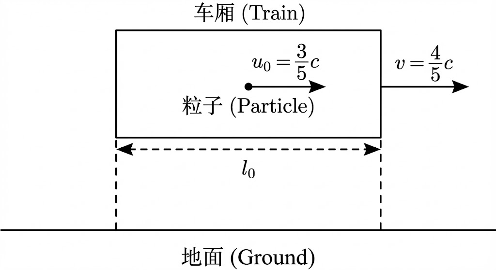

# 伽利略变换式

## 核心前提

- **绝对时间：** 时间是均匀流逝的，与观察者的运动状态无关。即 $t = t'$。
- **绝对空间：** 刚尺的长度是固定的，两点之间的距离在任何参考系中测量都一样（刚体不发生形变）。

## 推导过程

- **场景设定**

  - 参考系 $S$（地面）静止；

  - 参考系 $S'$（火车）以恒定速度 $\vec{v}$ 运动；

  - 某时刻有一事件发生在点 $P$；

  - 初始时刻 $t=0$​ 时，两坐标系原点重合。

  

- **几何关系**

  - 设点 $P$ 在 $S$ 系中的位置矢量为 $\vec{r}$，在 $S'$ 系中的位置矢量为 $\vec{r'}$。 根据向量三角形法则，可以直接写出位置关系：
    $$
    r=r'+vt
    $$

- **分量展开**

  - 假设 $\vec{v}$ 仅沿 $x$ 轴方向（即 $\vec{v} = (v, 0, 0)$），将上述向量方程投影到三个坐标轴上，并加上绝对时间假设：
    $$
    \begin{cases}
    x=x'+vt \\
    y=y' \\
    z=z' \\
    t=t'
    \end{cases}
    $$
    这就是**伽利略逆变换**，坐标系由$S'\rightarrow S$。反之，将 $x'$ 表示出来即为**正变换**，坐标系由$S\rightarrow S'$：
    $$
    \begin{cases}
    x'=x-vt \\
    y'=y \\
    z'=z \\
    t'=t
    \end{cases}
    $$

- **结论**

  - **牛顿定律的协变性：** 由于 $F=ma$，且 $m$（质量）在经典力学中是不变量，同时 $a=a'$，所以：
    $$
    F'=ma'=ma=F
    $$
    这意味着**牛顿力学定律在伽利略变换下形式不变**。对于任何惯性参照系,  牛顿力学的规律都具有相同的形式——也就是说，对于描述力学现象的规律而言，所有惯性系是等价的。

# 洛伦兹坐标变换式

洛伦兹变换就是一套算法，用来把牛顿力学中溢出的那个 $c+v$，强行“压缩”回 $c$，具体的实现方式为**空间变短**和**时间变慢**。

## 狭义相对论的基本原理

- **相对性原理**
  -  物理定律在所有惯性系中都具有相同的表达形式。
  - 不存在任何一个特殊的（例如“绝对静止”的）惯性系。

- **光速不变原理**
  - 真空中的光速是常量，它与光源或观测者的运动状态无关.
    - 在一切惯性系中，光在真空中沿各个方向的速率恒为$c$。

## 推导过程

- **建立模型与线性假设**

  设有两个惯性参考系 $S$ 和 $S'$：

  - $S$ 系静止（相对而言）。
  - $S'$ 系以速度 $v$ 沿 $x$ 轴正方向运动。

  - 当 $t=0$ 时，$S$ 和 $S'$ 的原点重合（$t=t'=0$​）。

  由于空间是均匀的，变换必须是线性的（否则一个不受力的物体在不同坐标系下的加速度不为0，违反惯性定律）。我们可以假设坐标 $x'$ 与 $x$ 和 $t$ 有如下关系：
  $$
  x' = k(x - vt)
  $$
  这里 $k$ 是一个待定的常数因子（即洛伦兹因子）。 根据**相对性原理**，从 $S'$ 看 $S$，S 是以速度 $-v$ 运动的。因此逆变换的形式应该完全一样，只是速度方向相反：
  $$
  x = k(x' + vt')
  $$

- **利用光速不变求解系数$k$​**

  想象在 $t=t'=0$ 的瞬间，原点处发出一个光脉冲，沿 $x$ 轴正方向传播。

  - 在$S$系中，光信号的位置满足方程：
    $$
    x=ct
    $$

  - 在$S'$系中，根据光速不变原理，光信号的位置必须满足：
    $$
    x'=ct'
    $$

  再将这两个光信号方程代入到坐标变换公式中：

  - 代入$x'$的表达式
    $$
    ct'=k(ct-vt)=kt(c-v)
    $$

  - 代入$x$的表达式
    $$
    ct=k(ct'+vt')=kt'(c+v)
    $$

  - 消去$t$和$t'$

    将这两式相乘得到
    $$
    c^2tt'=k^2tt'(c-v)(c+v) \\
    \Rightarrow c^2=k^2(c^2-v^2)
    $$
    解出$k$：
    $$
    k^2=\frac{c^2}{c^2-v^2} \\
    \Rightarrow k=\sqrt{\frac{1}{1-\frac{v^2}{c^2}}}
    $$
    将其记为$\gamma$：
    $$
    \gamma=\sqrt{\frac{1}{1-\frac{v^2}{c^2}}}
    $$
    也就是**洛伦兹因子**。

- **推导时间变换公式$t'$**

  需要找到 $t'$ 关于 $x$ 和 $t$ 的表达式。利用之前的逆变换公式：
  $$
  x=\gamma(x'+vt')
  $$
  代入$x'=\gamma(x-vt)$：
  $$
  x=\gamma[\gamma(x-vt)+vt']
  $$
  现在解出$t'$​：

  1. 两边同时除以$\gamma$：
     $$
     \frac{x}{\gamma}=\gamma(x-vt)+vt'
     $$

  2. 移项：
     $$
     vt'=\frac{x}{\gamma}-\gamma(x-vt)
     $$

  3. 提取出$x$项：
     $$
     vt'=\gamma vt-x(\gamma-\frac{1}{\gamma})
     $$

  4. 对括号内的项进行通分：
     $$
     \gamma-\frac{1}{\gamma}=\gamma(1-\frac{1}{\gamma^2})=\gamma[1-(1-\frac{v^2}{c^2})]=\gamma\frac{v^2}{c^2}
     $$

  5. 代回原式：
     $$
     vt'=\gamma vt-x\gamma\frac{v^2}{c^2} \\
     \Rightarrow t'=\gamma t-x\gamma\frac{v}{c^2}=\gamma(t-\frac{xv}{c^2})
     $$

- **最终结果**

  洛伦兹变换方程组如下：

  - **正变换**$S\rightarrow S'$：
    $$
    \begin{cases}
    x'=\gamma(x-vt) \\
    y'=y \\
    z'=z \\
    t'=\gamma(t-\frac{xv}{c^2})
    \end{cases}
    $$

  - **逆变换**$S'\rightarrow S$：
    $$
    \begin{cases}
    x=\gamma(x'+vt) \\
    y=y' \\
    z=z' \\
    t=\gamma(t'+\frac{x'v}{c^2})
    \end{cases}
    $$

  其中
  $$
  \gamma=\sqrt{\frac{1}{1-\frac{v^2}{c^2}}}
  $$

- **物理意义**
  - **低速退化：** 当 $v \ll c$ 时，$\frac{v}{c} \approx 0$，则 $\gamma \approx 1$。公式就退化成了我们熟悉的**伽利略变换** ($x'=x-vt$, $t'=t$)。这说明牛顿力学是相对论在低速下的近似。
  - **同时性的相对性：** 注意 $t'$ 的表达式中包含 $x$ 项。这意味着在 $S$ 系中不同地点 ($x_1 \neq x_2$) 同时发生的事件 ($t_1 = t_2$)，在 $S'$ 系中看并不是同时的 ($t'_1 \neq t'_2$)。
  - **时间与空间的混合：** 时间坐标 $t'$ 不仅取决于 $t$，还取决于空间位置 $x$​。

## 速度合成公式

速度是位移与时间的比值。如果知道两个参考系之间的时间和空间坐标是如何变换的（洛伦兹变换），我们就可以求出速度是如何变换的。

1. **设定参考系**

   设有两个惯性参考系：

   - **$S$ 系**（静止系）：坐标为 $(x, t)$。

   - **$S'$ 系**（运动系）：坐标为 $(x', t')$。

   - $S'$ 系相对于 $S$ 系沿 $x$ 轴正方向以速度 **$v$​** 匀速运动。

2. **写出洛伦兹变换公式**

   根据狭义相对论，从 $S'$ 系到 $S$​ 系的坐标变换公式为（逆洛伦兹变换）：
   $$
   x = \gamma (x' + vt') \\
   t = \gamma (t' + \frac{v}{c^2}x')
   $$

3. **定义物体速度**

   假设有一个物体（或粒子）在 $S'$ 系中运动：

   - 它在 $S'$ 系下的速度为 **$u'$**，定义为 $u' = \frac{dx'}{dt'}$。

   - 需要求它在 $S$ 系下的速度 **$u$**，定义为 $u = \frac{dx}{dt}$​。

4. **推导过程**

   利用微积分的概念，将洛伦兹变换公式取微分（即取极短的时间间隔和位移）：
   $$
   dx=\gamma(dx'+vdt') \\
   dt=\gamma(dt'+\frac{v}{c^2}dx')
   $$
   将 $dx$ 除以 $dt$ 来得到速度 $u$：
   $$
   u=\frac{dx'+vdt'}{dt'+\frac{v}{c^2}dx'}
   $$
   将分子和分母同时除以 $dt'$：
   $$
   u_x=\frac{u'+v}{1+\frac{u_x'v}{c^2}}
   $$
   即最终的速度变换公式。其中：

   - **$u$**：物体在 $S$ 系（地面）的速度。

   - **$u'$**：物体在 $S'$ 系（如飞船）的速度。

   - **$v$**：$S'$ 系相对于 $S$ 系的速度（飞船的速度）。

5. **最终结果**

   - **正变换**
     $$
     \begin{aligned}
     u_x'&=\frac{u_x-v}{1-\frac{v}{c^2}u_x} \\
     u_y'&=\frac{u_y}{\gamma(1-\frac{v}{c^2}u_x)} \\
     u_z'&=\frac{u_z}{\gamma(1-\frac{v}{c^2}u_x)}
     \end{aligned}
     $$

   - **逆变换**
     $$
     \begin{aligned}
     u_x&=\frac{u_x'+v}{1+\frac{v}{c^2}u_x'} \\
     u_y&=\frac{u_y'}{\gamma(1+\frac{v}{c^2}u_x')} \\
     u_z&=\frac{u_z'}{\gamma(1+\frac{v}{c^2}u_x')}
     \end{aligned}
     $$

# 狭义相对论的时空观

狭义相对论的时空观建立在**洛仑兹变换**的基础上，与经典力学（牛顿）的时空观有本质区别 。

- **时空一体性**：空间和时间不是相互独立的，而是一个不可分割的整体 2。光速 $c$ 是建立不同惯性系间时空变换的纽带。
- **同时的相对性**：
  - 在沿两个惯性系运动方向上，不同地点发生的两个事件，在其中一个惯性系中是同时的，在另一惯性系中观察则是“不同时”的。
  - **唯一例外**：只有在**同一地点、同一时刻**发生的两个事件，在其他惯性系中观察才是绝对同时的。
  - **判定结论**：若 $\Delta t' = 0$（在 $S'$ 系同时），但两事件位置不同（$x'_2 - x'_1 \neq 0$），则通过洛仑兹变换可知在 $S$ 系中 $\Delta t \neq 0$。

## 长度收缩

**概念：** 运动物体在运动方向上的长度会收缩，即所谓的“动尺变短”。

**定义：**

- **固有长度 ($l_0$)：** 物体相对静止时测得的长度。在 $S'$​ 系中棒静止，测得两端坐标差即为固有长度。
- **运动长度 ($l$)：** 在物体运动的参考系（$S$ 系）中测量的长度。

**测量规则（适用场景）：**

- **测静止物体：** 对测量两端坐标的先后次序无要求，可以不同时测量。

- **测运动物体：** 必须**同时**测定物体两端的坐标 ($t_1 = t_2$)，其坐标差 $\Delta x$ 才是物体的长度。
  $$
  l = l_0 \sqrt{1 - \beta^2} = l_0 \sqrt{1 - (\frac{v}{c})^2}
  $$

**结论：**

1. **$l < l_0$**：运动物体的长度总是小于其固有长度。
2. **相对效应：** 长度收缩是相互的。如果将物体固定在 $S$ 系，由 $S'$ 系测量，同样会出现收缩现象。
3. **方向性：** 收缩仅发生在运动方向上。
4. **低速近似：** 当 $\beta \ll 1$ (即 $v \ll c$) 时，$l \approx l_0$。
5. **本质：** 动尺缩短效应的根源在于“同时的相对性”，因为在 $S'$ 系看，$S$ 系测量两端坐标的动作并不是同时发生的。

## 时间延缓

**概念：** 运动的钟走得慢，即时间延缓效应。

**定义：**

- **固有时间 ($\Delta t_0$)：** 在同一地点发生的两事件的时间间隔。例如在火箭（$S'$ 系）中同一地点 $B$​ 发射和接收光信号。
- **相对时间 ($\Delta t$)：** 在另一个参考系（$S$​ 系）观测该两事件的时间间隔。

**推导逻辑：** 设 $S'$ 系为运动系，事件在 $S'$ 系同一地点发生（$\Delta x' = 0$）。 根据洛仑兹变换，在 $S$ 系观测到的时间间隔 $\Delta t$ 会变长。
$$
\Delta t = \frac{\Delta t_0}{\sqrt{1 - \beta^2}} = \frac{\Delta t_0}{\sqrt{1 - (\frac{v}{c})^2}}
$$
**结论：**

1. **$\Delta t > \Delta t_0$**：运动参照系测得的时间间隔比静止参照系（固有时间）要长。
2. **真实效应：** 时间的流逝不是绝对的，运动改变时间的进程，包括物理过程、化学反应甚至生命过程（如新陈代谢、寿命等）都会变慢。
3. **判断技巧：** 谁相对于事件是**静止**的（即事件在同地发生），谁测量的就是**固有时间**（最短的时间）；谁相对于事件是**运动**的，谁测量的就是**相对时间**（膨胀的时间）。

## 示例

> 示例1

设想有一光子火箭，相对于地球以速率$v=0.95c$直线飞行，若以火箭为参考系测得火箭长度为$15m$，问以地球为参考系，此火箭有多长？

以地面参考系为$S$系，火箭参考系为$S'$系，可得固有长度
$$
l_0=15m=l'
$$
运动长度则为
$$
l=l'\sqrt{1-\frac{v^2}{c^2}} \\
\Rightarrow l=4.68m
$$

> 示例2

两把米尺分别以速度$u$​相背而行，那么在它们各自参考系下测得的对方尺子的长度是？

**不能简单地将速度直接相加（即相对速度不是 $2u$）**，而必须使用爱因斯坦的速度合成公式来计算两把尺子之间的相对速度。

1. **定义参考系**

   - 设地面为实验室参考系 $S$。

   - **米尺 A** 相对于地面向左运动，速度为 $-u$。

   - **米尺 B** 相对于地面向右运动，速度为 $+u$。

   - 两把尺子的静止长度（固有长度）均为 $L_0 = 1$​​ 米。

2. **计算相对速度**

   求出**米尺 B 相对于米尺 A 的速度**（记为 $v_{rel}$）。根据狭义相对论的速度合成公式
   $$
   v_{rel} = \frac{v_B - v_A}{1 - \frac{v_B v_A}{c^2}}
   $$
   代入 $v_B = u$ 和 $v_A = -u$
   $$
   v_{rel} = \frac{u - (-u)}{1 - \frac{u \cdot (-u)}{c^2}} = \frac{2u}{1 + \frac{u^2}{c^2}}
   $$

3. **计算洛伦兹因子**

   根据相对论的尺缩效应公式 $L = L_0 / \gamma$，需要先计算该相对速度 $v_{rel}$ 对应的洛伦兹因子 $\gamma$​。
   $$
   \gamma=\frac{1}{\sqrt{1-\frac{v_{rel}^2}{c^2}}}
   $$
   令 $\beta = u/c$，则 $v_{rel}/c = \frac{2\beta}{1+\beta^2}$。 代入根号内的部分计算，最终可得
   $$
   1-\frac{v_{rel}^2}{c^2}= \frac{(1-\beta^2)^2}{(1+\beta^2)^2}
   $$
   因此
   $$
   \gamma=\sqrt{\frac{(1+\beta^2)^2}{(1-\beta^2)^2}} = \frac{1+\beta^2}{1-\beta^2} = \frac{1 + \frac{u^2}{c^2}}{1 - \frac{u^2}{c^2}}
   $$

4. **计算观测长度**

   使用尺缩公式 $L = L_0 / \gamma$（其中 $L_0 = 1$）：
   $$
   L=\frac{1-\frac{u^2}{c^2}}{1+\frac{u^2}{c^2}} \\
   \Rightarrow L=\frac{c^2-u^2}{c^2+u^2}
   $$

> 示例3

固有长度为$l_0$的车厢，以速率$\frac{4}{5}c$（$c$为真空中的光速）相对地面行驶，从车厢的后壁沿车前进方向射出一粒子，粒子以相对于车厢的速度$u_0=\frac{3}{5}c$​飞向车厢前壁，求：

1. 以车厢为参考系，测得粒子从车厢后壁运动到车厢前壁所用的时间$\Delta t$​=___。

   在车厢参考系中，**车厢是静止的，车厢的长度就是固有长度 $l_0$**。 粒子在车厢内以速度 $u_0 = \frac{3}{5}c$ 运动，从后壁跑到前壁，走过的距离正好是车厢长 $l_0$。所以
   $$
   \Delta t=\frac{l_0}{u_0}=\frac{l_0}{\frac{3}{5}c}=\frac{5l_0}{3c}
   $$

2. 以粒子为参考系，测得粒子从车厢后壁运动到车厢前壁所用的时间$\Delta t'$​​=___。

   以车厢为$S'$系，粒子为$S''$系，求得$S''$系相对$S'$系的洛伦兹因子为
   $$
   \gamma=\frac{1}{\sqrt{1-\frac{u_0^2}{c^2}}}=\frac{1}{\sqrt{1-(\frac{3}{5})^2}}=\frac{5}{4}
   $$
   又因为
   $$
   \Delta t'=\gamma(\Delta t-\frac{u_0l_0}{c^2})
   $$
   代入$\gamma=\frac{5}{4},\ \Delta t=\frac{5l_0}{3c},\ u_0=\frac{3}{5}c$可得
   $$
   \Delta t'=\frac{4l_0}{3c}
   $$
   另外地，也可直接利用**时间延缓**效应计算，对于粒子自身而言：

   - **事件A：**粒子离开车厢后壁
   - **事件B：**粒子到达车厢前壁

   对于粒子来说，这两个事件发生在**同一个地点**（就是粒子本身所在的位置），即$\Delta x''=0$。因此，粒子测量的时间 $\Delta t'$ 是**固有时间**；而现在已知的“运动时”$\Delta t$则是在车厢中测量到的**膨胀后的时间**。根据
   $$
   \Delta t_{车厢}=\gamma\Delta t_{粒子}
   $$
   也可得到
   $$
   \Delta t'=\frac{\Delta t}{\gamma} \\
   \Rightarrow \Delta t'=\frac{4l_0}{3c}
   $$

3. 以地面为参考系，测得粒子从车厢后壁运动到车厢前壁所用的时间$\Delta t''$​​=___。

   已知在车厢$S'$中有：

   - 两个事件的时间间隔：$\Delta t=\frac{5l_0}{3c}$
   - 两个事件的空间间隔：$\Delta x=l_0$

   计算车厢$S'$系相对地面$S$系的洛伦兹因子：
   $$
   \gamma=\frac{1}{\sqrt{1-(\frac{4}{5})^2}}=\frac{5}{3}
   $$
   根据
   $$
   \Delta t_{地面}=\gamma(\Delta t_{车厢}+\frac{v\Delta x_{车厢}}{c^2})
   $$
   有
   $$
   \Delta t''=\gamma(\Delta t+\frac{\frac{4}{5}c\cdot l_0}{c^2})=\frac{37l_0}{9c}
   $$
   另外地，通过洛伦兹速度合成公式可得到粒子$S''$相对地面$S$的速度：
   $$
   u=\frac{u_0+v}{1+\frac{u_0v}{c^2}}=\frac{35}{37}c
   $$
   由此可得到粒子$S''$相对地面$S$的洛伦兹因子：
   $$
   \gamma=\frac{1}{\sqrt{1-(\frac{35}{37})^2}}=\frac{37}{12}
   $$
   基于第2问得到的$\Delta t'$，即粒子的固有时，根据时间延缓效应，可得
   $$
   \Delta t''=\gamma\Delta t'
   $$
   代入$\Delta t'=\frac{4l_0}{3c}$，得到
   $$
   \Delta t''=\frac{37l_0}{9c}
   $$

> 示例4 | **物体长度 vs 事件的空间间隔**

-  一宇宙飞船相对于地面以$0.8c$的速度飞行，一光脉冲从船尾传到船头，飞船上的观察者测得飞船长为$90m$，地球上的观察者测得飞船的长度为？

  因为要测量一个运动物体的长度，地球观察者必须**同时**（$\Delta t = 0$）记下船尾和船头的位置；计算飞船相对地面的洛伦兹因子：
  $$
  \gamma=\frac{1}{\sqrt{1-0.8^2}}=\frac{5}{3}
  $$
  根据长度收缩效应，有
  $$
  l=\frac{l_0}{\gamma}
  $$
  代入$l_0=90m$，得到
  $$
  l=54m
  $$

- 若有一光脉冲从船尾传到船头，地球上的观察者测得脉冲从船尾发出和到达船头两个事件的空间间隔为？

  已知在飞船参考系中，光脉冲**离开船尾和到达船头**两个事件的时间间隔为
  $$
  \Delta t'=\frac{l_0}{c}
  $$
  设地球参考系中测得的空间间隔为$\Delta x$。根据洛伦兹变换式可得
  $$
  \Delta x=\gamma(\Delta x'+v\Delta t')
  $$
  代入$\Delta x'=l_0=90m,\ v=0.8c$可得
  $$
  \Delta x=\frac{5}{3}(90+72)=270m
  $$

# 相对论性动量和能量

## 相对论质量

物体的质量$m$与物体的运动速度$v$之间满足如下关系
$$
m=\frac{m_0}{\sqrt{1-\frac{v^2}{c^2}}}=\gamma m_0
$$
其中：

- $m_0$：静质量，物体相对于惯性系静止时的质量
- $m$：动质量（相对论质量），物体相对于惯性系运动时测得的质量
- $v$：物体相对于某惯性系的速率

**结论**：质量不是一个绝对不变的量，而是与运动有关的相对量。

> [!NOTE]
>
> 当$v=c$时质量无意义，实物粒子的速度不能达到光速；
>
> 光子的静质量为0。

## 相对论性动量

相对论动量遵循洛伦兹变换
$$
\vec{p}=\frac{m_0\vec{v}}{\sqrt{1-\beta^2}}=\gamma m_0\vec{v}=m\vec{v}
$$

- **相对论动量守恒定律**

  当$\sum_{i}\vec{F_i}=0$时，有相对论动量守恒
  $$
  \sum_{i}\vec{p_i}=\sum_{i}\frac{m_{0_i}\vec{v_i}}{\sqrt{1-\beta^2}}
  $$

## 质能关系

根据动能定理，即合力对粒子所做的功等于粒子动能的增量可得
$$
dW=\vec{F}\cdot d\vec{r}=dE_k
$$
设
$$
E_k=\int_{0}^{x}F_xdx=\int_0^x\frac{dp}{dt}dx=\int_0^pvdp
$$
而
$$
\int_0^pvdp=pv-\int_0^vpdv
$$
代入
$$
p=\frac{m_0v}{\sqrt{1-\beta^2}}
$$
可得
$$
E_k=\frac{m_0v^2}{\sqrt{1-\beta^2}}-\int_0^v\frac{m_0v}{\sqrt{1-\frac{v^2}{c^2}}}dv \\
\Rightarrow E_k=\frac{m_0c^2}{\sqrt{1-\beta^2}}-m_0c^2
$$
即
$$
E_k=mc^2-m_0c^2
$$
其中$m_0c^2$为静能量，即物体静止时(质心不动)所具有的能量。物体的静能是其内能的总和。

另外地，可得**总能量**
$$
\begin{aligned}
E&=mc^2 \\
&=E_k+m_0c^2
\end{aligned}
$$
其中：

- $E_k$：系统随质心平动的动能
- $m_0c^2$​：系统的内能

> 示例5

两相同的粒子$m$以相同的速率$v$相向运动，碰后复合。求：复合粒子的速度和质量。

设复合后的质量为$M$，速度为$V$。根据相对论性动量守恒
$$
\frac{m_0v}{\sqrt{1-\frac{v^2}{c^2}}}-\frac{m_0v}{\sqrt{1-\frac{v^2}{c^2}}}=MV \\
\Rightarrow V=0
$$
再根据能量守恒
$$
2mc^2=Mc^2
$$
所以可得
$$
M=2m=\frac{2m_0}{\sqrt{1-\frac{v^2}{c^2}}}>2m_0
$$
且由于$V=0$，所以有$M=M_0$​，说明**粒子的动能转换成复合粒子的静能**，从而表现为复合粒子**静止质量的增加**。

## 相对论能量-动量关系式

对能量公式平方：
$$
E^2 = (mc^2)^2 = \frac{m_0^2c^4}{1 - v^2/c^2}
$$
对动量公式平方并乘以 $c^2$：
$$
(pc)^2 = (mvc)^2 = \frac{m_0^2v^2c^2}{1 - v^2/c^2}
$$
计算 $E^2 - (pc)^2$：
$$
E^2 - (pc)^2 = \frac{m_0^2c^4}{1 - v^2/c^2} - \frac{m_0^2v^2c^2}{1 - v^2/c^2}
$$
提取公因子 $\frac{m_0^2c^2}{1 - v^2/c^2}$：
$$
E^2 - (pc)^2 = \frac{m_0^2c^2(c^2 - v^2)}{1 - v^2/c^2}
$$
**化简** 将分子中的 $(c^2 - v^2)$ 可以写成 $c^2(1 - \frac{v^2}{c^2})$​：
$$
E^2 - (pc)^2 = \frac{m_0^2c^2 \cdot c^2(1 - \frac{v^2}{c^2})}{1 - \frac{v^2}{c^2}} \\
\Rightarrow E^2-(pc)^2=m_0^2c^4
$$
所以得到最终关系式
$$
E^2 = (pc)^2 + (m_0c^2)^2
$$
该公式表明，在任何惯性系中，$E^2 - (pc)^2$ 的值都是恒定的（即 $m_0^2c^4$）。
