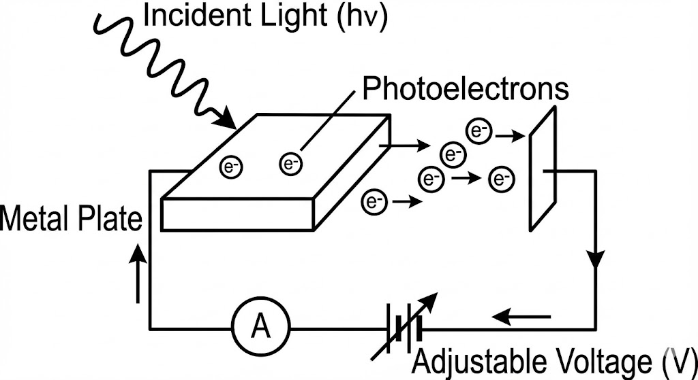
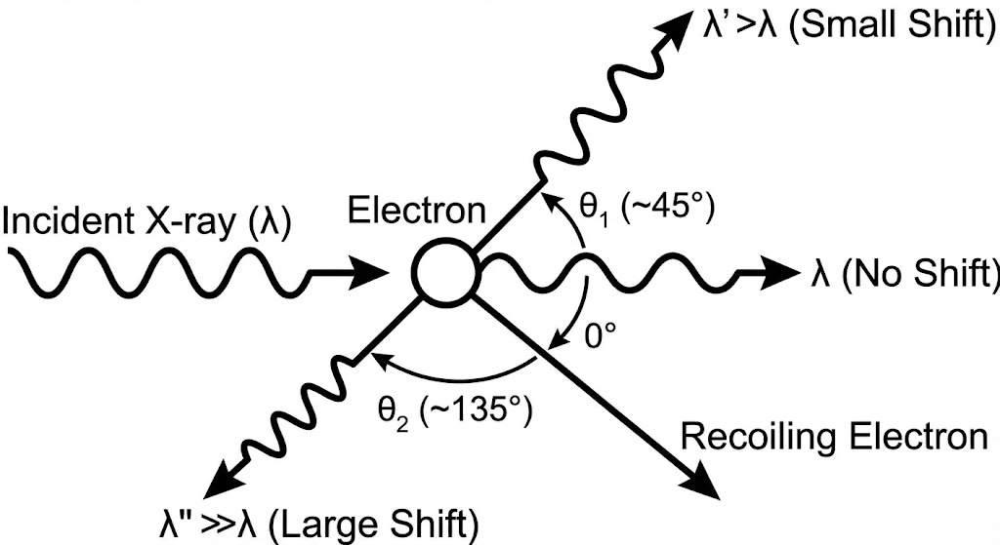
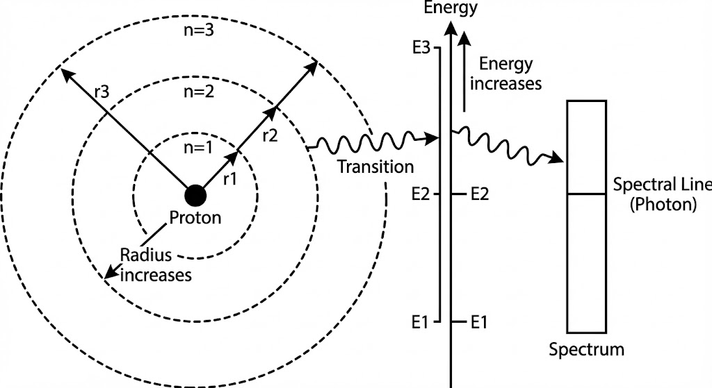
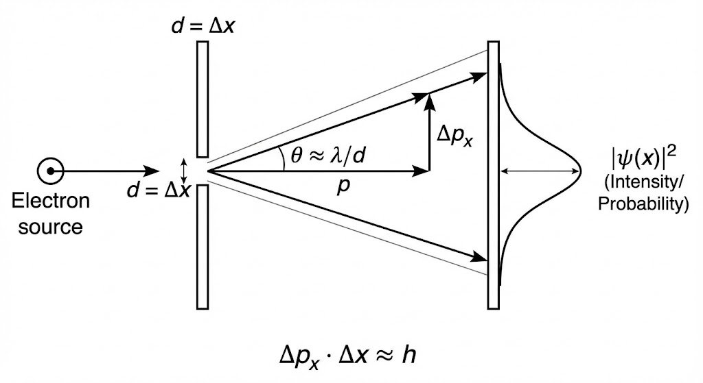
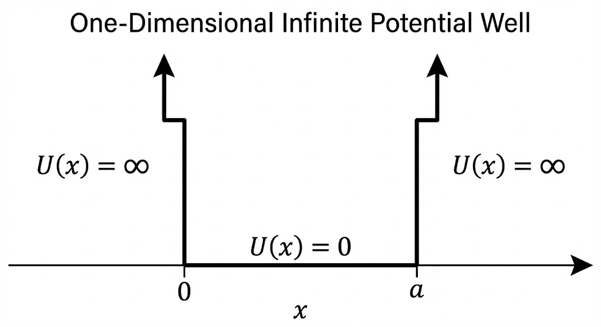
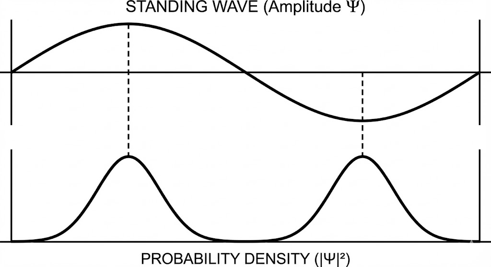

# 黑体辐射与普朗克量子假设

- **热辐射**：物体因分子热运动发射电磁波的现象。温度越高，辐射能量越大，短波成分越多。
- **黑体**：能完全吸收各种波长电磁波的理想模型（吸收比 $\alpha = 1$​）。

> 普朗克假说与公式

- **经典困难**：瑞利-金斯公式在短波区得出辐射能趋于无穷大的荒谬结论（**紫外灾难**）

- **能量子假设**：谐振子的能量是不连续的，最小能量单位为能量子 $\epsilon = h\nu$

- 普朗克公式：
  $$
  M_{B\lambda}(T) = \frac{2\pi hc^2}{\lambda^5} \frac{1}{e^{hc/\lambda kT} - 1}
  $$

  - $h$: 普朗克常数 ($6.63 \times 10^{-34} J \cdot s$​) 

  - $k$: 玻耳兹曼常数。

# 光电效应

1. **实验规律**

   - **饱和电流**：$i_m \propto I$​（光强）。单位时间内逸出的光电子数与入射光强成正比

     - 实验表明，在一定强度$I$的单色光照射下，光电流$i$随加速电压$U$的增大而增大，并逐渐趋于其饱和值$i_m$，其大小与入射光强成正比。

   - **遏止电压 $U_0$**：与光强无关，仅随入射光频率 $\nu$​ 线性增大

     - 当加速电压$U=0$时，光电流并不为零；只有当两极间加了反向电压$U=-U_0$时，光电流才为零。此电压称为遏止电势差（截止电压）。

     - 这表明：从阴极逸出的光电子必有初动能 (指光电子刚逸出金属表面时具有的动能)。则对于最大初动能有
       $$
       \frac{1}{2}mv_m^2=eU_0=E_{k_{max}}
       $$
       说明**光电子的最大初动能与入射光强度无关。**

     - 在持入射光强不变的条件下，**遏止电压$U_0$随着入射光的频率$\nu$的增大而线性增大：**
       $$
       U_0=K(\nu-\nu_0),\ \nu\ge\nu_0
       $$
       $K$：与金属材料无关的普适常数。

       所以对于光电子的最大初动能有
       $$
       \frac{1}{2}mv_m^2=eU_0=eK(\nu-\nu_0)
       $$
       即最大初动能随入射光的频率线性地增大。

   - **截止频率 $\nu_0$（红限）**：只有当 $\nu > \nu_0$ 时才会发生光电效应，也即只有当$\nu$降到$\nu_0$时光电子的最大初动能为零。

   - **瞬时性**：响应时间不超过 $10^{-9}s$

2. **爱因斯坦光电方程**

   【光强 / 单色光的能流密度】

   等于单位时间内通过单位面积的光子数$n_{\phi}$和每个光子能量之积，即
   $$
   I=n_{\phi}h\nu
   $$
   **【推导过程】**： 基于能量守恒，一个光子能量 $h\nu$ 被电子吸收后，一部分用于克服金属的束缚（逸出功 $W$），剩下的转化为电子逸出后的最大初动能 $E_{kmax}$
   $$
   h\nu = \frac{1}{2}mv_m^2 + W
   $$
   **【物理量含义】**：

   - $h\nu$：入射光子的能量

   - $W$：逸出功，$W = h\nu_0$（由材料本身决定）

   - $\frac{1}{2}mv_m^2 = eU_0$​：光电子的最大初动能（通过遏止电压测量）

> 示例

一半径为$1\times 10^{-3}m$的薄圆片，距光源$1m$。光源的功率为$1W$，发射波长$589nm$​的单色光。假定光源向各个方向发射的能量是相同的，试计算在单位时间内落在薄圆片上的光子数。

1. 计算单位时间内落在薄圆片上的能量 $P'$
   $$
   P' = P \cdot \frac{S_{\text{圆片}}}{S_{\text{球面}}} = P \cdot \frac{\pi r^2}{4 \pi d^2} = P \cdot \frac{r^2}{4d^2} \\
   \Rightarrow P' = 1 \times \frac{(10^{-3})^2}{4 \times 1^2} = 0.25 \times 10^{-6} \, J/s
   $$

2. 计算单个光子的能量 $E$
   $$
   E=h\nu=\frac{hc}{\lambda} \\
   \Rightarrow E = \frac{6.63 \times 10^{-34} \times 3.0 \times 10^8}{589 \times 10^{-9}} \approx 3.377 \times 10^{-19} \, J
   $$

3. 计算单位时间内落在圆片上的光子数 $N$
   $$
   N = \frac{P'}{E} \\
   \Rightarrow N = \frac{0.25 \times 10^{-6}}{3.377 \times 10^{-19}} \approx 7.4 \times 10^{11}
   $$

# 康普顿效应

当X射线被物质散射时，散射光中除了原波长 $\lambda_0$ 外，还出现了**波长变长** $\lambda > \lambda_0$ 的成分。**波长的改变量 $\Delta \lambda$ 仅与散射角 $\theta$ 有关。**

> 推导过程

将入射光子与电子的相互作用看作是**两个微观粒子之间的弹性碰撞** 。为了推导出波长位移公式，必须同时应用**能量守恒定律**和**动量守恒定律** 。由于碰撞后电子的反冲速度极大，必须使用**狭义相对论力学**进行处理。

1. **物理模型前提**

   - **入射光子**：能量 $E_0 = h\nu_0$，动量 $P_0 = \frac{h\nu_0}{c}$
   - **目标电子**：碰撞前视为静止的自由电子，静止质量为 $m_0$，静能为 $m_0c^2$
   - **散射光子**：能量 $E = h\nu$，动量 $P = \frac{h\nu}{c}$，散射角为 $\theta$
   - **反冲电子**：全能 $E_e = mc^2$，动量 $P_e = mv$

2. **能量守恒方程**

   碰撞前系统的总能量等于碰撞后系统的总能量。
   $$
   h\nu_0 + m_0c^2 = h\nu + mc^2
   $$

   - **左式：**入射光子和目标电子的静能量之和
   - **右式：**散射光子的能量和反冲电子的相对论总能量之和

3. **动量守恒方程**

   动量是矢量，碰撞前后的总动量矢量和保持不变。
   $$
   P_0=P+P_e
   $$
   根据矢量合成的余弦定理，将其转化为标量关系
   $$
   P_e^2 = P_0^2 + P^2 - 2P_0P\cos\theta
   $$
   代入光子动量公式 $P = \frac{h\nu}{c}$：
   $$
   P_e^2 = \left(\frac{h\nu_0}{c}\right)^2 + \left(\frac{h\nu}{c}\right)^2 - 2\left(\frac{h\nu_0}{c}\right)\left(\frac{h\nu}{c}\right)\cos\theta
   $$

   - $P_0, P$：入射和散射光子的动量大小
   - $P_e$：反冲电子的相对论动量 ($P_e = mv = \frac{m_0v}{\sqrt{1-v^2/c^2}}$)
   - $\theta$：散射角（散射光子方向与入射方向的夹角）

4. **康普顿公式**

   通过联立上述能量方程和动量方程，并利用相对论能量-动量关系式$E_e^2 = (P_ec)^2 + (m_0c^2)^2$ ，消去电子速度 $v$ 和质量 $m$，即可导出著名的康普顿波长位移公式：
   $$
   \Delta \lambda = \lambda - \lambda_0 = \frac{h}{m_0c}(1 - \cos\theta)
   $$
   **物理意义：**

   - **波长偏移 $\Delta \lambda$ 只与散射角 $\theta$ 有关**，与散射物质的种类无关
   - 当 $\theta = 0^\circ$ 时，$\Delta \lambda = 0$，表示光子未发生碰撞直接穿过
   - 当 $\theta = 180^\circ$ 时（逆散射），波长改变达到最大值 $\Delta \lambda = \frac{2h}{m_0c}$
   - 该效应有力地证明了光子具有动量，即**光具有粒子性**。

# 氢原子的玻尔理论

> 假设

1. **定态假设**

   - 电子只能在特定的圆轨道上运动，在这些轨道上运动时不辐射电磁波，原子处于稳定状态（定态）；
   - 每个定态对应特定的能量。

2. **频率条件**

   - 当原子从能量为 $E_i$ 的定态跃迁到能量为 $E_f$ 的定态时，会发射或吸收光子；

   - 跃迁频率公式
     $$
     h\nu =E_i-E_f
     $$
     其中 $E_i > E_f$ 为发射，$E_i < E_f$ 为吸收。

3. **量子化条件**

   - 电子以速度$v$在半径$r$的圆周上绕核运动时，只有电子的角动量$L$等于$\frac{h}{2\pi}$的整数倍的那些轨道是稳定的。即
     $$
     L=mvr=n\frac{h}{2\pi}=n\hbar\ (n=1,2,3 ...)
     $$
     其中$\hbar=\frac{h}{2\pi}$，称为约化普朗克常数。

> 定量计算

- **轨道半径**
  - **半径公式：**$r_n=r_1n^2$
  - **玻尔半径：**$r_1=5.29\times 10^{-11}m$
- **能量**
  - **激发态能量公式：**$E_n=\frac{E_1}{n^2}$
  - **基态能量：**$E_1=-13.6eV,\ n=1$
  - **电离能**：使原子电离（$n \to \infty, E=0$）所需的能量，基态氢原子电离能为 $13.6eV$

> 氢原子光谱

- **里德伯公式**

  氢原子光谱可见光部分的规律：
  $$
  \tilde{\nu}=\frac{1}{\lambda}=R(\frac{1}{n_f^2}-\frac{1}{n_i^2})
  $$

  - $\tilde{\nu}$：**波数**（波长的倒数），表示每单位长度内的波的数目
  - $R$：**里德伯常量**，这是一个通过实验测得的物理常数
  - **$n_f$（终态量子数）决定“线系”**：当固定 $n_f$​ 不变时，公式描述的就是某一个特定的光谱系
  - **$n_i$（初态量子数）决定“具体谱线”**：在同一个线系中，不同的 $n_i$ 值对应着该系中不同波长的具体谱线

- **波尔理论解释**

  - **机制**：原子光谱的产生是因为电子在不同**定态（能级）之间发生跃迁**

  - **公式**：当电子从高能级 ($E_i$) 跃迁到低能级 ($E_f$) 时，释放的光子能量 $h\nu$ 等于两能级之差：
    $$
    h\nu=E_i-E_f
    $$
    解释了为什么光谱是**线状**的（因为能级是分立的），而不是连续的。

  - **关联**

    - **光谱项与能级对应**： 里德伯公式暗示了每一条谱线的波数都可以写成两个“光谱项”之差：$T(n_f) - T(n_i)$ 。 在玻尔理论中，这个“光谱项” $R/n^2$ 实际上就对应着电子在第 $n$ 个轨道上的**能量**（忽略常数系数）；
    - **能量差产生光子**： 公式中的 $\frac{1}{n_f^2} - \frac{1}{n_i^2}$ 这一项，本质上代表了电子从高能级 $n_i$ 跳跃到低能级 $n_f$ 时释放出的**能量差**。

# 德布罗意波 实物粒子的波粒二象性

> 德布罗意假设与公式

- **核心假设**：运动的实物粒子（如电子、质子等静止质量不为零的粒子）都伴随着一种波，称为**德布罗意波**或**物质波**。

- **德布罗意公式：**
  $$
  \lambda=\frac{h}{p}=\frac{h}{m_0v}
  $$
  其中 $h$ 为普朗克常数，$m$ 为质量，$v$​ 为速度。

  另外地，因为
  $$
  E_k=\frac{1}{2}m_0v^2 \\
  \Rightarrow v=\sqrt{\frac{2E_k}{m_0}}
  $$
  所以
  $$
  \lambda=\frac{h}{p}=\frac{h}{m_0v}=\frac{h}{\sqrt{2m_0E_k}}
  $$

- **宏观与微观区别**
  - **宏观物体**：由于质量很大，动量很大，导致德布罗意波长极小，实验无法观测，因此主要表现为**粒子性**；
  - **微观粒子**（如电子）：波长与X射线相当，波动性显著。

> 实验证明

为了验证电子具有波动性，科学家进行了电子衍射实验，实验结果完全符合布拉格公式（X射线衍射规律）。

- **戴维孙-革末实验**
  - 使用低能电子束射向**镍单晶**；
  - 在加速电压 $U=54\text{ V}$，散射角 $\theta=50^\circ$ 时观测到电流峰值（衍射极大值）；
  - 结论：电子束在单晶上的反射符合波的干涉加强条件，证实电子具有波动性。
- **G.P. 汤姆孙实验**
  - 让电子束穿过**多晶薄膜**（如铝箔）；
  - 结果：观测到类似X射线衍射的同心圆环图样。

> 德布罗意波的统计解释

**电子的衍射现象：**

电子衍射图样并不意味着单个电子被“撕裂”成波弥散在空间中，而是体现了**概率的分布**。

- **单个电子（粒子性）**
  - 在一个一个地发射电子时，每一个电子在屏幕上打出的只是一个确定的**亮点**（粒子性）。
  - 单个电子落在哪里具有**偶然性**，无法精确预测它会落在条纹的亮处还是暗处。
- **大量电子（波动性）**
  - 发射成千上万个电子后，这些随机的亮点汇聚起来，就会呈现出**有规律的明暗条纹**（波动性） 
  - **亮纹处**（波强处）：代表电子在该处出现的**概率大**（粒子密集）
  - **暗纹处**（波弱处）：代表电子在该处出现的**概率小**（粒子稀疏）

所以说德布罗意波本质上是一种**概率波**，波的强度与粒子在该处附近出现的概率成正比。

# 不确定关系

> 电子的单缝衍射实验

1. **物理建模**

   假设一束动量为 $p$ 的电子流，沿 $Z$ 轴方向射向一块挡板。挡板上有一个宽度为 $d$ 的狭缝（开口方向沿 $X$ 轴）。

   对于两个核心的不确定量：

   - **位置不确定度 ($\Delta x$)**： 当电子穿过狭缝时，它在 $X$ 轴方向上的位置被限制在狭缝宽度范围内。因此，电子在 $X$ 方向上的位置不确定度即为狭缝宽度：
     $$
     \Delta x\approx d
     $$

   - **动量不确定度 ($\Delta p_x$)**： 电子穿过狭缝前，只有 $Z$ 方向的动量。穿过狭缝后，由于衍射效应，电子会向各个方向散开。这意味着电子获得了一个**垂直于原运动方向的横向动量分量** $p_x$。这个分量的分布范围，即为动量不确定度 $\Delta p_x$。

2. **推导过程**

   1. **引入波动光学的衍射条件**

      根据惠更斯-菲涅耳原理，电子波穿过狭缝会发生衍射。绝大多数电子会落在中央亮纹的范围内。中央亮纹的边缘（即**第一级暗纹/极小值**）对应的衍射角 $\theta$ 满足以下条件：
      $$
      d\sin\theta=\lambda
      $$

      - $d$：狭缝宽度。
      - $\theta$：第一级衍射角（半角宽度）。
      - $\lambda$：电子的德布罗意波长。

      说明要限制电子的位置（减小 $d$），衍射角 $\theta$​ 就必然增大，波束发散越厉害。

   2. **建立动量与角度的几何关系**

      电子发生偏转角 $\theta$，意味着它获得了一个横向动量分量 $\Delta p_x$。

      从矢量分解的角度看（如示意图所示的三角形关系），当偏转角 $\theta$ 较小时（小角近似），横向动量 $\Delta p_x$ 与总动量 $p$ 的关系满足：
      $$
      \frac{\Delta p_x}{p}\approx\sin\theta
      $$
      即
      $$
      \Delta p_x\approx p\sin\theta
      $$

   3. **联立方程**

      现在有两个关于$\sin\theta$的方程，分别来自波动光学和矢量几何：
      $$
      \begin{cases}
      \sin\theta=\frac{\lambda}{d} \\
      \sin\theta\approx\frac{\Delta p_x}{p}
      \end{cases}
      $$
      联立：
      $$
      \frac{\lambda}{d}\approx\frac{\Delta p_x}{p}
      $$
      整理得到：
      $$
      \Delta p_x d\approx p\lambda
      $$

   4. **引入德布罗意关系**

      根据德布罗意物质波的公式
      $$
      \lambda=\frac{h}{p}\Leftrightarrow p\lambda =h
      $$
      代入联立整理后的等式：
      $$
      \Delta p_x d\approx h \\
      \Rightarrow \Delta x\cdot\Delta p_x\approx h
      $$

> 最终结论

这个推导直观地证明了，**位置的精确度与动量的精确度是一对不可调和的矛盾**。即

1. 微观粒子同一方向上的坐标与动量不可同时准确测量,  它们的精度存在一个终极的不可逾越的限制；
2. 不确定的根源是“波粒二象性”这是微观粒子的根本属性；
3. 宏观粒子，因$h$很小，$\Delta x\Delta p_x\rightarrow 0$，可视为位置和动量能同时准确测量。

而对于微观粒子，$h$不能忽略，因此$\Delta x、\Delta p_x$​​不能同时拥有确定值。此时，只能从概率统计角度去认识其运动规律。在量子力学中，将用**波函数**来描述微观粒子。

# 波函数 薛定谔方程及其应用

> 波函数及其统计解释

在经典物理中，一个沿 $x$ 轴正方向传播的单色平面简谐波（机械波）可以用实函数表示，但为了数学处理的方便，通常利用欧拉公式将其写成复数形式
$$
y(x,t)=Ae^{-i2\pi(\nu t-\frac{x}{\lambda})}
$$
为了将上述经典波的形式转化为描述微观粒子的**物质波（德布罗意波）**，需要引入两个核心的量子力学关系式，将波的参数（$\nu, \lambda$）与粒子的动力学参数（$E, p$​​）联系起来

1. **普朗克-爱因斯坦关系式**（联系频率与能量）
   $$
   E=h\nu\Rightarrow\nu=\frac{E}{h}
   $$

2. **德布罗意关系式**（联系波长与动量）
   $$
   p=\frac{h}{\lambda}\Rightarrow\frac{1}{\lambda}=\frac{p}{h}
   $$

代入指数部分得到
$$
-i2\pi(\frac{E}{h}t-\frac{p}{h}x)
$$
提取公因子并简化后得到
$$
-\frac{i}{\hbar}(Et-px)
$$
最终获得：

- **波函数**

  对于能量为 $E$、动量为 $p$ 的自由粒子，其平面波函数形式为
  $$
  \Psi(x,t) = \psi_0 e^{-\frac{i}{\hbar}(Et - px)}
  $$
  其中$\hbar=\frac{h}{2\pi}$。

- **波函数的统计意义**

  - **概率幅**：波函数 $\Psi$ 本身无直接物理意义，被称为概率幅；

  - **概率密度**：粒子在某处出现的概率与波函数的模方成正比。即
    $$
    \omega=|\Psi|^2=\Psi\Psi^*
    $$

    - **物理含义**：$w$ 表示在某时刻、某点附近单位体积内找到粒子的概率。

  - **归一化条件**

    由于粒子在整个空间中必然存在，其总概率为1，所以有
    $$
    \int|\Psi|^2dV=1
    $$

    - **标准条件**：波函数必须满足**单值、连续、有限**三个条件。

> 薛定谔方程的建立

薛定谔方程是量子力学的核心动力学方程，描述了波函数随时间的演化规律。

- **一维含时薛定谔方程**

  一个质量为 $m$、能量为 $E$、动量为 $p$ 的自由粒子（即不受外力作用，势能 $U=0$）的运动状态可以由**平面波函数**描述：
  $$
  \Psi(x,t) = A e^{-i\frac{2\pi}{h}(Et - px)}
  $$
  为了在方程中消除具体的 $E$ 和 $p$ 参数，建立算符与物理量的对应关系，分别对波函数求$t$的一阶偏导和$x$的二阶偏导
  $$
  \frac{\partial\Psi}{\partial t}=-\frac{i2\pi}{h}E\Psi \\
  \frac{\partial^2\Psi}{\partial x^2}=-\frac{4\pi^2p^2}{h^2}\Psi
  $$
  此处可得
  $$
  E\Psi=i\frac{h}{2\pi}\cdot\frac{\partial\Psi}{\partial t} \\
  p^2\Psi=-\frac{h^2}{4\pi^2}\cdot\frac{\partial^2\Psi}{\partial x^2}
  $$
  对于势场中的粒子（势能$U(x,t)\ne 0$​），有
  $$
  E=E_k+U(x,t)=\frac{p^2}{2m}+U(x,t)
  $$
  两侧同时乘以波函数$\Psi$：
  $$
  E\Psi=\frac{p^2}{2m}\Psi+U(x,t)\Psi
  $$
  代入上文中$E\Psi、p^2\Psi$可得
  $$
  i\frac{h}{2\pi}\frac{\partial\Psi}{\partial t}=-\frac{h^2}{8\pi^2m}\frac{\partial^2\Psi}{\partial x^2}+U(x,t)\Psi
  $$

- **定态薛定谔方程**

  假设粒子处于一个不随时间变化的**恒定势场**中 ，即势能只与位置有关，与时间无关，即
  $$
  U(x,t)=U(x)
  $$
  在恒定势场下，可以将波函数 $\Psi(x,t)$ 写成“空间部分”和“时间部分”的乘积形式：
  $$
  \Psi(x,t) = \psi(x) \cdot f(t)
  $$

  - $\psi(x)$：定态波函数（只含空间坐标）。

  - $f(t)$：时间因子（只含时间）。

  代入到含时方程：
  $$
  i\frac{h}{2\pi}\psi(x)\frac{df(t)}{dt}=[-\frac{h^2}{8\pi^2m}\frac{d^2\psi(x)}{dx^2}+U(x)\psi(x)]f(t)
  $$
  将等式两边同时除以 $\psi(x)f(t)$：
  $$
  i\frac{h}{2\pi}\frac{1}{f(t)}\frac{df(t)}{dt}=\frac{1}{\psi(x)}[-\frac{h^2}{8\pi^2m}\frac{d^2\psi(x)}{dx^2}+U(x)\psi(x)]
  $$
  令
  $$
  E=i\frac{h}{2\pi}\frac{1}{f(t)}\frac{df(t)}{dt}=\frac{1}{\psi(x)}[-\frac{h^2}{8\pi^2m}\frac{d^2\psi(x)}{dx^2}+U(x)\psi(x)]
  $$
  可得

  - **时间方程**
    $$
    i\frac{h}{2\pi}\frac{df}{dt}=Ef \\
    \Rightarrow f(t)=e^{-i\frac{2\pi}{h}Et}
    $$

  - **空间方程**
    $$
    -\frac{h^2}{8\pi^2m} \frac{d^2 \psi}{d x^2} + U(x) \psi = E \psi
    $$
    这是能量本征方程，$E$ 为粒子的确定能量（本征值），$\psi(x)$ 为定态波函数。在此状态下，概率密度 $|\Psi|^2$ 不随时间变化。

> 一维无限深方势阱

用于展示能量量子化的简化模型，模拟金属中的自由电子。

1. **模型设定**

   势能分布如下：
   $$
   U(x) = \begin{cases} 0, & 0 < x < a \\ \infty, & x \le 0 \text{ 或 } x \ge a \end{cases}
   $$
   粒子不能穿透无穷大势垒，故 $\psi(0) = 0$ 且 $\psi(a) = 0$。

2. **方程求解与推导**

   在阱内，由于势能$U=0$，所以定态方程变为
   $$
   \frac{d^2\psi}{dx^2}+\frac{8\pi^2mE}{h^2}\psi=0
   $$
   令
   $$
   k=\sqrt{\frac{8\pi^2mE}{h^2}}
   $$
   则有
   $$
   \frac{d^2\psi}{dx^2}+k^2\psi=0
   $$
   可得通解为
   $$
   \psi(x) = A \sin kx + B \cos kx
   $$
   根据

   - $\psi(0)=0\Rightarrow B=0$；

   - $\psi(a)=A\sin ka=0$，可得$ka=n\pi$，即
     $$
     k=\frac{n\pi}{a}
     $$

3. **结果分析**

   > 粒子能量量子化

   将$k = \frac{n\pi}{a}$代回$k^2$的定义式，得到能量本征值
   $$
   E=\frac{n^2h^2}{8ma^2}
   $$
   这表明能量是不连续的（分立能级），与经典物理的“能量连续”截然不同。

   > 归一化波函数

   类似地，将$k=\frac{n\pi}{a}$代回$\psi(x)$的表达式可得
   $$
   \psi(x)=A\sin\frac{n\pi}{a}x
   $$
   根据归一化条件
   $$
   \int_0^a|\psi(x)|^2dx=1 \\
   \Rightarrow A=\sqrt{\frac{2}{a}}
   $$
   所以
   $$
   \psi(x)=\sqrt{\frac{2}{a}}\sin\frac{n\pi}{a}x,\quad 0<x<a
   $$
   同时可得概率密度函数
   $$
   |\psi(x)|^2=\frac{2}{a}\sin^2\frac{n\pi}{a}x
   $$

   > 波函数与驻波

   **定态波函数本质上是动量相反的自由粒子平面波发生相干叠加的结果。**在数学上，只要一个波函数能写成“空间分布 $\times$ 时间振荡”的形式，它就满足驻波的定义——对于$\Psi(x,t)=\sqrt{\frac{2}{a}}\sin\frac{n\pi}{a}x\cdot e^{-i\frac{2\pi}{h}Et}=\psi(x)\cdot f(t)$，则为空间分布$\psi(x)\times$时间振荡$f(t)$。

   

   - 驻波的**波腹**（振幅最大），就是粒子**出现概率最大**的地方。

   - 驻波的**波节**（振幅为0），就是粒子**绝对不可能出现**的地方。

> 示例

假如粒子只在一维空间运动，它的状态可用
$$
\Psi(x,t) =
\begin{cases}
0 & x \le 0, x \ge a \\
A e^{-\frac{i}{\hbar}Et} \sin\left(\frac{\pi}{a}x\right) & 0 \le x \le a
\end{cases}
$$
表示，其中$E、A$均为常数，求：

1. 归一化波函数；

   根据归一化条件公式
   $$
   \int_{-\infty}^{+\infty}|\Psi(x,t)|^2dx=1
   $$
   注意到
   $$
   |e^{-\frac{i}{\hbar}Et}|^2=e^{-\frac{i}{\hbar}Et}\cdot e^{\frac{i}{\hbar}Et}=1
   $$
   所以
   $$
   |\Psi(x,t)|^2=A^2\sin^2(\frac{\pi}{a}x)
   $$
   由于在$x\le 0,\ x\ge a$时$\Psi(x,t)=0$，所以
   $$
   原式=\int_0^aA^2\sin^2(\frac{\pi}{a}x)dx=1
   $$
   最终解得
   $$
   A=\sqrt{\frac{2}{a}}
   $$
   所以归一化后的波函数为
   $$
   \Psi(x,t) = \sqrt{\frac{2}{a}} e^{-\frac{i}{\hbar}Et} \sin\left(\frac{\pi}{a}x\right) \quad (0 \le x \le a)
   $$

2. 概率密度；

   根据
   $$
   \omega(x)=|\Psi(x,t)|^2=\Psi(x,t)\cdot\Psi(x,t)^*
   $$
   代入归一化后的波函数可得
   $$
   \omega(x)=\frac{2}{a}\sin^2(\frac{\pi}{a}x)
   $$

3. 在$x\rightarrow x+dx$找到粒子的概率是多少？

   由于$w(x)$是概率密度，那么在微元区间 $dx$ 内的概率 $dP$ 就是密度乘以区间长度，即
   $$
   dP=\omega(x)dx=|\Psi(x,t)|^2dx
   $$
   所以
   $$
   P(x\rightarrow x+dx)=\frac{2}{a}\sin^2(\frac{\pi}{a}x)dx
   $$

4. 在什么地方找到粒子的概率最大？

   要找到概率最大的位置，就是求概率密度函数 $w(x) = \frac{2}{a} \sin^2\left(\frac{\pi}{a}x\right)$ 在区间 $0 \le x \le a$ 上的最大值。因此只需令
   $$
   \sin^2(\frac{\pi}{a}x)=1
   $$
   即
   $$
   \frac{\pi}{a}x=\frac{\pi}{2}+k\pi
   $$
   因为 $x$ 的定义域限制在 $0 \le x \le a$，即相位角在 $0$ 到 $\pi$ 之间。 所以只能取 $\frac{\pi}{a}x = \frac{\pi}{2}$。由此可得
   $$
   x=\frac{a}{2}
   $$
   所以在 **$x = \frac{a}{2}$** 处（即势阱的正中央），找到粒子的概率最大。

