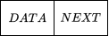

# 概念

**线性表(Linear List)：**由同类型数据元素构成有序序列的线性结构。


其中$$a_i$$是表中的元素，$$i$$表示元素$$a_i$$在表中的位置，$$n$$为表的长度。

- 线性表没有元素时，称为空表；
- 表起始位置称表头，表结束位置称表尾；
- 除第一个元素外，每个数据元素均只有一个前驱；
- 除最后一个元素外，每个数据元素均只有一个后驱。

# 顺序表

## 定义和创建

- 顺序表是线性表的**顺序存储**表示；

-  顺序表采用一组**地址连续**的存储单元依次存储线性表的数据元素；

- 可以在已知**第一个元素**的存储起始地址，以及每个元素所占用的存储单元个数的基础上，**直接计算**表中**任意**指定元素的存储地址。

- 使用C语言中的数组表示顺序表，结构体存储表信息：

  

  ```C
  typedef struct{
  	ElemType *elem; //存储的是数组第一个元素的地址
  	int length; //顺序表的当前长度
  } SqList; //定义了结构体数据类型SqList, 用于表示顺序表
  SqList L;
  ```

  - 线性表的长度：`L.length;`  

  - 访问第i个元素：`L.elem[i-1];`

## 查找

- 根据给定元素的序号进行查找；

- 根据给定的元素值进行查找 （通过数组下标定位）。

  > 基本思想：将给定的元素e和顺序表中的每个元素依次进行比较。若找到与e相等的元素，则查找成功，返回其在表中的位序值；若找遍整个顺序表，没有找到与e相等的元素，则查找失败，返回-1。

  ```C
  int Locate_Sq(SqList L, ElemType e){
  	int i=0; 
  	while(i<L.length && e!=L.elem[i])
   		i++;
   	if(i>=L.length) return -1;   //如果没找到，返回-1
   	else return i; //找到后返回的是存储位置
  }
  ```

- 查找成功的平均比较次数为$$\frac{n+1}{2}$$，因此平均时间性能为$$O(n)$$。

## 插入

- **先移动，再插入。**

-  在顺序表中，第𝑖个位置上插入一个元素，需要向后移动元素的个数为$$n-i+1$$；

- 平均移动的元素个数为：
  $$
  E_{is}=\sum_{i=1}^{n+1}p_i\times(n-i+1)
  $$
  又因为每个位置被插入元素的概率相等，所以代入$$p_i =\frac{1}{n+1}$$：
  $$
  E_{is}=\sum_{i=1}^{n+1}\frac{n-i+1}{n+1}=\frac{n}{2}
  $$
  所以顺序表插入操作的时间复杂度为$$O(n)$$。

  ```C
  Status Insert_Sq( SqList&L, inti,ElementTypex){
      if (i<1 || i>L.length+1)     /* 位置不合法*/
          return ERROR;
  	if (L.length>=MAXSIZE)  /* 表空间已满，不能插入*/ 
          return ERROR;
   	for(k=L.length-1; k >= i-1; k--) 
  		L.elem[k+1]=L.elem[k];     /*将𝒂𝒊～𝒂𝒏倒序向后移动*/ 
  	L.elem[i-1]=x;    /*新元素插入*/ 
  	L.length++;      /*表长+1*/ 
  	return OK; 
  }
  ```

## 删除

- 在顺序表中，删除第𝑖个位置上的元素，需要向前移动元素的个数为$$n-i$$；

- 平均移动的元素个数为：
  $$
  E_{dl}=\sum_{i=1}^{n}q_i \times(n-i)
  $$
  又因为每个位置被删除元素的概率相等，所以代入$$q_i =\frac{1}{n}$$：
  $$
  E_{dl}=\sum_{i=1}^{n}\frac{n-i}{n}=\frac{n-1}{2}
  $$
  所以顺序表删除操作的时间复杂度为$$O(n)$$。

# 链表

## 定义和创建

- 链表是线性表的**链式存储**表示；

- 链表中逻辑关系相邻的元素**不一定在存储位置上相连**，用一个链（**指针**）表示元素之间的邻接关系；

- 线性表的链式存储表示主要有三种形式：

  - 线性链表（单链表）

  - 循环链表

  - 双向链表

## 线性链表

-  线性链表的元素称为结点(node)；

- 每个结点均含有两个域：存放元素的**数据域**和存放其后继结点的**指针域**。

  

- 存储结构特点

  - 逻辑次序和物理次序不一定相同；
  - 元素之间的逻辑关系用**指针**表示；
  - 需要**额外空间**存储元素之间的**关系**；
  - **非随机访问**存取结构（顺序访问）$$\rightarrow$$  必须从**头指针**出发。

### 存储结构

- 结点结构

- 定义

  

  ```C
  struct LNode{
      ElemType data; // 数据域
      LNode *next; // 指针域，指向下一个结点
  };/*结点型*/
  LNode *LinkList; 
  ```


### 头结点


- 不带头结点的单链表–头指针
  - 线性链表可由头指针唯一确定
  - 最后一个结点没有后继，它的指针域为空（NULL）
  - **空表：**first == NULL
- 带头结点的单链表
  - 第一个结点之前附设一个头结点，其数据域可以为空，也可以为线性链表的长度信息
  - **空表**：head -> next == NULL

### 查找

在线性链表中找第𝒊个元素：由于线性链表中元素的存储位置具有**随机性**，因此只有**从头结点开始顺链一步步查找**。

```C
StatussearchLinkList(LNode*L,inti){
	LNode*p=L →next;//p指向第一个结点
	intj=1;//计数器
	while(p!=NULL&&j<i){
 		p=p-next; j++;
 	}
 	//顺链向后寻找，直到第i个结点或p为空
	if(!p||j>i)returnERROR;//第i个元素不存在
	e=p->data;returnOK;
}
```

### 插入


- `q -> data = e;`
- `q -> next = p -> next;`
- `p -> next = q;`

### 删除


- `q = p -> next;`
- `p -> next = q -> next;`
- `delete q;`

## 循环链表

- 循环链表是一种特殊的线性链表

- 循环链表中**最后一个结点的指针域指向头结点**，整个链表形成一个环

  

> 合并两个循环链表


引入**尾指针：**

- `r_2 -> next = L_1;`
- `r_1 -> next = L_2 -> next;`
- `delete L_2;`

## 双向链表

- 双向链表也是一种特殊的线性链表

- 双向链表中**每个结点有两个指针**，一个指针指向直接后继 （next），另一个指针指向直接前驱（prior）

- 优点：实现双向查找（单链表不易做到）

- 缺点：空间开销大

  

- **空表：**`p -> prior == NULL && p -> next == NULL`

- **双向循环链表**

  - `p -> prior == p == p -> next`

    

### 插入


- **设置新结点的前驱、后驱**
  - `s -> next = p;`
  - `s -> prior = p -> prior;`
- **修改前一结点的后驱、下一结点的前驱**
  - `p -> prior -> next = s;`
  - `p -> prior = s;`

### 删除


- `p -> prior -> next = p -> next;`
- `p -> next -> prior = p -> prior;`

# 栈


- **基本定义**
  - **栈**：只允许在一端进行插入和删除操作的线性数据结构。这个端通常叫做栈顶（Top），另一端叫做栈底（Bottom）。
  - 操作限制：
    - **Push**：将元素压入栈顶。
    - **Pop**：从栈顶弹出元素。
    - **isEmpty**：检查栈是否为空。
    - **Size**：返回栈中的元素数量。

## 顺序栈

- **基本要素**

  - 顺序栈是栈的顺序存储结构

  - 利用一组地址连续的存储单元**依次存放自栈底到栈顶**的数据元素

  - 指针`top`指向栈顶元素在顺序栈中的**下一个位置**

  - `base`为栈底指针，指向栈底的位置

- **特性**

  - 当`top==base`时，表示空栈；
  - `base==NULL`时，表示栈不存在；
  - `top+1`：往栈顶添加新的元素；
  - `top-1`：删除栈顶元素；
  - `top-base>MAXSTACKSIZE`：栈满，元素溢出。

- **描述**

  $$\begin{aligned}
  D &= \{a_1, a_2, ... a_i ... a_n\} //数据对象\\
  R &= \{<a_{i-1}, a_{i}> | a_{i-1}, a_i\in D\}//数据关系
  \end{aligned}\\$$

  ​	`InitStack //栈初始化操作`

  ​	`Push //插入元素（入栈）`

  ​	`Pop //删除元素（出栈）`

  ​	`StackEmpty //判断栈是否为空`

- **应用**

  - **数制转换**

    以十进制数字转为八进制数字为例：

    

  - **行编辑程序**

    - 用户输入一行字符，允许用户输入出差错，可以使用退格字符`#`进行修正。

    - 假设从终端输入`whli##ilr#e`，实际有效的为`while`。

      ```C
      ch = getchar(); //从终端输入第一个字符
      while (ch != '\n') {
          switch (ch){
              case '#': Pop(S, ch); break; //仅当栈非空时出栈
              default: Push(S, ch); break; //有效字符入栈
          }
          ch = getchar(); //继续从终端接收字符
      }
      ```

# 队列

- 队列是只允许在表的一端进行插入，而在另一端删除元素的线性表。
- 允许插入的一端称为**队尾(rear)**；
- 允许删除的一端称为**队头(front)**。


## 顺序队列

- 进队时新元素按照`rear`指针位置插入，然后`rear++`；
- 出队时将队头指针位置处的元素取出，然后`front++`；
- 队尾指针始终指向队列尾元素的**下一个位置**，队头指针始终指向队列头元素。

## 循环队列

- 将整个队列的存储单元首尾相连；

- 当`front==rear`时，表示空队列。

  

- **插入元素**

  - `rear = (rear + 1) % MAXSIZE;`

  - ```C
    int EnQueue(SqQueue &Q, int e){
        if ((Q.rear+1)%MAXSIZE == Q.front) {
            return Error; //队列满
    	}
        Q.base[Q.rear]=e; //在rear位置插入新元素
        Q.rear=(Q.rear+1)%MAXSIZE; //将rear后移一位
        return Correct;
    }
    ```

- **删除元素**

  - `front = (front + 1) % MAXSIZE;`

  - ```C
    int DeQueue(SqQueue &Q, int e){
        if (Q.rear == Q.front) {
            return Error; //队列空
        }
        Q.front=(Q.front+1)%MAXSIZE;
        return Correct;
    }
    ```

- **计算队中元素个数**
  - `(rear - front + MAXSIZE) % MAXSIZE;`
- **判断队列是否满**
  - `(rear + 1) % MAXSIZE == front;`

## 链队列


- **结构**

  - **节点（Node）**：每个元素通常是一个节点，每个节点包含：

    - **数据部分**：存储队列的实际数据。

    - **指针部分**：指向下一个节点的指针（在链表中叫做“next”指针）。

      ```C
      struct QNode{
          data;
          *next;
      }
      ```

  - **队头（Front）**：指向队列头部元素的指针。

  - **队尾（Rear）**：指向队列尾部元素的指针。

    ```C
    struct LQueue{
        *front;
        *rear;
    }
    ```

  - **队列为空**：`Q.front == Q.rear`

- **基本操作**

  - **入队**

    

    1. 创建一个新的节点，存储要入队的数据。
       - `p.data = e; p.next = NULL;`
    2. 将队尾指针（Rear）指向的节点的 `next` 指向新节点。
       - `Q.rear -> next = p;`
    3. 更新队尾指针（Rear）为新节点。
       - `Q.rear = p;`
    4. 时间复杂度：O(1)

  - **出队**

    

    1. 检查队列是否为空，如果为空则返回错误或无元素。
    2. 获取队头元素并返回。
    3. 更新队头指针（Front）指向下一个节点。
       - `Q.front -> next = p.next;`
    4. 如果队列为空，更新队尾指针（Rear）为 `NULL`。
    5. 时间复杂度：O(1)

# 串

## 定义与概念

- 串是一种特殊的线性表，其数据元素是**字符**；

- 串的操作主要关注**模式匹配与子串处理**，而不是插入删除；
  - **模式匹配：**确定子串在主串中首次出现位置的运算。
- 空串：不含任何字符的串，串长为零；
- 空格串：仅由一个或多个空格组成的串，它的长度为串中空格字符的个数；
- 串相等的条件：当两个串的**长度相等**且**各个对应位置的字符都相等**时才相等。

## 存储结构

### 顺序存储

> 定长数组

```C
#define MAXLEN 255
typedef struct {
    char ch[MAXLEN + 1];
    int length;
} SString;
```

### 堆分配存储

> 动态分配`malloc()`和`free()`实现

```C
typedef struct {
    char *ch;   // 动态分配区首地址
    int length;
} HString;
```

### 链式存储

- 采用链表方式存储串值；
- 以结点（单字符或多个字符块）链式连接。

## 模式匹配

在主串$$S=a_1a_2...a_n$$中，寻找模式串$$T=b_1b_2...b_m$$​​第一次出现的位置。

**穷举法**

- 从主串的指定位置开始，将主串与模式(要查找的子串) 的第一个字符比较；
  - 若相等，则继续比较下一个字符；
  - 若不相等，则从主串的下一个字符开始再重新和模式的字符比较。

```C
int Index(S, T) {
    i = j = 1;
    while (i <= S.length && j <= T.length) {
        if (S.ch[i] == T.ch[j]) { i++; j++; }
        else { i = i - j + 2; j = 1; }  // 回溯
    }
    if (j > T.length) return i - T.length;
    else return 0; // 未匹配
}
```

- 时间复杂度：**O(n*m)**（最坏）
