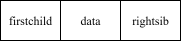

# 树

## 定义

**树（Tree）**是一种 **非线性数据结构**，由$$n(n\ge 0)$$个节点组成的有限集合。

- **递归定义：**

  当$$n>0$$时：

  - 有一个特殊的节点称为 **根（root）**；

  - 除根外的其余节点可分为若干个**互不相交**的子集$$T_1,\ T_2,\ ...\ T_k$$，每个子集本身又是一棵树（称为根的**子树**）。

- **直接定义：**

  每棵树只有唯一前驱；可能有多个后驱。

## 基本术语

|      术语       |           含义            |
| :-------------: | :-----------------------: |
|     **根**      |     无双亲的唯一节点      |
|     **度**      |    节点拥有的子树个数     |
|   **树的度**    |    所有节点度的最大值     |
| **深度 / 高度** |    树中节点的最大层数     |
|  **叶子结点**   |  无子节点的节点（度为0）  |
|  **分支结点**   | 有子节点的节点（度不为0） |

## 存储

### 双亲表示法

- 已知每个结点（根结点除外）都只有**唯一**的双亲结点。

- 因此，可以把各个结点按层序存储在一维数组中，同时记录其唯一双亲结点在数组中的下标。

- **结构体定义**

  ```C
  struct Node{
      char data; //数据域
      int parent; //指针域，双亲的下标
  };
  ```

以形如下图的树为例


可以使用二维数组存储：


### 孩子链表表示法

- 把每个结点的孩子排列起来，看成是一个线性表，且以单链表存储，则n个结点共有n个孩子链表。
- 再把每个单链表的头指针，组织成一个线性表，为了便于查找，采用顺序存储结构。


### 孩子兄弟表示法

采用二叉链表（（左）孩子－（右）兄弟链表表示）。

- 结点的右兄弟是唯一的；

- 设置两个分别指向该结点的第一个孩子和右兄弟的指针。

**结点结构**



> 示例


由于树与二叉树都可以采用二叉链表作存储结构，因此以二叉链表作为媒介可以导出树与二叉树的对应关系。仍以上图中的树为例，通过孩子兄弟链表可以得到其二叉树表示：


类似地能够得到森林与二叉树的对应关系，如下图所示。


且能够根据右支节点数倒推森林中树的数量（各棵树的根节点），图中已用蓝色标出。

# 二叉树

## 定义

二叉树是**每个节点最多有两个子树**（分别称为左子树、右子树）的有序树。

特点：

- 可以为空；
- 左右子树**有顺序且可区分**；一棵子树也有左右之别；
- 每个节点度 ≤ 2。

## 特殊的二叉树

> 满二叉树

- 分支节点都有2棵子树；
- 叶子节点都在最后一层。


> 完全二叉树

- 除最后一层外都满；最后一层叶子从左到右连续排列；
- 左右子树深度相等或大于1；
- 可以直接继承满二叉树的编号。


## 性质

1. 在二叉树的第$$i$$层上至多有$$2^{i-1}$$个节点；
2. 深度为$$k$$的二叉树至多有$$2^k-1$$个节点；
3. 若终端（叶子）节点数为$$n_0$$，度为2的节点数为$$n_2$$，则有$$n_0=n_2+1$$；
4. 具有$$n$$个节点的完全二叉树，深度为$$\lfloor\log_{2}n\rfloor+1$$；

## 存储

### 顺序存储


### 链式存储

**二叉链表**


- **定义**

  ```C
  struct BiNode{
      datatype data ;
      BiNode *lchild, *rchild;           
  };
  struct BiNode *BiTree;
  ```

**三叉链表**

采用数据域加上左、右孩子指针以及双亲指针。


## 遍历二叉树

- 遍历结果是二叉树结点的线性序列，将非线性结构**线性化**。
- 规定：**左子树节点必须在右子树前被访问**。

> 示例


### 先序

- 访问根节点；

- 先序遍历根节点的左子树；

- 先序遍历根节点的右子树。

  - eg1.1
    $$
    A\rightarrow B\rightarrow D\rightarrow G\rightarrow C\rightarrow E\rightarrow F
    $$
    
  - eg2.1
    $$
    -\rightarrow +\rightarrow a\rightarrow *\rightarrow b\rightarrow -\rightarrow c\rightarrow d\rightarrow /\rightarrow e\rightarrow f
    $$

### 中序

- 中序遍历根节点的左子树；

- 访问根节点；

- 中序遍历根节点的右子树。

  - eg1.2

    
    $$
    D\rightarrow G\rightarrow B\rightarrow A\rightarrow E\rightarrow C\rightarrow F
    $$
    
  - eg2.2
  
    
    $$
    a\rightarrow +\rightarrow b\rightarrow *\rightarrow c\rightarrow -\rightarrow d\rightarrow -\rightarrow e\rightarrow /\rightarrow f
    $$

### 后序

- 后序遍历根节点的左子树；

- 后序遍历根节点的右子树；

- 访问根节点。

  - eg1.3

    
    $$
    G\rightarrow D\rightarrow B\rightarrow E\rightarrow F\rightarrow C\rightarrow A
    $$

  - eg2.3

    
    $$
    a\rightarrow b\rightarrow c\rightarrow d\rightarrow -\rightarrow *\rightarrow +\rightarrow e\rightarrow f\rightarrow /\rightarrow -
    $$

  - eg3

    已知某一二叉树先序为ABDEGCF，中序为DBGEAFC。试确定此二叉树的形状。

    - 确定根节点

      已知先序的第一个节点就是根节点，故结合先序对中序做以下处理：

      

    - 作图

      

    - eg4

      已知某一二叉树后序为DGEBFCA，中序为DBGEAFC。试确定此二叉树的形状。

      - 确定根节点

        已知后序的最后一个节点就是根节点，故结合后序对中序做以下处理：

        

      - 作图

        

    > [!IMPORTANT]
    >
    > **先序+中序**或**中序+后序**可唯一确定二叉树的形状。


## 最优二叉树/哈夫曼树

### 定义与构造

指在给定一组带权叶子结点（或查找概率）的情况下，使得整棵树的**带权路径长度（WPL）最小**的二叉树。

- **路径长度（Path Length）**：
  - 从根节点到某个结点所经过的边数。

- **带权路径长度（Weighted Path Length）**：

  -  每个叶子结点有一个权值（权重），代表：

    - 出现频率；

    - 查找概率；

    - 或存储代价。

  - **计算公式**
    $$
    WPL=\sum_{i=1}^nw_il_i
    $$

- **哈夫曼树**

  1. 将每个权值（频率）作为一棵单结点二叉树；
  2. 选出两棵**权值最小**的树作为左右子树；
  3. 合并它们，根节点权值 = 左 + 右；
  4. 重复步骤 2~3，直到只剩一棵树。

  > 示例

  权值集合：$$\{7,5,2,4\}$$​

  

  

  注意到权值大的叶子节点离根节点较近，路径长度更短；权值小的叶子节点离根节点较远，路径长度更长。

  - **特点**

    - 没有度为1的结点；

    - $$n$$个叶子结点的赫夫曼树共有$$2n-1$$个结点；

    - 赫夫曼树的任意非叶节点的左右子树交换后仍是赫夫曼树。

### 哈夫曼编码

对于给定的字符集及其每个字符出现的概率（使用频度），求该字符集的最优的前缀性编码。

**解法**

1. 使字符集中的每个字符对应一棵只有叶结点的二叉树，叶的权值为对应字符的使用频率---**初始化**
2. 利用哈夫曼算法来构造一棵哈夫曼树---**构造算法**
3. 对哈夫曼树上的每个结点，左、右支分别附以0、1，则从根到叶结点路径上的分支编码（0、1序列）就是相应字符的编码---**哈夫曼编码**

> 示例

已知一段文本，其构成字符与对应的出现频率如下表所示，对各字符进行哈夫曼编码。

| **字符** |  a   |  b   |  c   |  d   |  e   |  f   |
| :------: | :--: | :--: | :--: | :--: | :--: | :--: |
| **频率** |  45  |  13  |  12  |  16  |  9   |  5   |


构造的哈夫曼树如上图所示，可得编码表


