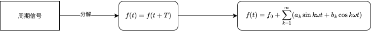

# 半导体基础知识

## 本征半导体与杂质半导体

1. **本征半导体**

   - **定义**

     - 纯净晶体结构的半导体称为本征半导体。

   - **结构特点**

     - 硅、锗为四价元素，每个原子与周围 4 个原子通过**共价键**紧密结合。

     - 在$$0K$$时，没有自由电子。

   - **导电机理**

     - 温度升高或受光照时，部分价电子获得能量，挣脱束缚，成为自由电子。
     - 原共价键中留下的“空位”称为空穴（带正电）。
     - 自由电子与空穴总是**成对产生**（电子-空穴对）。
     - 空穴通过相邻电子依次填补而“移动”，表现为**空穴电流**。

   - **特点**

     - 载流子：自由电子（负电）+ 空穴（正电）。
     - 本征半导体的导电性很弱，依赖温度激发。

2. **杂质半导体**

   - 在本征半导体中**掺入微量杂质**（五价或三价元素），导电性能显著增强。

   - **N 型半导体**

     - 掺入 **五价元素**（如磷 P、砷 As）。
     - 四个电子参与共价键，多余的 1 个电子成为自由电子。
     - **多数载流子：自由电子**（由杂质提供），又称**多子**。
     - **少数载流子：空穴**（热激发产生），又称**少子**。
     - 五价杂质原子失去电子后带正电，称为**施主杂质**。

   - **P 型半导体**

     - 掺入 **三价元素**（如硼 B、镓 Ga、铟 In）。

     - 与硅形成共价键时缺少 1 个电子 → 出现空穴。

     - **多数载流子：空穴**（由杂质提供）。

     - **少数载流子：自由电子**（热激发产生）。

     - 三价杂质原子俘获电子后带负电，称为 **受主杂质**。

   - **结论**

     - 多数载流子的浓度主要由**掺杂**决定，几乎不受温度影响。
     - 少数载流子浓度很低，但受**温度**影响显著，是半导体器件温度特性差的主要原因。

# 半导体二极管及其基本应用电路 

## PN结

**形成原理**

浓度差 → 多子的扩散运动（P型半导体为空穴，N型半导体为自由电子） → 复合 → 内电场

**内电场作用**

抑制多子扩散，促进少子的漂移运动

**偏置：**外加直流电压

- **正向** - 有$$u_P>u_N$$​，外内电场方向**相反**，有利于增强多子扩散，抑制少子漂移。

  - 扩散电流远大于漂移电流，可忽略漂移电流的影响，PN结呈现**低阻性**。

  

- **反向** - 有$$u_P<u_N$$​，外内电场方向**相同**，有利于增强少子漂移，抑制多子扩散。

  - 少子形成的漂移电流是恒定的，基本上与所加反向电压的大小无关，这个电流也称为**反向饱和电流**。        

  

## 二极管

### **二极管的伏安特性**

- **正向区：**
  - 当$$0<u_D<U_{th}$$时，$$I_D=0A$$；
  - 当$$u_{D}>U_{th}$$时，出现正向电流，且按照指数规律增长；
  - 把$$U_{th}$$称为开启电压
- **反向区：**
  - 当$$U_{BR}<u{D}<0$$时，$$I_D=I_S$$，反向电流很小，也把$$I_S$$称为**反向饱和电流**，且基本不随反向电压的变化而变化；
  - 当$$u_{D}<U_{BR}$$时，反向电流急剧增加，把$$U_{BR}$$称为称为**反向击穿电压**；
  - 由于击穿破坏了PN结的单向导电特性, 因而一般使用时应避免出现击穿现象

### **伏安特性的数学表示**

根据理论推导，二极管的伏安特性曲线可用下式表示
$$
I_D=I_S(e^\frac{U_D}{U_T}-1)
$$

- $$U_T$$称为温度的电压当量，是一个会受环境温度影响的电压值；

- 当$$U_D>0$$时PN结正向偏置，有：
  $$
  I_D\approx I_Se^{\frac{U_D}{U_T}}
  $$
  
- 当$$U_D<0$$时PN结反向偏置，有：
  $$
  I_D\approx I_S
  $$

### 等效模型

> 示例1

下图电路各参数已标出，求通过二极管的电流大小。

注意到$$u_P=3V$$，$$u_N=5V\cdot\frac{2k\Omega}{2k\Omega+3k\Omega}=2V$$，因为$$u_P>u_N$$​，所以二极管**正偏导通**。

$$\because$$**导通**，$$\therefore$$N端电压实际为$$3V$$(使用理想模型，将二极管视作导线，压降为0)

所以根据基尔霍夫定律，有：
$$
I_3=I_1+I_2
$$
又因为N端电压为$$3V$$，所以有：
$$
I_1=\frac{5V-3V}{3k\Omega}=\frac{2}{3}mA \\
I_3=\frac{3V-0}{2k\Omega}=\frac{3}{2}mA
$$
所以
$$
I_2=I_3-I_1=\frac{5}{6}mA
$$

> 示例2

下图电路各参数已标出，求$$u_o$$的大小。

由电路图可知：$$u_P=10V,\ u_N=20V$$；

因为$$u_N>u_P$$，所以二极管**反偏截止**，整个电路开路，电流为0，所以
$$
u_o=-10V
$$

## 基本应用电路

**傅里叶变换**

- 任何**非纯正弦**的周期信号，都可以看成是**一堆正弦/余弦**信号叠加出来的。
- **傅里叶级数**：适用于周期信号，把信号分解成不同频率的正弦波。
- **傅里叶变换**：适用于非周期信号，把时间域信号变成频率域的连续谱。

> [!NOTE]
>
> 其中$$f_0$$是整流电路中要提取的直流成分，有$$f_0=\frac{1}{T}\int_0^Tf(t)dt$$。

### 整流电路

**目的**：将交流电（AC）转换为单向脉动的直流电（DC）。

- **半波整流**

  - **工作原理**
    - 正半周：二极管正向导通 → RL上得到正半波电压。
    - 负半周：二极管反向截止 → RL上电压≈0。

  

  - **输入输出信号对比**

    

- **全波整流（桥式）**

  - 全波整流后波形 = 绝对值正弦波，周期减半。

    在频率域：

    - 直流分量比半波大（平均值高）。
    - 基波成分变成$$2f$$（频率翻倍）。

  

  - **输入输出信号对比**

    

### 限幅电路

- **限幅电路（Clipping Circuit / Limiter）**：用二极管或其他器件将输入信号中**超过某一电压水平**的部分“切掉”或限制住，只保留不超过这个幅值的部分。
- 作用：**保护电路**、**波形整形**、**产生特定波形**（如脉冲整形、消除尖峰）。
- **工作原理：**当输入超过设定电压（如 +Vref + 二极管导通压降）时，二极管导通→输出被钳位在这个电平。

- **输入输出信号对比**

  

# 稳压管

- **定义**
  - **稳压管（Zener Diode）**：一种在**反向击穿**区工作、能在较宽的电流范围内保持**近似恒定电压**的二极管。
- **伏安特性**
  - **正向特性**：和普通二极管一样，正向导通压降约0.7V。
  - **反向特性**：
    - 在反向电压低于击穿电压时，只有微小反向漏电流。
    - **达到击穿电压$$V_Z$$后导通，电压基本保持$$V_Z$$不变**（随电流变化很小）。
    - 稳压区工作需要**限流电阻**保护。

- **切入点**
  - 在电路中是否反偏？
  - 反偏程度是否足够（是否到达击穿电压？）

> 示例3

下图电路各参数已标出，求$$I_L$$的大小。

**判断：**

1. 是否反偏？——是

2. 反偏程度是否足够？

   注意到负载电阻分压最多为$$12\times\frac{3}{3+3}=6V$$，而稳压管需要$$8V$$，所以仍然工作在反向偏置区而非击穿区。

   所以有
   $$
   I_L=\frac{12V}{6k\Omega}=2mA
   $$

> 示例4

下图电路各参数已标出，求$$I_L$$的**范围**。

令稳压管工作在稳压状态，则有限流电阻$$R$$分压恒为$$12V-8V=4V$$，所以有
$$
I=\frac{4V}{0.05k\Omega}=80mA
$$
又因为稳压管最小工作电流限制为$$5mA$$，所以
$$
I_{L_{max}}=I-5mA=75mA
$$
且稳压管最大功率为$$320mW$$，所以
$$
I_{L_{min}}=I-\frac{320mW}{8V}=40mA
$$
故$$I_L$$的范围为$$40mA<I_L<75mA$$。

