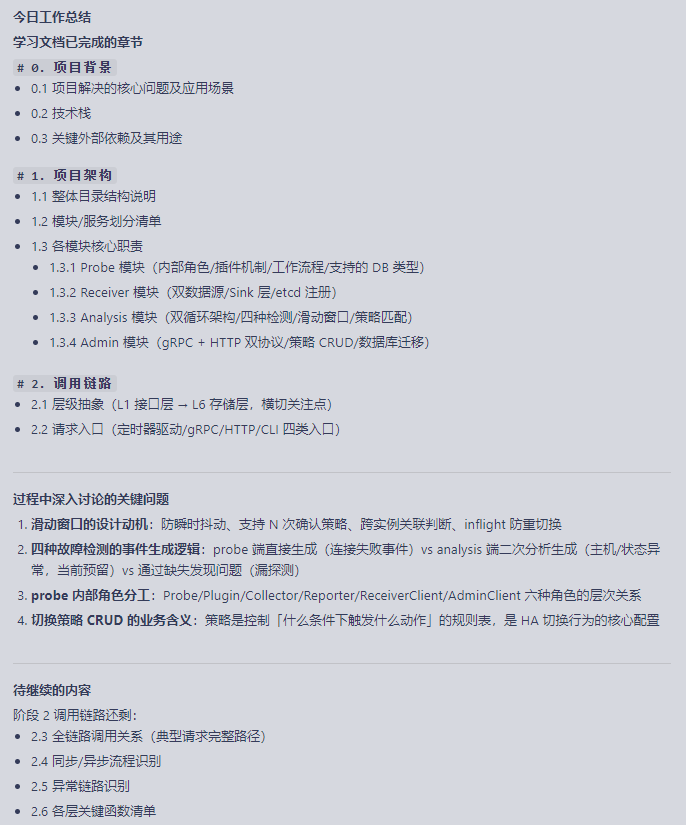

工作总结

今日：
1. 熟悉 DBHA 各组件（Probe / Receiver / Analysis / Admin）的核心职责与工作模式；
2. 深入探讨
    1. Analysis 中滑动窗口算法的设计动机；
    2. Scan 循环中的四种故障检测逻辑；
3. 绘制总体架构图。

下一步规划：
全链路调用关系（典型请求完整路径）；同步 / 异步流程识别；异常链路分析；数据流转

