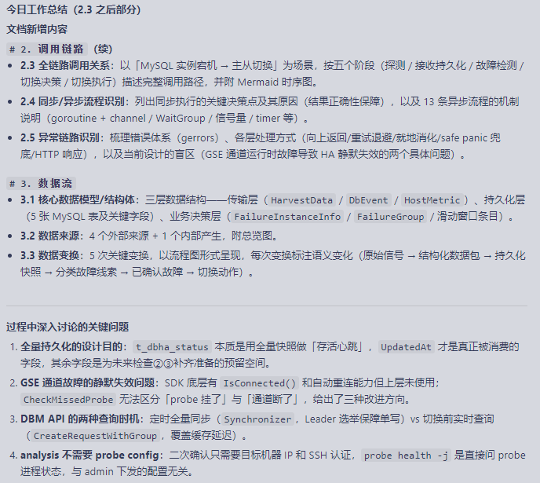

工作总结

今日：
1. 以「MySQL 实例宕机 → 主从切换」为场景，按五个阶段（探测 / 接收持久化 / 故障检测 / 切换决策 / 切换执行）描述完整调用路径；
2. 识别异常链路，了解了各层级错误处理方式（向上返回/重试退避/就地消化/safe panic 兜底/HTTP 响应）；
3. 从数据模型、来源及变换角度理清了数据流；
4. 深入讨论了通道故障时服务可能静默失效的问题。

下一步规划：
各组件的核心函数逻辑和开放性探讨

