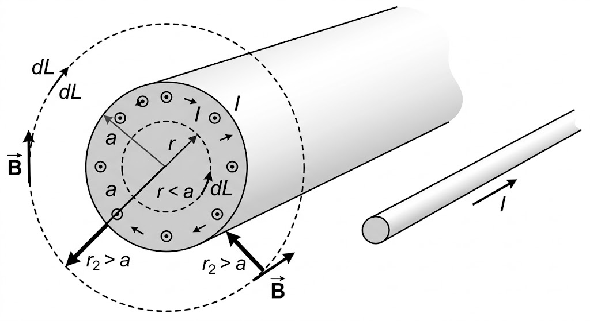
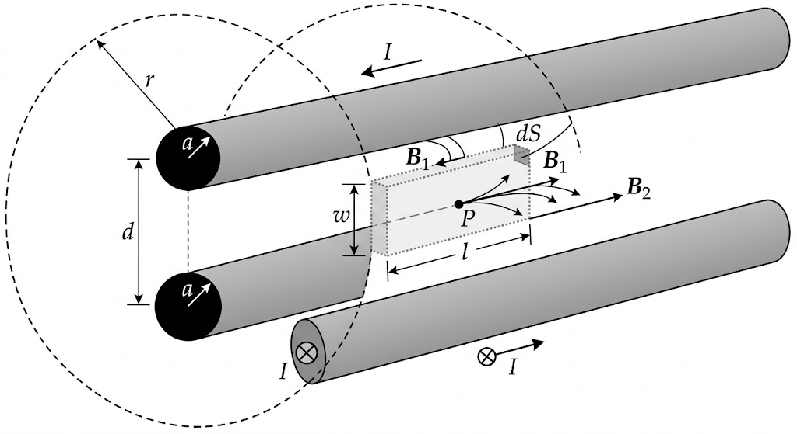
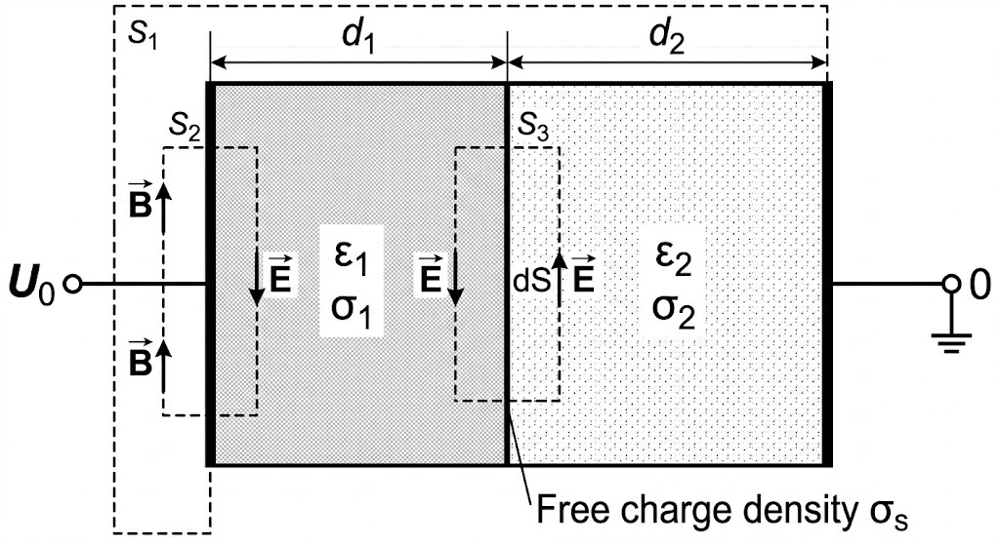

# 恒定电流的电场

## 电流密度

在宏观电路中，常用电流 $I$（标量），但在场论分析中需要描述空间中**每一点**电流的大小和方向，这时就必须引入**电流密度矢量 $\mathbf{J}$**。

- **定义**

  电流密度 $\mathbf{J}$ 是描述空间某点电流分布强度的矢量。它的方向与该点正电荷运动的方向一致，大小等于单位时间内垂直通过单位面积的电荷量。

- **核心公式**

  - **宏观关系**

    通过某一曲面 $S$ 的总电流 $I$ 是电流密度的面积分，即电流密度 $\mathbf{J}$ 在 $\mathbf{S}$ 上的通量：
    $$
    I=\int_S\mathbf{J}\cdot d\mathbf{S}=\int_SJ\cos\theta dS
    $$

  - **微观关系**

    从微观角度看，$\mathbf{J}$ 与电荷载流子的运动有关：
    $$
    \mathbf{J} = \rho \mathbf{v}
    $$
    其中：

    - $\rho$ 是电荷体密度。
    - $\mathbf{v}$ 是电荷的定向漂移速度。

## 电荷守恒定律

电荷守恒定律反映了一个基本物理事实：电荷既不会凭空产生，也不会凭空消失。

- **积分形式**

  假设空间中有一个闭合曲面 $S$，从该曲面流出的净电流，必须等于该曲面内电荷量的减少率。
  $$
  \oint_S \mathbf{J} \cdot d\mathbf{S} = -\frac{dq_{in}}{dt}=-\frac{d}{dt}\int_V\rho dV
  $$

- **微分形式**

  利用高斯散度定理，将通量转为散度
  $$
  \oint_S\mathbf{J}\cdot d\mathbf{S}=\int_V\nabla\cdot\mathbf{J}dV
  $$
  由此我们可以得到描述空间任一点的微观方程，也称**电流连续性方程**：
  $$
  \nabla \cdot \mathbf{J} = -\frac{\partial \rho}{\partial t}
  $$
  其中

  - **$\nabla \cdot \mathbf{J}$**：代表该点电流的散度（流出的净量）。

  - **$-\frac{\partial \rho}{\partial t}$**：代表该点电荷密度的随时间的变化率。

  > **特殊状态**

  既然讨论的是**恒定**电流场，意味着电荷分布不随时间改变（即 $\frac{\partial \rho}{\partial t} = 0$​）。 于是，方程简化为
  $$
  \nabla\cdot\mathbf{J}=0
  $$
  或写成积分形式
  $$
  \oint_S\mathbf{J}\cdot d\mathbf{S}=0
  $$
  这表明在恒定电流场中，电流线是**闭合**的。流进某个区域的电流必须等于流出的电流，空间内没有电荷的堆积或流失。

## 欧姆定律

在电磁场中，需要描述的是场点上**电流密度 $\mathbf{J}$** 与 **电场强度 $\mathbf{E}$​** 之间的局部对应关系。

- **定义**

  欧姆定律的微分形式描述了在导体内某一点，电流密度与该点的电场强度成正比。

- **核心公式**
  $$
  \mathbf{J} = \sigma \mathbf{E}
  $$
  其中：

  - **$\sigma$ (电导率)**：衡量材料导电能力的物理量（单位：S/m）。它是电阻率 $\rho$ 的倒数（$\sigma = 1/\rho$）。
  - **$\mathbf{E}$**：该点的电场强度。

> 电动势

在纯导体内，电荷总是从高电位流向低电位。如果没有外部能量补充，电位差会因电荷的移动而消失。要维持**恒定**电流，必须将正电荷从低电位处逆着静电力“搬运”回高电位处。

- **局域场**

  为了描述这种非静电力的作用，引入**局域场强度 $\mathbf{E}_e$**。

  - **静电场 $\mathbf{E}_s$**：由电荷产生，阻碍电荷逆向移动。
  - **局域场 $\mathbf{E}_e$​**：由电源（如电池的化学作用、温差、磁场变化）产生，驱动电荷克服静电力。

- **定义与公式**

  电动势 $\mathcal{E}$ 定义为：单位正电荷在电源内部由局域场**从负极移动到正极**所做的功。
  $$
  \mathcal{E} = \int_{L^-}^{L^+} \mathbf{E}_e \cdot d\mathbf{l}
  $$
  也可以从**全电路回路积分**理解电动势
  $$
  \mathcal{E}=\oint_l(\mathbf{E_s}+\mathbf{E_e})\cdot dl
  $$

  - **静电场项**：由于静电场是保守场，其环路积分为零，即 $\oint_l \mathbf{E}_s \cdot d\mathbf{l} = 0$。

  - **局域场项**：局域场只存在于电源内部，其积分结果即为电动势 $\mathcal{E}$。

- **全电路欧姆定律的微分形式**：

  在电源内部，总的驱动力是 $\mathbf{E}_s + \mathbf{E}_e$，因此：
  $$
  \mathbf{J} = \sigma (\mathbf{E}_s + \mathbf{E}_e)
  $$

## 焦耳定律

在恒定电流场中，需要描述的是**能量转换在空间中的分布情况**，即单位体积内的功率。

- **定义**

  焦耳定律的微分形式描述了导电介质中**某一点**单位时间内产生的热量（功率密度）。

- **核心公式**

  单位体积的功率密度 $p$（单位：$\text{W/m}^3$）表示为：
  $$
  p = \mathbf{J} \cdot \mathbf{E}
  $$
  这说明热量的产生取决于该点的电流密度大小以及为了维持该电流所需的电场强度。

  如果代入欧姆定律微分形式 $\mathbf{J} = \sigma \mathbf{E}$，可以写成：
  $$
  p=\sigma E^2
  $$

## 恒定电流场的基本方程

恒定电流场的基本方程由两个微分方程组成，分别描述了场的**散度**和**旋度**特性。

- **散度方程**

  又称电流连续性方程。
  $$
  \nabla\cdot\mathbf{J}=0
  $$

  - **来源**：由电荷守恒定律推导而来，在恒定状态下 $\frac{\partial \rho}{\partial t} = 0$。

  - **物理意义**：这表明恒定电流场是一个**无源场**。电流线是闭合的，既不会在空间中某个点凭空消失，也不会凭空产生。

- **旋度方程**

  体现了静电场特性。
  $$
  \nabla\times\mathbf{E}=0
  $$

  - **来源**：虽然电荷在移动，但电荷分布 $\rho$ 是恒定的，因此它产生的电场仍然满足静电场的环路定理。

  - **物理意义**：这表明恒定电流场中的电场仍然是**无旋场**，也是保守场。

- **积分形式**
  $$
  \begin{aligned}
  \oint_{S}\mathbf{J}\cdot d\mathbf{S}&=0 \\
  \oint_{l}\mathbf{E}\cdot d\mathbf{l}&=0
  \end{aligned}
  $$

- **其他结论**

  结合欧姆定律 $\mathbf{J}=\sigma\mathbf{E}$，代入到散度方程可得
  $$
  \nabla\cdot(\sigma\mathbf{E})=0
  $$
  又因为
  $$
  \mathbf{E}=-\nabla\varphi
  $$
  所以
  $$
  \nabla\cdot(-\sigma\nabla\varphi)=0
  $$
  且 $\sigma$ 是常数，由此可得**拉普拉斯方程**
  $$
  \nabla^2\varphi=0
  $$

## 边界条件

类似于静电场，同样将场量分解为**切向分量**和**法向分量**来分析。

1. **切向分量**
   $$
   E_{1t}=E_{2t}
   $$

   - **来源**：由旋度方程 $\nabla \times \mathbf{E} = 0$（环路定理）推导而来。

   - **物理意义**：界面两侧的电场切向分量必须相等。体现了**电场的连续性**。

2. **法向分量**
   $$
   J_{1n}=J_{2n}
   $$

   - **来源**：由散度方程 $\nabla \cdot \mathbf{J} = 0$ 推导而来。

   - **物理意义**：在恒定状态下，流入界面的电流必须等于流出界面的电流，界面上不会有电荷的持续堆积。体现了**电流的连续性**。

> 特殊场景

由于
$$
D_{2n}-D_{1n}=\rho_s
$$
即虽然电流是连续的（$J_n$ 连续），但由于两侧介质的电导率 $\sigma$ 和介电常数 $\varepsilon$ 不同，根据高斯定律，界面上通常会存在**静止的面电荷**
$$
\begin{aligned}
\rho_s&=\varepsilon_2E_2-\varepsilon_1E_1 \\
&=\varepsilon_2\frac{J_{2n}}{\sigma_2}-\varepsilon_1\frac{J_{1n}}{\sigma_1} \\
&=J_n(\frac{\varepsilon_2}{\sigma_2}-\frac{\varepsilon_1}{\sigma_1})
\end{aligned}
$$

> 示例3-1

设同轴线的内导体半径为 $a$，外导体内半径为 $b$，内、外导体间填充电导率为 $\sigma$ 的导电媒质，如图所示，求同轴线单位长度的漏电导。

注意到**单位长度**，所以有 $L=1$。已知漏电导的定义为
$$
G=\frac{1}{R}=\frac{I}{U}
$$

1. **计算电流密度** $\mathbf{J}$

    根据电流密度的定义，电流密度等于电流除以垂直于电流方向的截面积。在半径为 $r$ ($a < r < b$) 的圆柱面上，截面积为侧面积
    $$
    S=2\pi rL
    $$
    当取单位长度 $L=1$ 时：
    $$
    \mathbf{J} = \frac{I}{2\pi r L} \mathbf{e}_r \bigg|_{L=1} = \frac{I}{2\pi r} \mathbf{e}_r
    $$

2.  **计算电场强度** $\mathbf{E}$

    根据欧姆定律的微分形式
    $$
    \mathbf{J}=\sigma\mathbf{E}
    $$
    可以求得介质中的场强为
    $$
    \mathbf{E}=\frac{\mathbf{J}}{\sigma}=\frac{I}{2\pi\sigma r}\mathbf{e}_r
    $$

3. **计算内外导体间的电压** $U$

    因为
    $$
    U=\int_a^b\mathbf{E}\cdot d\mathbf{l}=\int_a^b\frac{I}{2\pi\sigma r}dr
    $$
    由此可得
    $$
    U = \frac{I}{2\pi \sigma} \ln(r) \bigg|_{a}^{b} = \frac{I}{2\pi \sigma} \ln\left(\frac{b}{a}\right)
    $$

4. **计算单位长度漏电导** $G$

    根据
    $$
    G=\frac{I}{U}
    $$
    最终得到
    $$
    G=\frac{2\pi\sigma}{\ln\left(\frac{b}{a}\right)}
    $$

> 示例3-2

一个同心球电容器的内、外半径为 $a、b$，其间导电媒质的电导率为 $\sigma$，求该电容器的漏电导。

- 法1. 常规方法

  1. **计算电流密度** $\mathbf{J}$

      已知
      $$
      \mathbf{J}=\frac{I}{\mathbf{S}}
      $$
      又因为**球电容器**，设半径为 $r$，则
      $$
      S=4\pi r^2
      $$
      所以
      $$
      \mathbf{J}=\frac{I}{4\pi r^2}\mathbf{e}_r
      $$

  2. **计算电场强度** $\mathbf{E}$

      根据欧姆定律的微分形式
      $$
      \mathbf{J}=\sigma\mathbf{E}
      $$
      可以求得介质中的场强为
      $$
      \mathbf{E}=\frac{\mathbf{J}}{\sigma}=\frac{I}{4\pi\sigma r^2}\mathbf{e}_r
      $$

  3. **计算内外导体间的电压** $U$

      因为
      $$
      U=\int_a^b\mathbf{E}\cdot d\mathbf{l}=\int_a^b\frac{I}{4\pi\sigma r^2}dr
      $$
      所以积分可得
      $$
      U=\left[-\frac{I}{4\pi\sigma r}\right]_a^b=\frac{I}{4\pi\sigma}\left(\frac{1}{a}-\frac{1}{b}\right)
      $$

  4. **计算漏电导** $G$

      由此可得
      $$
      G=\frac{I}{U}=\frac{4\pi\sigma ab}{b-a}
      $$

- 法2. 通过功率计算

  1. **计算导体总功率**

      因为
      $$
      P=\int_V\mathbf{J}\cdot\mathbf{E}dV
      $$
      且
      $$
      \begin{aligned}
      \mathbf{J}&=\frac{I}{4\pi r^2}\mathbf{e}_r \\
      \mathbf{E}&=\frac{I}{4\pi\sigma r^2}\mathbf{e}_r \\
      dV&=4\pi r^2dr
      \end{aligned}
      $$
      所以
      $$
      P=\int_a^b\frac{I^2}{(4\pi r^2)^2\sigma}4\pi r^2dr=\frac{I^2}{4\pi\sigma}\left(\frac{1}{a}-\frac{1}{b}\right)
      $$
      又因为
      $$
      G=\frac{1}{R}=\frac{I^2}{P}
      $$
      所以
      $$
      G=\frac{4\pi\sigma ab}{b-a}
      $$

# 磁感应强度

## 安培定律

安培定律是恒定磁场（静磁场）领域的一个基本实验定律。

- **定义**

  

  载有电流 $I_1$ 的回路 $C_1$ 上任一线元 $d\mathbf{l}_1$ 对另一载有电流 $I_2$ 的回路 $C_2$ 上任一线元 $d\mathbf{l}_2$​ 的磁场作用力公式如下：
  $$
  \mathbf{F}_{12} = \frac{\mu_0}{4\pi} \oint_{C_2} \oint_{C_1} \frac{I_2 d\mathbf{l}_2 \times (I_1 d\mathbf{l}_1 \times \mathbf{R})}{R^3}
  $$

  - **$\mathbf{F}_{12}$**：回路 $C_1$ 对回路 $C_2$ 的总磁场作用力。

  - **$\mu_0$**：真空介磁导率（真空磁导率），常数，$\mu_0 = 4\pi \times 10^{-7} \text{H/m}$。

  - **$I_1 d\mathbf{l}_1$** 与 **$I_2 d\mathbf{l}_2$**：分别为回路 $C_1$ 和 $C_2$ 上的微小电流元矢量。$d\mathbf{l}$ 的方向与电流 $I$ 的流向一致。

  - **$\mathbf{R}$**：距离矢量，方向从产生磁场的源点（$I_1 d\mathbf{l}_1$）指向场点（$I_2 d\mathbf{l}_2$）。

  - **$R$**：两个电流元之间的空间距离，即矢量 $\mathbf{R}$ 的模。

  - **公式中的矢量叉乘 ($\times$)：**

    - 括弧内的 $I_1 d\mathbf{l}_1 \times \mathbf{R}$：计算第一根导线在第二根导线处产生的磁场。

    - 外层的叉乘：计算第二根导线的电流在这个磁场中所受的安培力。力 $d\mathbf{F}$ 的方向总是垂直于电流元和磁感应强度所构成的平面。

- **特性**

  1. **孤立电流元不遵守牛顿第三定律**

     公式推导表明，由于双重叉乘展开后的不对称性，导致一般情况下两个独立的电流元之间的磁场力满足 $d\mathbf{F}_{12} \neq -d\mathbf{F}_{21}$​，且不共线。

  2. **宏观闭合回路遵守牛顿第三定律**

     虽然微观的电流元受力复杂，但当对整个闭合回路进行积分运算时，不对称的分量会在环路积分中相互抵消，宏观上总作用力重新找回牛顿第三定律。

## 毕奥-萨伐尔定律

定量描述了空间中任意形态的稳恒载流导线（或分布电流）在真空中某一点所激发的磁感应强度分布。

- **定义**

  对于一段微小的线电流元在空间某一目标点（场点）产生的微小磁感应强度：

  - **大小**：
    - 与电流元的大小成正比
    - 与电流元到场点的距离的平方成反比
  - **方向**：
    - 垂直于电流元和位移矢量所构成的平面

  最终通过对整个闭合电流回路进行空间矢量积分，即可求得空间任意一点的总磁感应强度。

- **核心公式**

  对于真空中载有电流 $I_1$ 的一维细导线（回路 $C_1$），其在空间某点产生的总磁感应强度 $\mathbf{B}$ 的核心表达式为
  $$
  \mathbf{B} = \frac{\mu_0}{4\pi} \oint_{C_1} \frac{I_1 d\mathbf{l}_1 \times \mathbf{R}}{R^3}
  $$
  其中

  - **$\mathbf{B}$**：目标位置（场点）处的总磁感应强度

  - **$\mu_0$**：真空介磁导率，常数，值为 $4\pi \times 10^{-7} \text{H/m}$

  - **$I_1 d\mathbf{l}_1$**：源点处的“电流元”矢量；大小为电流 $I_1$ 与微小线段长度的乘积，方向沿着该处电流的真实流动方向

  - **$\mathbf{R}$**：距离矢量，它的方向明确规定为**从源点（产生磁场的电流元所在位置 $\mathbf{r}'$）指向场点（计算磁感应强度的目标位置 $\mathbf{r}$）**

  - **$R^3$**：分母上的 $R$ 是距离矢量 $\mathbf{R}$ 的空间绝对模长（即直线距离）

  - **$\times$ (矢量叉乘)**：分子中的 $d\mathbf{l}_1 \times \mathbf{R}$​ 决定了该微小段产生的磁场方向，遵循右手螺旋定则。

- **扩展**

  如果电流不是在一根细导线中流动（线电流），定律也可以平滑扩展。对于在表面流动的面电流分布，公式转化为
  $$
  \mathbf{B} = \frac{\mu_0}{4\pi} \int_{S'} \frac{\mathbf{J}_s \times \mathbf{R}}{R^3} dS'
  $$
  对于在三维空间中流动的体电流分布，则转化为
  $$
  \mathbf{B} = \frac{\mu_0}{4\pi} \int_{V'} \frac{\mathbf{J}(\mathbf{r}') \times \mathbf{R}}{R^3} dV'
  $$
  无论是 $Id\mathbf{l}$、$\mathbf{J}_s dS$ 还是 $\mathbf{J}dV$，**微观上全都是 $dQ\mathbf{v}$（运动电荷）**。

## 磁场力与洛伦兹公式

- **定义**

  - **磁场力**

    描述了载流导线上的**微小电流元**（宏观电流的微分形式）在外部静磁场中所受到的磁场作用力。

  - **洛伦兹力**

    描述了**单个运动点电荷**在外部电磁场（即电场与磁场的叠加空间）中所受到的综合电磁力。

- **核心公式**

  1. **电流元在纯磁场中的受力（安培力微元）**
     $$
     d\mathbf{F} = I d\mathbf{l} \times \mathbf{B}
     $$

     - **$d\mathbf{F}$**：电流元受到的微小磁场力。

     - **$I d\mathbf{l}$**：电流元矢量，方向与电流流动方向一致。

     - **$\mathbf{B}$**：电流元所在位置的**外加**磁感应强度。

  2. **运动电荷在纯磁场中的受力**

     宏观到微观的过渡。

     因为
     $$
     Id\mathbf{l}=\frac{q}{t}d\mathbf{l}=q\frac{d\mathbf{l}}{t}=q\mathbf{v}
     $$
     所以
     $$
     \mathbf{F} = q\mathbf{v} \times \mathbf{B}
     $$
     
3. **一般情况下的洛伦兹公式（电磁场叠加）**
   $$
   \mathbf{F} = q(\mathbf{v} \times \mathbf{B} + \mathbf{E})
   $$

   - **$q\mathbf{E}$**：电场力分量。只要电荷放在电场 $\mathbf{E}$ 中就会受力，与电荷动不动无关，力的方向与电场方向共线。
     
   - **$q\mathbf{v} \times \mathbf{B}$**：磁场力分量。只有**运动**的电荷（$\mathbf{v} \neq 0$​）在磁场中才会受力，且力的方向永远垂直于运动方向，因此**磁场力永远不做功**（只改变速度方向，不改变速度大小）。

# 恒定磁场的基本方程

## 磁通连续性原理

这一原理表明磁感应强度 $\mathbf{B}$ 是一个**无源场**。即任意闭合面射出的净磁通量恒等于零。这在物理上意味着磁荷并不存在，**磁感线是无始无终的闭合曲线**。

- **磁通量**

  磁通量 $\Phi$ 表示穿过某一截面 $S$ 的磁感线条数。数学表达式为：
  $$
  \Phi = \int_S \mathbf{B} \cdot d\mathbf{S}
  $$

- **积分形式**

  对于任何一个**闭合曲面** $S$，穿入其中的磁通量必然等于穿出的磁通量：
  $$
  \oint_S \mathbf{B} \cdot d\mathbf{S} = 0
  $$

- **微分形式**

  根据数学中的**高斯散度定理**，任何矢量场通过闭合曲面的面积分等于该矢量散度的体积分：
  $$
  \oint_S \mathbf{B} \cdot d\mathbf{S} = \int_V (\nabla \cdot \mathbf{B}) dV
  $$
  由于该结论对空间中任意体积 $V$ 都成立，要使积分为0，唯一的可能就是被积函数处处为0，即
  $$
  \nabla \cdot \mathbf{B} = 0
  $$
  由此可得**恒定磁场是无源场，自然界中不存在孤立的磁单极子。**

## 安培环路定律

该定律表明恒定磁场是有旋场，电流是产生磁场的旋涡源。

- **磁场环量特性**

  在静磁场中，磁感应强度 $\mathbf{B}$ 沿闭合路径的线积分（环量）与该路径所包围的电流有关。

- **积分形式**

  磁感应强度沿任意闭合路径 $L$ 的线积分，等于穿过该路径所限定曲面的电流代数和的 $\mu_0$ 倍：
  $$
  \oint_L \mathbf{B} \cdot d\mathbf{l} = \mu_0 \sum I = \mu_0 \int_S \mathbf{J} \cdot d\mathbf{S}
  $$

- **微分形式**

  根据数学中的**斯托克斯定理**，矢量沿闭合路径的线积分等于该矢量的旋度在该路径所包围面积上的面积分
  $$
  \oint_L \mathbf{B} \cdot d\mathbf{l} = \int_S (\nabla \times \mathbf{B}) \cdot d\mathbf{S}
  $$
  结合积分形式的公式：
  $$
  \int_S (\nabla \times \mathbf{B}) \cdot d\mathbf{S} = \mu_0 \int_S \mathbf{J} \cdot d\mathbf{S}
  $$
  由于曲面 $S$ 是任意选取的，所以两边的被积函数必须相等：
  $$
  \nabla\times\mathbf{B}=\mu_0\mathbf{J}
  $$

> 示例3-3

半径为 $a$ 的无限长直导线，载有电流 $I$，计算导体内外的磁感应强度。

取导体中轴线和 $z$ 轴重合。沿磁感应线取半径为 $r$ 的积分路径 $C$，根据安培环路定律可得
$$
\oint_C\mathbf{B}\cdot d\mathbf{l}=\mu_0\sum I=2\pi rB
$$
当 $r>a$ 时，有
$$
2\pi rB=\mu_0I
$$
即
$$
B=\frac{\mu_0I}{2\pi r}
$$
当 $r<a$ 时，有
$$
2\pi rB=\mu_0I\frac{r^2}{a^2}
$$
即
$$
B=\frac{\mu_0Ir}{2\pi a^2}
$$
所以最终可得
$$
\mathbf{B}=
\begin{cases}
\overrightarrow{e}_{\phi}\frac{\mu_0Ir}{2\pi a^2},\ & r\le a \\
\overrightarrow{e}_{\phi}\frac{\mu_0I}{2\pi r},\ & r>a
\end{cases}
$$

> 示例3-4

内、外半径分别为 $a、b$ 的无限长空心圆柱中均匀分布着轴向电流 $I$，求柱内、外的磁感应强度。

如图所示，作半径为 $r$、圆心在圆柱轴线上的闭合环路 $C$。

- 当 $r<a$ 时，由于闭合环路包围的电流为 0，所以有

  $$
  \oint_{C}\mathbf{B}\cdot d\mathbf{l}=\mu_0\sum I=0
  $$
  所以
  $$
  \mathbf{B}=0
  $$

- 当 $a<r<b$ 时，包围的电流可使用截面面积来衡量：

  $$
  \oint_{C}\mathbf{B}\cdot d\mathbf{l}=\mu_0\cdot I\frac{\pi(r^2-a^2)}{\pi(b^2-a^2)}
  $$
  即
  $$
  2\pi rB=\mu_0I\frac{r^2-a^2}{b^2-a^2}
  $$
  可得
  $$
  B=\frac{\mu_0I(r^2-a^2)}{2\pi r(b^2-a^2)}
  $$

- 当 $r>b$ 时，则有

  $$
  \oint_C\mathbf{B}\cdot d\mathbf{l}=\mu_0I
  $$
  即
  $$
  2\pi rB=\mu_0I
  $$
  可得
  $$
  B=\frac{\mu_0I}{2\pi r}
  $$

综上所述，写成矢量形式有
$$
\mathbf{B}=
\begin{cases}
0,\ & r<a \\
\frac{\mu_0I(r^2-a^2)}{b^2-a^2}\overrightarrow{e_{\phi}},\ & a<r<b \\
\frac{\mu_0I}{2\pi r}\overrightarrow{e_{\phi}}, \ & r>b
\end{cases}
$$

# 矢量磁位

- **定义**

  根据磁通连续性原理
  $$
  \nabla\cdot\mathbf{B}=0
  $$
  由矢量分析可知，任何散度为零的矢量场都可以表示为另一个矢量场的旋度。

  因此，定义矢量磁位 $\mathbf{A}$ 满足：
  $$
  \mathbf{B} = \nabla \times \mathbf{A}
  $$
  另外地，对 $\mathbf{A}$ 作出规定
  $$
  \nabla\cdot\mathbf{A}=0
  $$
  这一规范又称作**库伦规范**，令 $\mathbf{A}$​ 可以被唯一确定。

- **泊松方程**

  将 $\mathbf{B} = \nabla \times \mathbf{A}$ 代入安培环路定律的微分形式
  $$
  \nabla\times\mathbf{B}=\mu_0\mathbf{J}
  $$
  即
  $$
  \nabla\times(\nabla\times\mathbf{A})=\mu_0\mathbf{J}
  $$
  利用矢量恒等式
  $$
  \nabla \times (\nabla \times \mathbf{A}) = \nabla(\nabla \cdot \mathbf{A}) - \nabla^2 \mathbf{A}
  $$
  并代入库伦规范
  $$
  \nabla\cdot\mathbf{A}=0
  $$
  最终可得**矢量泊松方程**
  $$
  \nabla^2\mathbf{A}=-\mu_0\mathbf{J}
  $$

- **不同电流分布下的积分表达式**

  类似于电位的叠加原理，磁矢位也可以通过电流分布求和得到。

  - **体电流**
    $$
    \mathbf{A}=\frac{\mu_0}{4\pi}\int_V\frac{\mathbf{J}}{r}dV
    $$

  - **面电流**
    $$
    \mathbf{A}=\frac{\mu_0}{4\pi}\int_S\frac{\mathbf{J_S}}{r}dS
    $$

  - **线电流**
    $$
    \mathbf{A}=\frac{\mu_0I}{4\pi}\oint_L\frac{d\mathbf{l}}{r}
    $$

- **与磁通量的关系**

  因为磁通量
  $$
  \Phi=\int_S\mathbf{B}\cdot d\mathbf{S}
  $$
  代入
  $$
  \mathbf{B}=\nabla\times\mathbf{A}
  $$
  得到
  $$
  \Phi=\int_S(\nabla\times\mathbf{A})\cdot d\mathbf{S}
  $$
  利用**斯托克斯定理**，将面积分转换为沿曲面边界 $L$ 的线积分：
  $$
  \Phi = \oint_L \mathbf{A} \cdot d\mathbf{l}
  $$
  由此可知，**穿过某一闭合路径所包围面积的磁通量，等于矢量磁位沿该路径的环量**。

# 磁偶极子

考虑一个半径为 $b$ 的圆环，置于 $xOy$ 平面，圆心在原点，通有电流 $I$。当载流回路的**面积 $S$ 趋近于极小**，且**观察点距离回路的距离 $r$ 远大于回路的尺寸**时，该载流回路被称为磁偶极子。

- **磁矩**

  描述磁偶极子特性的核心物理量。定义为
  $$
  \mathbf{m}=IS\mathbf{a}_n
  $$
  其中，$I$ 是电流，$S$ 是回路面积，$\mathbf{a}_n$ 是符合右手螺旋定则的单位法矢量。

- **磁偶极子的磁矢位与磁场强度**

  - **磁矢位**

    在远场条件下（$r \gg b$），通过对线电流积分公式进行一阶泰勒展开近似，可以得到磁偶极子的磁矢位
    $$
    \mathbf{A}=\frac{\mu_0}{4\pi}\frac{\mathbf{m}\times\mathbf{a}_r}{r^2}
    $$
    或
    $$
    \mathbf{A}=\frac{\mu_0}{4\pi}\frac{\mathbf{m}\times\mathbf{r}}{r^3}
    $$

  - **磁场强度**

    因为
    $$
    \mathbf{B}=\nabla\times\mathbf{A}
    $$
    在球坐标系下对上述 $\mathbf{A}$ 求旋度，可以得到远场磁场分布
    $$
    \mathbf{B} = \frac{\mu_0 m}{4\pi r^3} (2\cos\theta \mathbf{a}_r + \sin\theta \mathbf{a}_\theta)
    $$

# 磁介质中的场方程

## 磁化强度

物质由原子组成，电子的轨道运动和自旋形成微观的环流（分子电流），对应一个微观磁矩 $\mathbf{m}$。将磁化强度定义为**单位体积内分子磁矩的矢量和**，即
$$
\mathbf{M} = \lim_{\Delta V \to 0} \frac{\sum \mathbf{m}_i}{\Delta V}
$$
在磁化介质中的体积元 $\Delta V$ 内，每一个分子磁矩的大小和方向全相同。设单位体积内分子数是 $N$，则磁化强度为
$$
\mathbf{M}=\frac{N\Delta V\mathbf{m}}{\Delta V}=N\mathbf{m}
$$

## 磁化电流

- **等效体磁化电流密度 $\mathbf{J}_m$**
  $$
  \mathbf{J}_m = \nabla \times \mathbf{M}
  $$

- **面磁化电流密度 $\mathbf{J}_{ms}$**
  $$
  \mathbf{J}_{ms} = \mathbf{M} \times \mathbf{n}
  $$

## 磁场强度

在介质中，总电流等于自由电流 $\mathbf{J}$ 与磁化电流 $\mathbf{J}_m$ 之和。根据安培环路定律微分形式
$$
\nabla \times \frac{\mathbf{B}}{\mu_0} = \mathbf{J} + \mathbf{J}_m
$$
代入
$$
\mathbf{J}_m = \nabla \times \mathbf{M}
$$
有
$$
\nabla \times \frac{\mathbf{B}}{\mu_0} = \mathbf{J} + \nabla \times \mathbf{M}
$$
整理得到
$$
\nabla \times \left( \frac{\mathbf{B}}{\mu_0} - \mathbf{M} \right) = \mathbf{J}
$$
为了简化，**定义磁场强度**
$$
\mathbf{H} = \frac{\mathbf{B}}{\mu_0} - \mathbf{M}
$$
最终有
$$
\nabla\times\mathbf{H}=\mathbf{J}
$$
由此可得**磁介质中的安培环路定律**：

- **微分形式**
  $$
  \nabla\times\mathbf{H}=\mathbf{J}
  $$

- **积分形式**
  $$
  \oint_L \mathbf{H} \cdot d\mathbf{l} = \sum I_{free}
  $$

> 磁导率

根据
$$
\mathbf{H} = \frac{\mathbf{B}}{\mu_0} - \mathbf{M}
$$
可得
$$
\mathbf{B} = \mu_0(\mathbf{H} + \mathbf{M})
$$
已知
$$
\mathbf{M} = \chi_m \mathbf{H}
$$
其中 $\chi_m$ 为磁化率。所以有
$$
\mathbf{B} = \mu_0(1 + \chi_m)\mathbf{H} = \mu_0 \mu_r \mathbf{H} = \mu \mathbf{H}
$$
$\mu_r$ 为相对磁导率，$\mu$ 为绝对磁导率。

## 基本方程组

- **无源性**
  $$
  \nabla\cdot\mathbf{B}=0 \\
  \oint_S\mathbf{B}\cdot d\mathbf{S}=0
  $$

- **有旋性**
  $$
  \nabla\times\mathbf{H}=\mathbf{J} \\
  \oint_L\mathbf{H}\cdot d\mathbf{l}=I_{free}
  $$

# 恒定磁场的边界条件

边界条件是由恒定磁场的基本方程组（积分形式）在两种不同媒质交界面上的极限形式。它规定了磁场矢量 $\mathbf{B}$ 和 $\mathbf{H}$ 在跨越界面时的连续性或跳变关系。

##  法向分量的边界条件

在任何交界面上，磁感应强度的法向分量总是连续的。

- 推导过程

  选取一个跨越界面的微小圆柱形“高斯面”。如下图所示。

  根据磁通连续性原理：
  $$
  \oint_S\mathbf{B}\cdot d\mathbf{S}=0
  $$
  设底面和顶面的面积均等于 $\Delta S$。当高度 $\Delta h \to 0$ 时，有
  $$
  -\mathbf{B_1}\cdot\mathbf{n}\Delta S+\mathbf{B_2}\cdot\mathbf{n}\Delta S=0
  $$
  所以
  $$
  \mathbf{B_1}\cdot\mathbf{n}=\mathbf{B_2}\cdot\mathbf{n}
  $$
  写成矢量形式为
  $$
  \mathbf{n}\cdot(\mathbf{B_2}-\mathbf{B_1})=0
  $$

## 切向分量的边界条件

磁场强度的切向分量之差等于界面上的面电流密度。

- 推导过程

  选取一个跨越界面的微小矩形闭合回路 $L$。如下图所示。

  根据安培环路定律：
  $$
  \oint_L\mathbf{H}\cdot d\mathbf{l}=I_{free}=\int_S\mathbf{J}\cdot d\mathbf{S}
  $$
  设矩形长度为 $\Delta l$。当矩形高度 $\Delta h\rightarrow 0$ 时，有
  $$
  (\mathbf{H_2}\cdot\mathbf{l}-\mathbf{H_1}\cdot\mathbf{l})=\int_S\mathbf{J}\cdot d\mathbf{S}
  $$
  最终得到
  $$
  \mathbf{n}\times(\mathbf{H_2}-\mathbf{H_1})=\mathbf{J_S}
  $$
  其中 $\mathbf{J_S}$ 是面电流密度。如果无面电流，同时用 $t$ 表示切向分量，也可写成标量形式：
  $$
  H_{2t}=H_{1t}
  $$

## 折射规律

当磁感线从磁导率 $\mu_1$ 的媒质进入 $\mu_2$ 的媒质时，其方向会发生偏转。假设界面无面电流，利用 $B_{1n} = B_{2n}$ 和 $H_{1t} = H_{2t}$：
$$
B_1\cos\alpha_1=B_2\cos\alpha_2 \\
\frac{B_1}{\mu_1}\sin\alpha_1=\frac{B_2}{\mu_2}\sin\alpha_2
$$
两式相除可得到
$$
\frac{\tan\alpha_1}{\tan\alpha_2}=\frac{\mu_1}{\mu_2}
$$
其中 $\alpha$ 为磁感线与界面法线的夹角。

# 标量磁位

根据磁介质中恒定磁场的基本方程
$$
\nabla\times\mathbf{H}=\mathbf{J}
$$
在无自由电流即 $\mathbf{J}=0$ 的区域内，有
$$
\nabla\times\mathbf{H}=0
$$
矢量分析表明，任何无旋场的矢量都可以表示为一个标量函数的负梯度。因此，在 $\mathbf{J}=0$ 的连通区域内，可定义标量磁位 $\psi_m$
$$
\mathbf{H} = -\nabla \psi_m
$$
另外地，因为
$$
\nabla\cdot\mathbf{B}=\mu\nabla\cdot\mathbf{H}=0
$$
所以有
$$
\nabla^2\psi_m=0
$$

# 互感和自感

## 相关概念

- **磁链**

  当穿过一个 $N$ 匝线圈的磁通量为 $\Phi$ 时，各匝线圈所穿过的磁通量之总和称为磁链 $\Psi$。若每匝线圈穿过的磁通量相同，则：
  $$
  \Psi = N \Phi = N \int_S \mathbf{B} \cdot d\mathbf{S}
  $$

- **自感**

  当回路中流过电流 $I$ 时，该电流自身产生的磁场与该回路自身相交链的磁链 $\Psi_{11}$ 与电流 $I$ 的比值，定义为自感系数 $L$：
  $$
  L=\frac{\Psi_{11}}{I}
  $$

- **互感**

  设有两个邻近的电流回路 1 和 2。当回路 1 中流过电流 $I_1$ 时，它产生的磁场穿过回路 2，形成互磁链 $\Psi_{12}$。互感系数 $M_{12}$ 定义为：
  $$
  M_{12} = \frac{\Psi_{12}}{I_1}
  $$
  同样，也可以用回路 2 的磁场在回路 1 上产生的磁链 $\Psi_{21}$ 与电流 $I_2$ 来定义互感系数 $M_{21}$，即
  $$
  M_{21}=\frac{\Psi_{21}}{I_2}
  $$
  理论证明，回路 1 对回路 2 的互感等于回路 2 对回路 1 的互感，即：
  $$
  M_{12} = M_{21} = M
  $$

## 互感的计算

已知两个丝状闭合回路 $L_1$ 和 $L_2$，现推导它们之间的互感。

当回路 $L_1$ 载有电流 $I_1$ 时，回路 $L_2$ 上的磁链为
$$
\Psi_{12}=\Phi_{12}=\int_{S_2}\mathbf{B_1}\cdot d\mathbf{S_2}=\oint_{L_2}\mathbf{A_{12}}\cdot d\mathbf{l_2}
$$
其中 $\mathbf{A_{12}}$ 为电流 $I_1$ 在 $L_2$ 上的磁矢位，有
$$
\mathbf{A_{12}}=\frac{\mu_0I_1}{4\pi}\oint_{L_1}\frac{d\mathbf{l_1}}{R}
$$
所以
$$
\Psi_{12}=\frac{\mu_0I_1}{4\pi}\oint_{L_2}\oint_{L_1}\frac{d\mathbf{l_1}\cdot d\mathbf{l_2}}{R}
$$
最终可得互感的计算公式
$$
M_{12}=\frac{\Psi_{12}}{I_1}=\frac{\mu_0}{4\pi}\oint_{L_2}\oint_{L_1}\frac{d\mathbf{l_1}\cdot d\mathbf{l_2}}{R}
$$
对于自感，也可写成类似的形式
$$
L=\frac{\mu_0}{4\pi}\oint_{L_0}\oint_{L_0}\frac{d\mathbf{l_1}\cdot d\mathbf{l_2}}{R}
$$

> 示例3-5

两根半径为 $a$ 的平行长直导线，轴线相距为 $d$，流过大小相等、方向相反的电流 $I$。求单位长度的外自感 $L_e$。

由无线长导线的磁场公式（具体推导过程见[链接](第3章.md##安培环路定律)的例题）可知
$$
B=\frac{\mu_0I}{2\pi x}+\frac{\mu_0I}{2\pi(d-x)}
$$
则单位长度上的外磁链为
$$
\Psi=\int_a^{d-a}Bdx=\frac{\mu_0I}{\pi}\ln\frac{d-a}{a}
$$
所以单位长度的外自感为
$$
L_e=\frac{\mu_0}{\pi}\ln\frac{d-a}{a}
$$

# 磁场能量

 假定空间中有两个形状、相对位置固定的电流回路 $C_1$ 和 $C_2$ 。在建立磁场的过程中，两回路的电流从 0 分别增加到最终的 $I_1$ 和 $I_2$ 。由于电流改变引起磁通变化，两回路中会产生阻碍电流增加的感应电动势 。电源为了克服这个电动势而做的功，将完全转化为系统所储存的磁场能量 $W_m$。

 - **自能与互能**

  保持回路 2 电流为 0，让回路 1 的电流从 0 增加到 $I_1$ 。此时回路 1 的电源需要克服自感电动势做功
$$
  W_1 = \int_{0}^{I_1} i_1 d\Psi_{11} = \int_{0}^{I_1} L_1 i_1 di_1 = \frac{1}{2}L_1 I_1^2
$$
  再保持回路 1 的电流 $I_1$ 不变，让回路 2 的电流从 0 增加到 $I_2$。

  此时回路 2 电流变化不仅在自身激发电动势，还会在回路 1 中激发出互感电动势 。为了维持 $I_1$ 不变，回路 1 的电源也必须额外做功 。总功 $W_2$ 为两回路电源做功之和
$$
  dW_2 = I_1 d\Psi_{21} + i_2 d\Psi_{22} = I_1 M_{21} di_2 + L_2 i_2 di_2
$$
  积分得到
$$
  W_2=M_{21}I_1I_2+\frac{1}{2}L_2I_2^2
$$
  所以
$$
  W_m=W_1+W_2=\frac{1}{2}L_1I_1^2+\frac{1}{2}L_2I_2^2+M_{21}I_1I_2
$$
  其中 $\frac{1}{2}L_1I_1^2$ 和 $\frac{1}{2}L_2I_2^2$ 为回路的自能，$M_{21}I_1I_2$ 为两回路的相互作用能（互能）。

- **磁通量**

  将电感定义代入能量公式，可写为
  $$
  \begin{aligned}
  W_m &= \frac{1}{2}I_1(L_1I_1 + M_{21}I_2) + \frac{1}{2}I_2(L_2I_2 + M_{12}I_2) \\
  &= \frac{1}{2}(\Psi_{11}+\Psi_{21})I_1+\frac{1}{2}(\Psi_{22}+\Psi_{12})I_2 \\
  &= \frac{1}{2}I_1\Psi_1 + \frac{1}{2}I_2\Psi_2
  \end{aligned}
  $$
  推广到 $N$ 个电流回路系统可得
  $$
  W_m=\frac{1}{2}\sum_{i=1}^{N}\Psi_iI_i
  $$
  将回路 $i$ 上的 $\Psi_i$ 用磁矢位表示
  $$
  \Psi_i=\oint_{C_i}\mathbf{A}\cdot d\mathbf{l_i}
  $$
  也可得到
  $$
  W_m=\frac{1}{2}\sum_{i=1}^NI_i\oint_{C_i}\mathbf{A}\cdot d\mathbf{l_i}=\frac{1}{2}\sum_{i=1}^N\oint_{C_i}\mathbf{A}\cdot(I_id\mathbf{l_i})
  $$

- **分布电流**

  对于具有一定横截面、空间连续分布的体电流密度 $\mathbf{J}$ ，其微元关系满足 $I_i d\mathbf{l}_i = \mathbf{J} dV$ 。将求和转化为全空间的体积分
  $$
  W_m=\frac{1}{2}\int_V\mathbf{J}\cdot\mathbf{A}dV
  $$

- **磁场能量密度**

  代入
  $$
  \mathbf{J}=\nabla\times\mathbf{H}
  $$
  最终可得
  $$
  W_m=\frac{1}{2}\int_V\mathbf{H}\cdot\mathbf{B}dV
  $$
  所以磁场能量密度为
  $$
  w_m=\frac{1}{2}\mathbf{H}\cdot\mathbf{B}
  $$

# 课后习题详解

## 3-5

平板电容器间由两种媒质完全填充，厚度分别为 $d_1$ 和 $d_2$，介电常数分别为 $\varepsilon_1$ 和 $\varepsilon_2$，电导率分别为 $\sigma_1$ 和 $\sigma_2$，求当外加电压 $U_0$ 时，分界面上的自由电荷面密度。

1. 确定电场强度 $E$

    因为在分界面上，法向电流密度 $J_n$ 必须连续（否则电荷会无限制堆积，系统无法达到稳态），所以有
    $$
    J_{1n}=J_{2n}
    $$
    即
    $$
    \sigma_1E_1=\sigma_2E_2
    $$
    同时，两层媒质上的电压（电场强度的线积分）之和必须等于外加总电压 $U_0$
    $$
    E_1d_1+E_2d_2=U_0
    $$
    联立上述两条方程可解出两层媒质中的电场强度
    $$
    E_1 = \frac{\sigma_2 U_0}{\sigma_2 d_1 + \sigma_1 d_2}\\
    E_2 = \frac{\sigma_1 U_0}{\sigma_2 d_1 + \sigma_1 d_2}
    $$

2. 求解自由电荷

    根据高斯定理在介质分界面上的表现形式，电位移矢量 $\mathbf{D}$ 的法向跳变等于分界面上的自由电荷面密度
    $$
    \rho_s=D_{2n}-D_{1n}
    $$
    代入
    $$
    D=\varepsilon E
    $$
    可得
    $$
    \rho_s=\varepsilon_2E_2-\varepsilon_1E_1
    $$
    最终代入求得的电场强度 $E_1$ 和 $E_2$，有
    $$
    \rho_{s} = \frac{\varepsilon_2 \sigma_1 - \varepsilon_1 \sigma_2}{\sigma_2 d_1 + \sigma_1 d_2} U_0
    $$

## 3-23

已知在半径为 $a$ 的无限长圆柱导体内有恒定电流 $I$ 沿轴向方向。设导体的磁导率为 $\mu_1$，其外充满磁导率为 $\mu_2$ 的均匀磁介质，求导体内、外的磁场强度、磁感应强度、磁化电流分布。

建立柱坐标系 $(r, \phi, z)$，使 $z$ 轴与圆柱导体的轴线重合。恒定电流 $I$ 沿 $\mathbf{e}_z$ 方向。

因为导体内自由电流是均匀分布的，其体密度为
$$
J=\frac{I}{\pi a^2}
$$

1. 求解磁场强度 $\mathbf{H}$（利用安培环路定理）;

    取一个半径为 $r$、与轴线同心的闭合环路 $C$，应用磁场强度的安培环路定理：

    - 当 $r<a$ 时，圆形回路包裹的自由电流为

      $$
      I\cdot\frac{\pi r^2}{\pi a^2}=I\frac{r^2}{a^2}
      $$
      所以
      $$
      H\cdot 2\pi r=I\frac{r^2}{a^2}\Rightarrow H=I\frac{r}{2\pi a^2}
      $$

    - 当 $r>a$ 时，环路 $C$ 包含了全部的电流：

      $$
      H\cdot 2\pi r=I\Rightarrow H=\frac{I}{2\pi r}
      $$

    得到磁场强度 $\mathbf{H}$ 的矢量完整解
    $$
    \mathbf{H} = \begin{cases} \frac{Ir}{2\pi a^2}\mathbf{e}_\phi, & r < a \\ \frac{I}{2\pi r}\mathbf{e}_\phi, & r > a \end{cases}
    $$
      
2. 求解磁感应强度 $\mathbf{B}$（利用介质本构关系）；

    根据磁介质的本构关系 $\mathbf{B} = \mu \mathbf{H}$

    - 当 $r<a$ 时，磁导率为 $\mu_1$，所以

      $$
      B_1=\mu_1H_1=\mu_1I\frac{r}{2\pi a^2}
      $$
    
    - 当 $r>a$ 时，磁导率为 $\mu_2$，所以

      $$
      B_2=\mu_2H_2=\frac{\mu_2I}{2\pi r}
      $$

3. 求解磁化电流分布；

    首先求出磁化强度矢量 $\mathbf{M}$。根据定义
    $$
    \mathbf{M} = \left(\frac{\mu}{\mu_0} - 1\right)\mathbf{H}= \frac{\mathbf{B}}{\mu_0}-\mathbf{H}
    $$
    所以：
    - 当 $r<a$ 时，导体内的磁化强度为

      $$
      \mathbf{M}=I\frac{r}{2\pi a^2}\left(\frac{\mu_1}{\mu_0}-1\right)\mathbf{e}_\phi
      $$

    - 当 $r>a$ 时，导体外的磁化强度为

      $$
      \mathbf{M}=\frac{I}{2\pi r}\left(\frac{\mu_2}{\mu_0}-1\right)\mathbf{e}_\phi
      $$

    1. 计算体磁化电流密度 $\mathbf{J}_m$；

        根据算子方程
        $$
        \mathbf{J_m}=\nabla\times\mathbf{M}
        $$
        在柱坐标系下，由于 $\mathbf{M}$ 仅有 $\phi$ 分量且仅与 $r$ 有关，旋度公式简化为
        $$
        \nabla \times \mathbf{M} = \frac{1}{r}\frac{\partial(r M_\phi)}{\partial r}\mathbf{e}_z
        $$
        所以：
        - 当 $r<a$ 时

          $$
          \mathbf{J}_{m} = \frac{1}{r} \left[ \left(\frac{\mu_1}{\mu_0} - 1\right) \frac{Ir}{\pi a^2} \right] \mathbf{e}_z = \left(\frac{\mu_1}{\mu_0} - 1\right)\frac{I}{\pi a^2}\mathbf{e}_z
          $$

        - 当 $r>a$ 时

          此时 $r\mathbf{M}$ 不含 $r$，也就是常数，所以
          $$
          \mathbf{J}_{m} = \mathbf{0}
          $$

      2. 计算表面磁化电流密度 $\mathbf{J_{ms}}$；

          表面磁化电流仅存在于物理性质突变的分界面 $r = a$ 上。

          根据边界公式
          $$
          \mathbf{J_{ms}}=\mathbf{M}\times\mathbf{n}
          $$
          此处的法向单位矢量从导体内指向导体外，所以
          $$
          \mathbf{n}=\mathbf{e}_r
          $$
          在 $r = a$ 界面处代入：
          $$
          \mathbf{M_1}=\frac{I}{2\pi a}\left(\frac{\mu_1}{\mu_0}-1\right)\mathbf{e}_\phi \\
          \mathbf{M_2}=\frac{I}{2\pi a}\left(\frac{\mu_2}{\mu_0}-1\right)\mathbf{e}_\phi 
          $$
          两者相减得到
          $$
          \mathbf{M_1}-\mathbf{M_2}=\frac{\mu_1-\mu_2}{\mu_0}\frac{I}{2\pi a}\mathbf{e}_\phi
          $$
          因为
          $$
          \mathbf{e}_\phi\times\mathbf{e}_r=-\mathbf{e}_z
          $$
          所以
          $$
          \mathbf{J_{ms}}=\frac{\mu_2-\mu_1}{\mu_0}\frac{I}{2\pi a}\mathbf{e}_z
          $$
