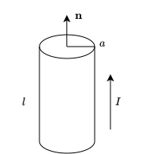

# 时变电磁场的基本定律

## 法拉第电磁感应定律

- **公式**
  $$
  \oint_l\mathbf{E}\cdot d\mathbf{l}=-\frac{d\Phi}{dt}=-\frac{d}{dt}\int_S\mathbf{B}\cdot d\mathbf{S}
  $$
  其中：

  - $\mathbf{E}$：总电场，由非保守的感应电动势和静止电荷的保守场共同构成；
  - $\Phi$：穿过曲面 $S$ 和回路 $l$ 的磁通量。

  二者满足**右手螺旋关系**。

- **磁通量变化的原因**

  1. 磁感应强度 $\mathbf{B}$ 随时间在发生变化；
  2. 闭合回路 $l$ 自身的运动：大小 / 形状 / 位置变化。

### 静态回路的感应电动势

静止回路是指回路相对磁场没有机械运动，只是磁场随时间发生变化。由此可得
$$
\oint_l\mathbf{E}\cdot d\mathbf{l}=-\frac{d}{dt}\int_S\mathbf{B}\cdot d\mathbf{S}=-\int_S\frac{\partial\mathbf{B}}{\partial t}\cdot d\mathbf{S}
$$
根据斯托克斯定理，有
$$
\oint_l\mathbf{E}\cdot d\mathbf{l}=\int_S\nabla\times\mathbf{E}\cdot d\mathbf{S}
$$
最终可得
$$
\nabla\times\mathbf{E}=-\frac{\partial\mathbf{B}}{\partial t}
$$
这就是法拉第电磁感应定律的**微分形式**。

此公式表明：

- 静态回路中的感应电动势，完全由磁感应强度 $\mathbf{B}$ 随时间的变化率（$\frac{\partial \mathbf{B}}{\partial t}$）决定；
- 负号代表感应电动势建立的场**削弱**原场的变化趋向；
- 时变电场是**有旋场**，其源头是**随时间变化的磁场**。

### 运动回路的感应电动势

外部磁场 $\mathbf{B}$ 是恒定不变的（静态磁场），但是导体回路自身在空间中做切割磁感线运动。

当导体以速度 $\mathbf{v}$ 在磁场 $\mathbf{B}$ 中运动时，导体内部的自由电荷会受到**洛仑兹力**的作用。单位电荷受到的洛仑兹力（即动生电场强度 $\mathbf{E}_m$）为
$$
\mathbf{E}_m=\mathbf{v}\times\mathbf{B}
$$
将这个动生电场强度沿着运动的闭合回路 $l$ 进行线积分，就得到了**动生电动势**
$$
\mathbf{E'}=\oint_l(\mathbf{v}\times\mathbf{B})\cdot d\mathbf{l}
$$
如果磁场在变，回路也在动，那么总电动势就是上面两种情况的叠加：
$$
\mathbf{E}=-\frac{d\Phi}{dt}=-\int_S\frac{\partial\mathbf{B}}{\partial t}\cdot d\mathbf{S}+\oint_l(\mathbf{v}\times\mathbf{B})\cdot d\mathbf{l}
$$

## 位移电流

### 电流连续性方程

电荷既不能凭空产生，也不能凭空消失（电荷守恒）。**如果一个封闭体积内的总电荷量减少了，那么减少的电荷必然化作了电流，穿过边界表面流向了外部。**

设封闭曲面 $S$ 包围的体积为 $V$，电荷体密度为 $\rho$，则体积内的总电荷为
$$
q=\int_V\rho dV
$$
且流出该封闭曲面的总传导电流为
$$
I=\oint_S\mathbf{J}\cdot d\mathbf{S}
$$
根据电荷守恒，流出的电流等于内部电荷的减少率：
$$
\oint_S\mathbf{J}\cdot d\mathbf{S}=-\frac{dq}{dt}=-\frac{d}{dt}\int_V\rho dV
$$
假设体积 $V$ 形状固定，将时间导数移入积分内变为偏导。同时，应用**高斯散度定理**将左边的面积分转换为体积分：
$$
\int_V (\nabla \cdot \mathbf{J}) dV = \int_V \left( -\frac{\partial \rho}{\partial t} \right) dV
$$
由此可得
$$
\nabla\cdot\mathbf{J}=-\frac{\partial\rho}{\partial t}
$$
这就是电流连续性方程的微分形式。

方程表明：**电流密度 $\mathbf{J}$ 的散度（发散源）等于该点电荷密度随时间的变化率的负值**。若电荷密度在减少（负值），则散度为正，说明电流在向外发散。

### 位移电流密度

- 漏洞

  在静态场中，安培环路定理的微分形式为
  $$
  \nabla\times\mathbf{H}=\mathbf{J}
  $$
  两边同时取散度：
  $$
  \nabla\cdot(\nabla\times\mathbf{H})=\nabla\cdot\mathbf{J}
  $$
  根据**旋无散**，可知必然有
  $$
  \nabla\cdot\mathbf{J}=0
  $$
  静态场下没有问题，但一旦到了时变场，由前文推导可知
  $$
  \nabla\cdot\mathbf{J}=-\frac{\partial\rho}{\partial t}
  $$
  旧的安培环路定理在时变条件下在数学上无法自洽。

- **修正**

  为了补上这个漏洞，麦克斯韦假设时变场中，磁场的旋度除了传导电流 $\mathbf{J}$ 之外，一定还存在未知项  $\mathbf{J}_x$，即
  $$
  \nabla\times\mathbf{H}=\mathbf{J}+\mathbf{J}_x
  $$
  再次对两边取散度可得：
  $$
  \nabla\cdot\mathbf{J}=-\nabla\cdot\mathbf{J}_x
  $$
  代入
  $$
  \nabla\cdot\mathbf{J}=-\frac{\partial\rho}{\partial t}
  $$
  得到
  $$
  \nabla\cdot\mathbf{J}_x=\frac{\partial\rho}{\partial t}
  $$
  根据**微分形式的高斯定理**
  $$
  \int_S\mathbf{D}\cdot d\mathbf{S}=Q=\int_V\rho dV
  $$
  有
  $$
  \frac{\partial\rho}{\partial t}=\frac{\partial}{\partial t}(\nabla\cdot\mathbf{D})=\nabla\cdot\left(\frac{\partial\mathbf{D}}{\partial t}\right)
  $$
  最终可得**位移电流密度**：
  $$
  \mathbf{J}_d=\frac{\partial\mathbf{D}}{\partial t}
  $$
  这表明：**电位移矢量随时间的变化率，在激发磁场的效应上，完全等效于真实的传导电流**。

- **麦克斯韦全电流定律**

  - **微分形式**

    由此可以将磁场旋度方程重构为
    $$
    \nabla\times\mathbf{H}=\mathbf{J}+\frac{\partial\mathbf{D}}{\partial t}
    $$

  - **积分形式**

    两边同时应用斯托克斯定理，可得
    $$
    \oint_l\mathbf{H}\cdot d\mathbf{l}=\int_S\left(\mathbf{J}+\frac{\partial\mathbf{D}}{\partial t}\right)\cdot d\mathbf{S}
    $$
    说明磁场强度沿任意闭合路径的积分等于该路径所包围曲面上的全电流。

- **示例**

  1. 计算铜中的位移电流密度和传导电流密度的比值。设铜中的电场为 $E_0\sin\omega t$，电导率为 $\sigma=5.8\times10^7S/m$，$\varepsilon\approx\varepsilon_0$。

     1. 计算传导电流
        $$
        J_c=\sigma E=\sigma E_0\sin\omega t
        $$

     2. 计算位移电流
        $$
        J_d=\frac{\partial\mathbf{D}}{\partial t}=\varepsilon\frac{\partial\mathbf{E}}{\partial t}=\varepsilon E_0\omega\cos\omega t
        $$

     因此，位移电流密度与传导电流密度的**振幅**比值为
     $$
     \frac{J_d}{J_c}=\frac{\omega\varepsilon}{\sigma}=\frac{2\pi f\frac{1}{36\pi}\times10^{-9}}{5.8\times10^7}=9.6\times10^{-6}f
     $$

  2. 证明通过任意封闭曲面的传导电流和位移电流的总量为 0 。

     根据麦克斯韦全电流方程
     $$
     \nabla\times\mathbf{H}=\mathbf{J}+\frac{\partial\mathbf{D}}{\partial t}
     $$
     两边同时取散度
     $$
     0=\nabla\cdot\left(\mathbf{J}+\frac{\partial\mathbf{D}}{\partial t}\right)
     $$
     对于任意封闭曲面，设该曲面包裹的体积为 $V$，有
     $$
     \int_V\nabla\cdot\left(\mathbf{J}+\frac{\partial\mathbf{D}}{\partial t}\right)dV=0
     $$
     根据散度定理
     $$
     \oint_S\left(\mathbf{J}+\frac{\partial\mathbf{D}}{\partial t}\right)\cdot d\mathbf{S}=0
     $$
     得证。

  3. 在坐标原点附近区域内，传导电流密度为
     $$
     \mathbf{J}=10r^{-1.5}\mathbf{e}_r(A/m^2)
     $$
     求：

     1. 通过半径 $=1mm$ 的球面的电流值；

        根据电流密度的定义有
        $$
        I=\oint_S\mathbf{J}\cdot d\mathbf{S}
        $$
  
        在球坐标系中，面积微元为
        $$
        d\mathbf{S}=\mathbf{e}_rr^2\sin\theta d\theta d\varphi
        $$
        所以有
        $$
        I=\int_0^{2\pi}\int_0^{2\pi}10r^{-1.5}\cdot r^2\sin\theta d\theta d\varphi|_{r=1mm}
        $$
        最终求得
        $$
        I=40\pi r^{0.5}=3.97A
        $$
  
     2. 在 $r=1mm$ 的球面上电荷密度的增加率；
  
        根据电流连续性方程
        $$
        \nabla\cdot\mathbf{J}=-\frac{\partial\rho}{\partial t}
        $$
        因为
        $$
        \nabla\cdot\mathbf{J}=\frac{1}{r^2}\frac{d}{dr}(r^2\cdot10r^{-1.5})=5r^{-2.5}
        $$
  
        所以
        $$
        \frac{\partial\rho}{\partial t}=-5r^{-2.5}|_{r=1mm}=-1.58\times10^8C/(m^3\cdot s)
        $$
  
     3. 在 $r=1mm$ 的球内总电荷的增加率。
  
        根据电荷守恒定律
        $$
        \frac{dQ}{dt}=-I=-3.97A
        $$
        
  
  4. 在无源的自由空间中，已知磁场强度
     $$
     \mathbf{H}=2.63\times10^{-5}\cos(3\times10^9t-10z)\mathbf{e}_y(A/m)
     $$
     求位移电流密度 $\mathbf{J}_d$。
  
     因为**无源的自由空间中传导电流为 0 **，即 $\mathbf{J}_c=0$，所以
     $$
     \begin{aligned}
     \nabla\times\mathbf{H}=\mathbf{J}_d&=
     \begin{vmatrix}
     \mathbf{e}_x & \mathbf{e}_y & \mathbf{e}_z \\
     \frac{\partial}{\partial x} & \frac{\partial}{\partial y} & \frac{\partial}{\partial z} \\
     0 & H_y & 0
     \end{vmatrix} \\
     &=-\frac{\partial H_y}{\partial z}\mathbf{e}_x \\
     &=-2.63\times10^{-4}\sin(3\times10^9t-10z)\mathbf{e}_x
     \end{aligned}
     $$

# 麦克斯韦方程组

## 基本方程组

- **全电流定律**

  随时间变化的电场可以激发起旋涡状的磁场。

  - 微分形式
    $$
    \nabla\times\mathbf{H}=\mathbf{J}+\frac{\partial\mathbf{D}}{\partial t}
    $$

  - 积分形式
    $$
    \oint_l\mathbf{H}\cdot d\mathbf{l}=\int_S\left(\mathbf{J}+\frac{\partial\mathbf{D}}{\partial t}\right)\cdot d\mathbf{S}
    $$

- **法拉第电磁感应定律**

  随时间变化的磁场可以激发起旋涡状的电场。

  - 微分形式
    $$
    \nabla\times\mathbf{E}=-\frac{\partial\mathbf{B}}{\partial t}
    $$

  - 积分形式
    $$
    \oint_l\mathbf{E}\cdot d\mathbf{l}=-\int_S\frac{\partial\mathbf{B}}{\partial t}\cdot d\mathbf{S}
    $$

- **磁通连续性原理**

  磁场是无源场。磁力线永远是闭合的，流出任意封闭面的净磁通量必然为 $0$。

  - 微分形式
    $$
    \nabla\cdot\mathbf{B}=0
    $$

  - 积分形式
    $$
    \oint_S\mathbf{B}\cdot d\mathbf{S}=0
    $$

- **高斯定理**

  电场是有源场。**自由电荷 $\rho$ 是电位移矢量 $\mathbf{D}$ 的发散源**。正电荷向外发散电场线，负电荷向内汇聚电场线。

  - 微分形式
    $$
    \nabla\cdot\mathbf{D}=\rho
    $$

  - 积分形式
    $$
    \oint_S\mathbf{D}\cdot d\mathbf{S}=q=\int_V\rho dV
    $$

## 本构关系

$$
\begin{cases}
\mathbf{D}=\varepsilon\mathbf{E} \\
\mathbf{B}=\mu\mathbf{H} \\
\mathbf{J}=\sigma\mathbf{E}
\end{cases}
$$

其中：$\varepsilon$ 为介电常数，$\mu$ 为磁导率，$\sigma$ 为电导率。

## 洛伦兹力公式

电荷(运动或静止)激发电磁场，电磁场反过来对电荷有作用力。

- **单点电荷形式**

  当空间同时存在电场和磁场时，以恒速 $v$ 运动的点电荷 $q$ 所受的力为
  $$
  \mathbf{F}=q(\mathbf{E}+\mathbf{v}\times\mathbf{B})
  $$

- **连续分布电荷系统（力密度形式）**

  如果电荷是连续分布的，其密度为 $\rho$，则电荷系统所受的电磁场力密度为
  $$
  \mathbf{f}=\rho\mathbf{E}+\mathbf{J}\times\mathbf{B}
  $$
  其中 $\mathbf{f}$ 为单位体积电荷所受的电磁力，单位是 $\text{N/m}^3$ 。

  这说明洛伦兹力由两部分合成：

  1. 电场力 $\rho \mathbf{E}$，其方向与电场共线，与电荷运动速度无关；
  2. 磁场力（洛仑兹力/安培力变体） $\mathbf{J} \times \mathbf{B}$，其方向永远垂直于电流运动方向和磁场方向。

- **示例**

  已知在无源的自由空间中有
  $$
  \mathbf{E}=E_0\cos(\omega t-\beta z)\mathbf{e}_x
  $$
  其中 $E_0、\beta$ 是常数，求 $\mathbf{H}$。

  根据法拉第电磁感应定律的微分形式，结合**无源的自由空间**可得
  $$
  \nabla\times\mathbf{E}=-\frac{\partial\mathbf{B}}{\partial t}=-\mu_0\frac{\partial\mathbf{H}}{\partial t}
  $$
  又因为
  $$
  \nabla\times\mathbf{E}=
  \begin{vmatrix}
  \mathbf{e}_x & \mathbf{e}_y & \mathbf{e}_z \\
  \frac{\partial}{\partial x} & \frac{\partial}{\partial y} & \frac{\partial}{\partial z} \\
  E_x & 0 & 0
  \end{vmatrix}
  $$
  即
  $$
  E_0\beta\sin(\omega t-\beta z)\mathbf{e}_y=-\mu_0\frac{\partial}{\partial t}(H_x\mathbf{e}_x+H_y\mathbf{e}_y+H_z\mathbf{e}_z)
  $$
  由此可得
  $$
  -\mu_0\frac{\partial H_y}{\partial t}=E_0\beta\sin(\omega t-\beta z) \\
  $$
  最终可得
  $$
  H_y=\frac{E_0\beta}{\mu_0\omega}\cos(\omega t-\beta z),\ \mathbf{H}=\frac{E_0\beta}{\mu_0\omega}\cos(\omega t-\beta z)\mathbf{e}_y
  $$

# 时变电磁场的边界条件

## 一般情况

- **法向边界条件**
  $$
  \begin{aligned}
  &\mathbf{n} \cdot (\mathbf{D}_1 - \mathbf{D}_2) = \rho_S \implies D_{1n} - D_{2n} = \rho_S \\
  &\mathbf{n} \cdot (\mathbf{B}_1 - \mathbf{B}_2) = 0 \implies B_{1n} = B_{2n}
  \end{aligned}
  $$
  这说明：

  - **电位移矢量 $\mathbf{D}$ 的法向分量不连续**：其突变值等于交界面上的表面自由电荷密度 $\rho_S$。

  - **磁感应强度 $\mathbf{B}$ 的法向分量处处连续**：无论跨越什么介质，垂直于界面的 $\mathbf{B}$ 强弱不会发生跳变。

- **切向边界条件**
  $$
  \begin{aligned}
  &\mathbf{n} \times (\mathbf{H}_1 - \mathbf{H}_2) = \mathbf{J}_S \implies H_{1t} - H_{2t} = J_S \\
  &\mathbf{n} \times (\mathbf{E}_1 - \mathbf{E}_2) = 0 \implies E_{1t} = E_{2t}
  \end{aligned}
  $$
  这说明：

  - **电场强度 $\mathbf{E}$ 的切向分量处处连续**：跨越界面时，平行于界面的电场分量完全相等。

  - **磁场强度 $\mathbf{H}$ 的切向分量不连续**：其突变值等于交界面上的表面传导电流密度 $\mathbf{J}_S$。

## 特殊情况

- **理想介质的边界**

  两种介质都是完美的绝缘体（如空气和陶瓷的交界面）。由于没有自由电荷和传导电流，此时界面上 $\rho_S = 0$ 且 $\mathbf{J}_S = 0$。

  此时边界条件退化为：
  $$
  D_{1n}=D_{2n}\\
  B_{1n}=B_{2n}\\
  E_{1t}=E_{2t}\\
  H_{1t}=H_{2t}
  $$
  在没有源的完美介质交界处，**$\mathbf{B}、\mathbf{E}、\mathbf{H}$ 的切向和 $\mathbf{B}、\mathbf{D}$ 的法向全部完美连续**。$\mathbf{E}$ 和 $\mathbf{H}$ 的法向跳变完全由两边的介质参数（$\varepsilon, \mu$）的比例决定：
  $$
  \varepsilon_1E_1=\varepsilon_2E_2 \\
  \mu_1H_1=\mu_2H_2
  $$

- **理想导体的边界**

  电导率 $\sigma \to \infty$，在理想导体内部不存在电场。令媒质 2 各项为 0 ：
  $$
  \begin{aligned}
  D_{1n}&=\rho_S\Rightarrow\varepsilon_1E_1=\rho_S\\
  B_{1n}&=0\Rightarrow H_1=0 \\
  E_{1t}&=0 \\
  H_{1t}&=J_S
  \end{aligned}
  $$

## 示例

1. 设 $z=0$ 的平面为空气与理想导体的分界面，$z<0$ 一侧为理想导体，分界面处的磁场强度为
   $$
   H(x,y,0,t)=H_0\sin ax\cos(\omega t-ay)\mathbf{e}_x
   $$
   试求理想导体表面上的电流分布、电荷分布以及分界面处的电场强度。

   因为
   $$
   \mathbf{J}_S=\mathbf{H}_t=\mathbf{n}\times\mathbf{H}
   $$
   所以
   $$
   \begin{aligned}
   \mathbf{J}_s&=\mathbf{e}_z\times\mathbf{e}_zH_0\sin ax\cos(\omega t-ay) \\
   &=H_0\sin ax\cos(\omega t-ay)\mathbf{e}_y
   \end{aligned}
   $$
   又因为
   $$
   \nabla\cdot\mathbf{J}=-\frac{\partial\rho_S}{\partial t}=aH_0\sin ax\sin(\omega t-ay)
   $$
   所以
   $$
   \rho_S=aH_0\sin ax\int\sin(\omega t-ay)dt=\frac{aH_0}{\omega}\sin ax\cos(\omega t-ay)+c(x,y)
   $$
   假设 $t=0$ 时有 $\rho_S=0$，则
   $$
   c(x,y)=-\frac{aH_0}{\omega}\sin (ax)\cos(ay) \\
   \rho_S=\frac{aH_0}{\omega}\sin(ax)[\cos(\omega t-ay)-\cos(ay)]
   $$
   又因为理想导体有
   $$
   D_n=\rho_S=\varepsilon_0 E_n
   $$
   所以
   $$
   \mathbf{E}=\frac{aH_0}{\omega_0\varepsilon_0}\sin (ax)[\cos(\omega t-ay)-\cos(ay)]\mathbf{e}_z
   $$

2. 设区域 I $(z<0)$ 的媒质参数 $\varepsilon_{r1}=1,\ \mu_{r1}=1,\ \sigma_1=0$；区域 II $(z>0)$ 的媒质参数 $\varepsilon_{r2}=5,\ \mu_{r2}=2,\ \sigma_2=0$。区域 I 中的电场强度为
   $$
   \mathbf{E}_1=[60\cos(15\times10^8t-5z)+20\cos(15\times10^8t+5z)]\mathbf{e}_x
   $$
   区域 II 中的电场强度为
   $$
   \mathbf{E}_2=A\cos(15\times10^8t-5z)\mathbf{e}_x
   $$
   求：

   1. 常数 $A$；

      因为在边界 $z=0$ 处有
      $$
      E_{1t}=E_{2t}
      $$
      所以
      $$
      A=80
      $$

   2. 磁场强度 $\mathbf{H}_1$ 和 $\mathbf{H}_2$；

      因为
      $$
      \nabla\times\mathbf{E}=-\frac{\partial\mathbf{B}}{\partial t}=-\mu_r\frac{\partial\mathbf{H}}{\partial t}
      $$
      所以
      $$
      \begin{aligned}
      \frac{\partial\mathbf{H}}{\partial t}&=-\frac{1}{\mu_r}\nabla\times\mathbf{E} \\
      &=
      \begin{vmatrix}
      \mathbf{e}_x & \mathbf{e}_y & \mathbf{e}_z \\
      \frac{\partial}{\partial x} & \frac{\partial}{\partial y} & \frac{\partial}{\partial z} \\
      E_x & 0 & 0
      \end{vmatrix}\\
      \end{aligned}
      $$
      代入区域 I 中的电场强度可得
      $$
      \frac{\partial\mathbf{H}_1}{\partial t}=\frac{1}{\mu_{r1}}[300\sin(15\times10^8t-5z)-100\sin(15\times10^8t_5z)]\mathbf{e}_y
      $$
      所以
      $$
      \mathbf{H_1}=[0.1592\cos(15\times10^8t-5z)-0.0531\cos(15\times10^8t+5z)]\mathbf{e}_y
      $$
      类似地可得
      $$
      \mathbf{H}_2=[0.1061\cos(15\times10^8t-5z)]\mathbf{e}_y
      $$

   3. 证明在 $z=0$ 处 $\mathbf{H}_1$ 和 $\mathbf{H}_2$ 满足边界条件。

      因为
      $$
      H_{1t}-H_{2t}=J_S=\sigma E=0
      $$
      又因为 $z=0$ 时有
      $$
      H_{1t}=0.106\cos(15\times10^8t)=H_{2t}
      $$
      得证。

# 时变电磁场的能量与能流

在体积 $V$ 内，由于传导电流引起的瞬时欧姆功率损耗 $P_L$ 的宏观积分表达式为：
$$
P_L=\int_V(\mathbf{J}\cdot\mathbf{E})dV
$$
其中积分项 $\mathbf{J} \cdot \mathbf{E}$ 代表**单位体积内的热损耗功率密度**（单位：$\text{W/m}^3$）。

为了描述**能量在空间中流动的强弱和方向**，需要定义一个全新的核心矢量：
$$
S_p=\mathbf{E}\times\mathbf{H}
$$

- **大小**：代表单位时间内穿过垂直于能量传播方向的单位面积的电磁能量。

- **方向**：由电场 $\mathbf{E}$ 和磁场 $\mathbf{H}$ 按右手螺旋法则共同决定，代表**电磁能量流动的几何矢量方向**。只要空间中同时存在电场和磁场，且二者不平行，该点就会存在能量的流动。

## 坡印廷定理

从焦耳损耗功率密度 $\mathbf{J} \cdot \mathbf{E}$ 出发。根据麦克斯韦全电流定律
$$
\mathbf{J}=\nabla\times\mathbf{H}-\frac{\partial\mathbf{D}}{\partial t}
$$
两边同时与 $\mathbf{E}$ 点乘：
$$
\mathbf{J}\cdot\mathbf{E}=\mathbf{E}\cdot(\nabla\times\mathbf{H})-\mathbf{E}\cdot\frac{\partial\mathbf{D}}{\partial t}
$$
根据场论矢量恒等式（散度求导链式法则）：
$$
\nabla \cdot (\mathbf{E} \times \mathbf{H}) = \mathbf{H} \cdot (\nabla \times \mathbf{E}) - \mathbf{E} \cdot (\nabla \times \mathbf{H})
$$
移项得到
$$
\mathbf{E} \cdot (\nabla \times \mathbf{H}) = \mathbf{H} \cdot (\nabla \times \mathbf{E}) - \nabla \cdot (\mathbf{E} \times \mathbf{H})
$$
代入法拉第电磁感应定律
$$
\nabla\times\mathbf{E}=-\frac{\partial\mathbf{B}}{\partial t}
$$
有
$$
\mathbf{E} \cdot (\nabla \times \mathbf{H}) = \mathbf{H} \cdot \left(-\frac{\partial\mathbf{B}}{\partial t}\right) - \nabla \cdot (\mathbf{E} \times \mathbf{H})
$$
代回式(45)可得
$$
\mathbf{J}\cdot\mathbf{E}=-\left[\mathbf{H}\cdot\frac{\partial\mathbf{B}}{\partial t}+\mathbf{E}\cdot\frac{\partial\mathbf{D}}{\partial t}+\nabla\cdot(\mathbf{E}\times\mathbf{H})\right]
$$
两边同时取体积分
$$
\int_V\mathbf{J}\cdot\mathbf{E}dV=-\int_V\left[\mathbf{H}\cdot\frac{\partial\mathbf{B}}{\partial t}+\mathbf{E}\cdot\frac{\partial\mathbf{D}}{\partial t}+\nabla\cdot(\mathbf{E}\times\mathbf{H})\right]dV
$$
根据散度定理
$$
\int_V\nabla\cdot(\mathbf{E}\times\mathbf{H})dV=\oint_S(\mathbf{E}\times\mathbf{H})\cdot d\mathbf{S}
$$
所以移项可得
$$
-\oint_S(\mathbf{E}\times\mathbf{H})\cdot d\mathbf{S}=\int_V\left(\mathbf{H}\cdot\frac{\partial\mathbf{B}}{\partial t}+\mathbf{E}\cdot\frac{\partial\mathbf{D}}{\partial t}+\mathbf{J}\cdot\mathbf{E}\right)dV
$$
从而推导出了**适合一般媒质的坡印廷定理**。

利用矢量函数求导公式还可将其转化为
$$
\begin{aligned}
-\oint_SS_p\cdot d\mathbf{S}&=\frac{\partial}{\partial t}\int_V\left(\frac{1}{2}\mathbf{B}\cdot\mathbf{H}+\frac{1}{2}\mathbf{D}\cdot\mathbf{E}\right)dV+\int_V(\mathbf{J}\cdot\mathbf{E})dV \\
&=\frac{\partial}{\partial t}\int_V(w_e+w_m)dV+\int_V(\mathbf{J}\cdot\mathbf{E})dV
\end{aligned}
$$
其中：

- $-\oint_S \mathbf{S}_p \cdot d\mathbf{S}$

  代表**单位时间内从外部空间跨越边界表面 $S$ 纯流入体积 $V$ 内的电磁功率总净值**；

- $\frac{\partial}{\partial t} \int_V (w_e + w_m) dV$

  由于 $w_e = \frac{1}{2}\mathbf{D} \cdot \mathbf{E}$ 是电场能量密度，$w_m = \frac{1}{2}\mathbf{B} \cdot \mathbf{H}$ 是磁场能量密度。所以这一项代表**体积 $V$ 内部所储存的电磁场总能量随时间的变化率（储能增加功率）**。

- $\int_V (\mathbf{J} \cdot \mathbf{E}) dV$

  代表单位时间内，体积 $V$ 内由于传导电流作功而**转化为焦耳热能并永远损失掉的功率（热损耗功率）**。

# 正弦电磁场

## 复数相量表示法

在正弦交变场中，瞬时值场矢量 $\mathbf{E}(t)$ 与空间复矢量（相量） $\mathbf{\dot{E}}$ 之间的唯一桥梁是**乘以共同时间因子 $e^{j\omega t}$ 并取实部**
$$
\mathbf{E}(t) = \text{Re}\left[ \mathbf{\dot{E}} \cdot e^{j\omega t} \right]
$$
在进行互换时，需要用到复数与三角函数的两阶基础变换：

1. 虚数单位 $j$ 的相位含义

   在复指数中，$j$ 代表着 $+90^\circ$（即 $+\frac{\pi}{2}$）的初相位。
   $$
   j = e^{j\frac{\pi}{2}}
   $$

2. 正弦变余弦

   由于标准形式建立在 $\text{Re}[e^{j\theta}] = \cos\theta$ 上，如果题目中出现 $\sin$ 函数，需要利用诱导公式将其统一化为 $\cos$ 形式才能提取相量
   $$
   \sin\theta = \cos\left(\theta - \frac{\pi}{2}\right) = \text{Re}\left[ e^{j\left(\theta - \frac{\pi}{2}\right)} \right] = \text{Re}\left[ e^{j\theta} \cdot e^{-j\frac{\pi}{2}} \right] = \text{Re}\left[ e^{j\theta} \cdot (-j) \right]
   $$
   

## 示例

1. 将下列场矢量的瞬时值表示为复数值；

   > 把函数写成 $\cos(\omega t + \phi)$ 的形式，其复相量就是 $(\text{幅值}) \cdot e^{j\phi}$；$\sin(\omega t+\phi)\rightarrow\cos(\omega t+\phi-\frac{\pi}{2})$

   1）
   $$
   \mathbf{E}(t)=E_{ym}\cos(\omega t-kx+\alpha)\mathbf{e}_y+E_{zm}\sin(\omega t-kx+\alpha)\mathbf{e}_z
   $$
   因为
   $$
   \begin{aligned}
   \mathbf{E}(x,y,z,t)&=\text{Re}[\mathbf{\dot{E}}\cdot e^{j\omega t}] \\
   &=\text{Re}[E_{ym}e^{j(\omega t-kx+\alpha)}\mathbf{e}_y+E_{zm}e^{j(\omega t-kx+\alpha-\frac{\pi}{2})}\mathbf{e}_z]
   \end{aligned}
   $$
   所以
   $$
   \mathbf{E}(x,y,z)=(E_{ym}\mathbf{e}_y-jE_{zm}\mathbf{e}_z)e^{j(-kx+\alpha)}
   $$
   2）
   $$
   \mathbf{H}(t)=H_0k\left(\frac{a}{\pi}\right)\sin\left(\frac{\pi x}{a}\right)\sin(kz-\omega t)\mathbf{e}_x+H_0\cos\left(\frac{\pi x}{a}\right)\cos(kz-\omega t)\mathbf{e}_z
   $$
   因为
   $$
   \sin(kz-\omega t)=\sin(\omega t-kz+\pi),\ \cos(kz-\omega t)=\cos(\omega t-kz)
   $$
   所以
   $$
   \begin{aligned}
   \mathbf{H}(x,y,z,t)&=\text{Re}[\mathbf{\dot{H}}\cdot e^{j\omega t}] \\
   &=\text{Re}[H_0k\left(\frac{a}{\pi}\right)\sin\left(\frac{\pi x}{a}\right)e^{j(\omega t-kz+\frac{\pi}{2})}\mathbf{e}_x+H_0\cos\left(\frac{\pi x}{a}\right)e^{j(\omega t-kz)}\mathbf{e}_z]
   \end{aligned}
   $$
   最终得到
   $$
   \mathbf{H}(x,y,z)=H_0k\left(\frac{a}{\pi}\right)\sin\left(\frac{\pi x}{a}\right)e^{j(-kz+\frac{\pi}{2})}\mathbf{e}_x+H_0\cos\left(\frac{\pi x}{a}\right)e^{-jkz}\mathbf{e}_z
   $$

2. 将下列场矢量的复数值表示为瞬时值。

   > 给复相量乘上 $e^{j\omega t}$，取实部即还原为余弦函数；$j\rightarrow e^{j\frac{\pi}{2}},\ -j\rightarrow e^{-j\frac{\pi}{2}}$

   1）
   $$
   E_{zm}=E_0\sin(k_xx)\sin(k_yy)e^{-jk_zz}
   $$
   得到
   $$
   \begin{aligned}
   \mathbf{E}(x,y,z,t)&=\text{Re}[E_0\sin(k_xx)\sin(k_yy)e^{-jk_zz}e^{j\omega t}\mathbf{e}_z] \\
   &=E_0\sin(k_xx)\sin(k_yy)\cos(\omega t-k_zz)\mathbf{e}_z
   \end{aligned}
   $$
   2）
   $$
   E_{xm}=2jE_0\sin\theta\cos(k_xx\cos\theta)e^{-jkz\sin\theta}
   $$
   得到
   $$
   \begin{aligned}
   \mathbf{E}(x,y,z,t)&=\text{Re}[2E_0\sin\theta\cos(k_xx\cos\theta)e^{j(-kz\sin\theta+\frac{\pi}{2})}e^{j\omega t}\mathbf{e}_x] \\
   &=2E_0\sin\theta\cos(k_xx\cos\theta)\cos(\omega t-kz\sin\theta+\frac{\pi}{2})\mathbf{e}_x
   \end{aligned}
   $$

# 课后习题详解

## 5-5

已知在空气媒质的无源区域中，电场强度
$$
\mathbf{E}=100e^{-\alpha z}\cos(\omega t-\beta z)\mathbf{e}_x
$$
其中 $\alpha、\beta$ 为常数，求磁场强度。

> 思路：$\mathbf{E}\rightarrow\mathbf{B}\rightarrow\mathbf{H}$

根据**法拉第电磁感应定律**
$$
\nabla\times\mathbf{E}=-\frac{\partial\mathbf{B}}{\partial t}
$$
令
$$
E_x=100e^{-\alpha z}\cos(\omega t-\beta z)
$$
所以有
$$
\begin{aligned}
\nabla\times\mathbf{E}&=
\begin{vmatrix}
\mathbf{e}_x & \mathbf{e}_y & \mathbf{e}_z \\
\frac{\partial}{\partial x} & \frac{\partial}{\partial y} & \frac{\partial}{\partial z} \\
E_x & 0 & 0
\end{vmatrix} \\
&=\frac{\partial E_x}{\partial z}\mathbf{e}_y-\frac{\partial E_x}{\partial y}\mathbf{e}_z \\
&=100[-\alpha e^{-\alpha z}\cos(\omega t-\beta z)+\beta e^{-\alpha z}\sin(\omega t-\beta z)]\mathbf{e}_y \\
&=100e^{-\alpha z}[\beta\sin(\omega t-\beta z)-\alpha\cos(\omega t-\beta z)]\mathbf{e}_y
\end{aligned}
$$

又因为
$$
-\frac{\partial\mathbf{B}}{\partial t}=-\mu_0\frac{\partial\mathbf{H}}{\partial t}=100e^{-\alpha z}[\beta\sin(\omega t-\beta z)-\alpha\cos(\omega t-\beta z)]\mathbf{e}_y
$$
所以
$$
\frac{\partial\mathbf{H}}{\partial t}=\frac{100e^{-\alpha z}}{\mu_0}[\alpha\cos(\omega t-\beta z)-\beta\sin(\omega t-\beta z)]\mathbf{e}_y
$$
最终可得
$$
\mathbf{H}=\frac{100e^{-\alpha z}}{\mu_0\omega}[\alpha\sin(\omega t-\beta z)+\beta\cos(\omega t-\beta z)]\mathbf{e}_y
$$

## 5-9

假设真空中的磁感应强度
$$
\mathbf{B}=10^{-2}\cos(6\pi\times10^8t)\cos(2\pi z)\mathbf{e}_y
$$
试求位移电流密度。

> 思路：$\mathbf{B}\rightarrow\mathbf{H}\rightarrow\mathbf{J}_d$

因为
$$
\mathbf{B}=\mu_0\mathbf{H},\ \nabla\times\mathbf{H}=\mathbf{J}_c+\mathbf{J}_d
$$
又因为在**真空**中，所以传导电流
$$
\mathbf{J}_c=0,\ \nabla\times\mathbf{H}=\mathbf{J}_d
$$
所以有
$$
\mathbf{H}=\frac{10^{-2}}{\mu_0}\cos(6\pi\times10^8t)\cos(2\pi z)\mathbf{e}_y
$$
令
$$
H_y=\frac{10^{-2}}{\mu_0}\cos(6\pi\times10^8t)\cos(2\pi z)
$$
由此可得
$$
\begin{aligned}
\mathbf{J}_d&=
\begin{vmatrix}
\mathbf{e}_x & \mathbf{e}_y & \mathbf{e}_z \\
\frac{\partial}{\partial x} & \frac{\partial}{\partial y} & \frac{\partial}{\partial z} \\
0 & H_y & 0
\end{vmatrix} \\
&=\frac{\partial H_y}{\partial x}\mathbf{e}_z-\frac{\partial H_y}{\partial z}\mathbf{e}_x \\
&=5\times10^4\cos(6\pi\times10^8t)\sin(2\pi z)\mathbf{e}_x
\end{aligned}
$$

## 5-12

如下图所示，一根半径为 $a$ 的长直圆柱体上通过直流电流 $I$。假设导体的电导率为 $\sigma$ 为有限值，求导体表面附近的坡印廷矢量，计算长度为 $l$ 的导体所损耗的功率。

因为面积微元 $d\mathbf{S}$ 和电流密度 $\mathbf{J}$ 的方向相同，所以有
$$
I=\oint_S\mathbf{J}\cdot d\mathbf{S}=\oint_S JdS
$$
代入 $S=\pi a^2$，可得
$$
I=J\cdot\pi a^2
$$
又因为
$$
J=\sigma E
$$
所以
$$
I=\pi a^2\sigma E
$$
由此可得
$$
\mathbf{E}=\frac{I}{\pi a^2\sigma}\mathbf{e}_z
$$
作如下图所示的闭合环路 $L$

$L$ 是与圆柱体同轴、半径也为 $a$ 的环路。

根据安培环路定理，且磁场方向（由右手定则可得）与线元方向一致，有
$$
\oint_L\mathbf{H}\cdot d\mathbf{l}=\sum I=I=2\pi aH
$$
所以
$$
H=\frac{I}{2\pi a}\mathbf{e}_{\varphi}
$$

将 $\mathbf{E}$ 和 $\mathbf{H}$ 代入到坡印廷矢量的计算公式
$$
\mathbf{S}_p=\mathbf{E}\times\mathbf{H}
$$
已知
$$
\mathbf{e}_z\times\mathbf{e}_{\varphi}=-\mathbf{e}_r
$$
所以最终得到
$$
\mathbf{S}_p=-\frac{I^2}{2\pi^2a^3\sigma}\mathbf{e}_r
$$
因为
$$
P=\int_V(\mathbf{J}\cdot\mathbf{E})dV
$$
代入 $\mathbf{J}=\sigma\mathbf{E},\ V=\pi a^2l$，得到
$$
P=\sigma E^2V=\sigma\left(\frac{I}{\pi a^2\sigma}\right)^2\cdot\pi a^2l=\frac{I^2l}{\pi a^2\sigma}
$$
